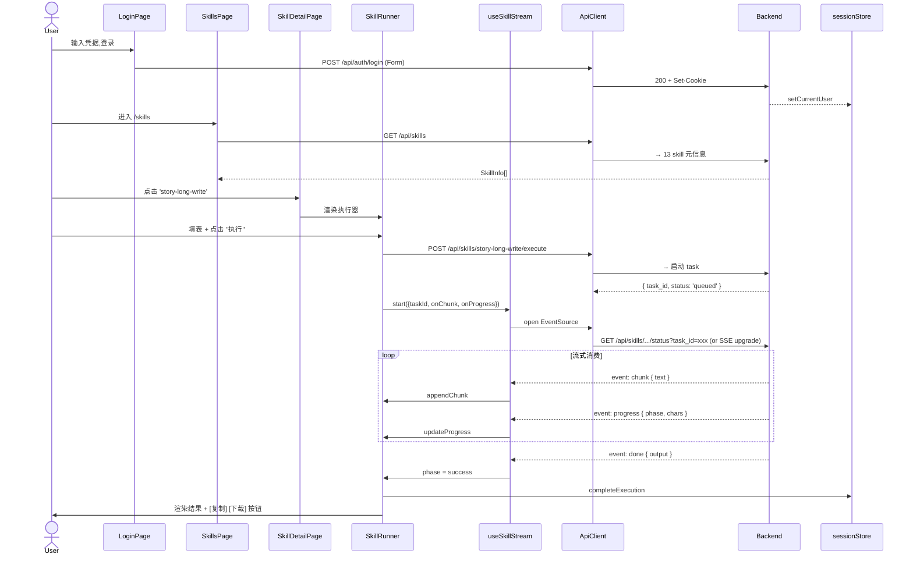
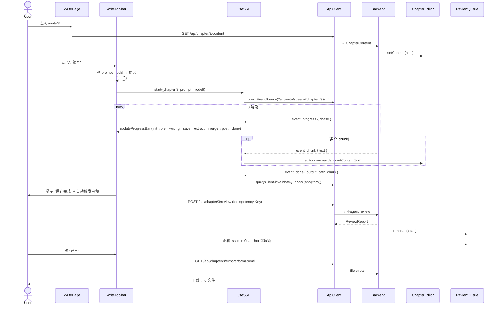
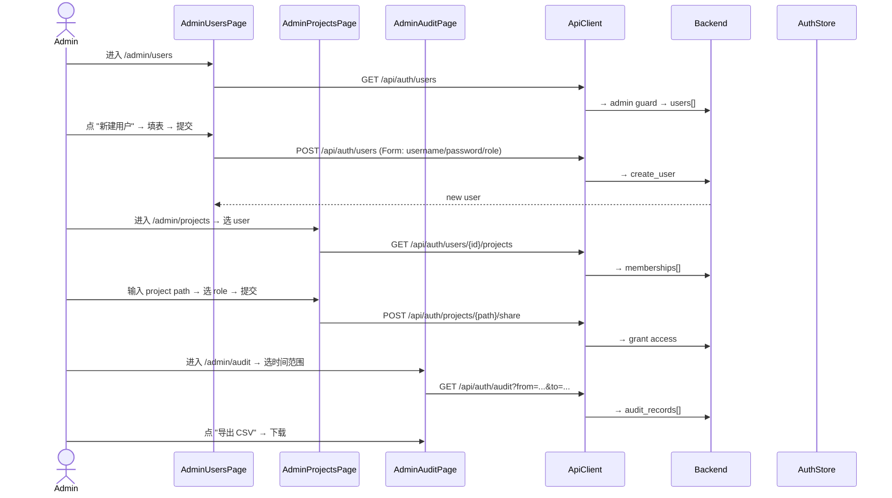
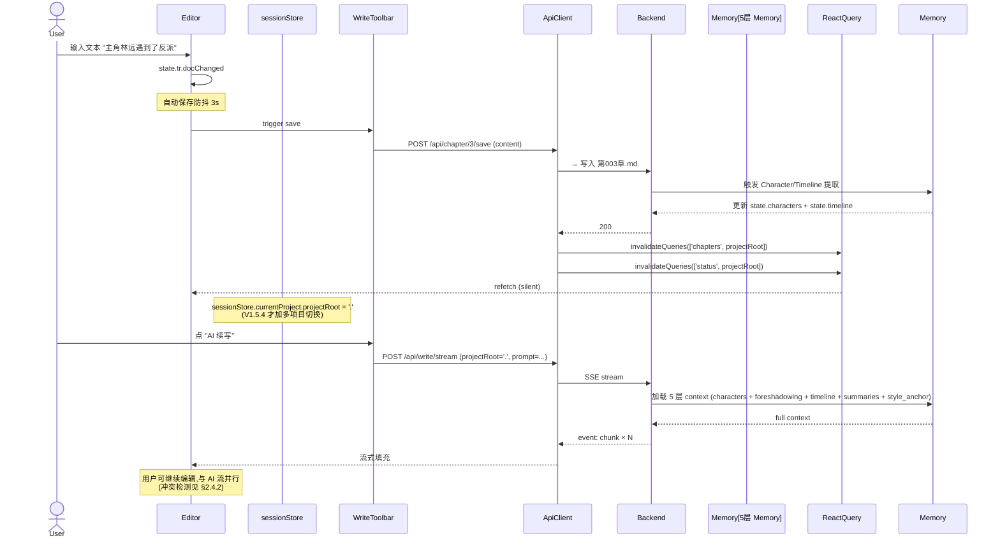

# novel2all V1.5.x Architecture Design

> **作者**: Bob (Architect)
> **范围**: V1.5.x 系列前端 sprint 设计 (V1.5.1 — V1.5.4)
> **输入**: PM PRD (`docs/PRD-V1.5.x.md`, V1.5.x 已 PASS) + 已部署 V1.5.0 React scaffold
> **后端基线**: FastAPI V1.0.2 + 13 skills + 7 roles + 44 API + SSE 流式写作
> **前端基线**: V1.5.0 React SPA (Vite 5 + React 18 + TS 5 + MUI 5 + React Query 5 + Tiptap 2 + zustand)
> **部署**: 同源 `http://192.168.3.106:8000` (FastAPI mount React dist)

---

## 0. TL;DR

本设计在 **不重写现有 V1.5.0 scaffold 的前提下** 增量扩展,按 4 个 sprint (V1.5.1–V1.5.4) 实现:

| Sprint | 版本 | 目标 | 主要交付 | 估时 |
|--------|------|------|---------|------|
| S1 | V1.5.1 | **Skill 浏览器 + 通用 Skill 执行器** (打通 SSE 通用通道) | `/skills` 网格 + `/skills/:name` schema-driven 执行页 | **3 天** |
| S2 | V1.5.2 | **章节管理 + 写作主界面** (Tiptap + 续写/重写/插入 + SSE 8 阶段) | `/chapters` + `/write/:chapter` + AI 工具栏 | **4 天** |
| S3 | V1.5.3 | **审查 + 去 AI 味 + 短篇 + 封面 + 设置** | `/review` + 短篇 8 节 tab + `/cover` + `/settings` | **3 天** |
| S4 | V1.5.4 | **Admin + 导入 + Onboarding + 移动响应式** | `/admin/*` + `/import` + 移动端断点 + Session 上下文 | **3 天** |
| **合计** | | | | **13 工作日** (≈ 2.6 周) |

**核心架构决策**:
1. **单一 SkillRunner 通用框架** — 13 个 skill 复用同一执行器组件 + 同一 SSE hook + 同一 store。
2. **schema-driven 表单** — 后端返回 skill `inputSchema`,前端用 JSON Schema → react-hook-form 动态生成表单。
3. **Context 分层** — zustand sessionStore (UI 状态) + React Query cache (server state) + 后端 5 层 memory (业务状态)。
4. **人机协同** — AI 操作全部走"预览 modal + 用户确认"模式,避免静默改稿。
5. **SSE 断线重连 + 降级 polling** — 客户端 3 次失败自动改 polling `/api/skills/{name}/status`。
6. **不重写** — 复用现有 V1.5.0 scaffold 的脚手架/构建/路由/状态基础,只增量加 pages/hooks/components。

---

## 1. 实现方案概览

### 1.1 架构图

```mermaid
graph TB
    subgraph Client[React 18 SPA (Vite dist → FastAPI mount)]
        UI[Pages + AppShell]
        Hk[Hooks Layer<br/>useSSE / useSkillStream<br/>useDebounce / useIdempotency]
        St[Zustand Stores<br/>sessionStore / skillExecutionStore]
        RQ[React Query<br/>cache + invalidation]
        Api[api/* Layer<br/>axios + zod + SSE]
    end

    subgraph Proxy[Same-Origin Proxy<br/>Vite dev :5173 → :8000<br/>Nginx prod]
    end

    subgraph Backend[FastAPI V1.0.2 :8000]
        Auth[Auth Middleware<br/>httpOnly cookie]
        Skills[Skill Registry<br/>13 skills]
        Roles[Role Registry<br/>7 roles]
        SSE[SSE Endpoints<br/>/api/write/stream<br/>/api/skills/:name/execute]
        Review[4-Agent Review<br/>+ Idempotency Store]
        Memory[5-Layer Memory<br/>Tracker / Characters<br/>Foreshadowing / Timeline / Summary]
    end

    UI --> Hk
    Hk --> Api
    Hk --> St
    UI --> RQ
    RQ --> Api
    Api --> Proxy
    Proxy --> Backend
    Api -.SSE.-> SSE
    SSE --> Skills
    Skills --> Memory
    Skills --> Roles
    Skills --> Review
```

### 1.2 核心架构决策

| 决策 | 选择 | 理由 |
|------|------|------|
| **构建** | 复用 Vite 5 + TS 5 + React 18 | 现有 scaffold 已就绪;不重写 |
| **UI 库** | 复用 MUI 5 + @mui/icons-material | 现有 dashboard/cards/snackbar 全部基于 MUI |
| **编辑器** | 复用 Tiptap 2 + StarterKit + Placeholder | 中文段落;后续可扩展表格/图片 |
| **HTTP** | 复用 axios + interceptors (401/429/5xx) | 已配置 withCredentials;Cookie 自动带 |
| **状态 (UI)** | 新增 zustand `sessionStore` + `skillExecutionStore` | zustand 已在用 (authStore/themeStore);扩展即可 |
| **状态 (server)** | 复用 React Query 5 + 集中 queryKeys | cache + invalidation 标准化 |
| **数据校验** | 复用 zod + 新增 skill schema 解析 | 后端 dict 无 OpenAPI;前端 zod parse 兜底 |
| **图表** | 复用 recharts 2 | 已在 dashboard;S5 扫榜图表复用 |
| **SSE 客户端** | 扩展 `useSSE` (已有) → `useSkillStream` (新增) | 复用 EventSource 封装;加重连 + 心跳 + 进度回调 |
| **拖拽** | **不做** (P2) | 章节号固定;后端无 reorder API |
| **多项目** | **V1.5.4 简化方案**: AppBar 加项目选择器 (来自 `/api/auth/users/{id}/projects`) | 不做全局 project context |
| **i18n** | **不做** (V1.5.x 默认 zh-CN) | S5 预留 |
| **移动端** | S4 加 768px 断点 + Sidebar 折叠成汉堡 | iOS Safari 软键盘后续优化 |
| **测试** | 复用 vitest + MSW + 加 Playwright E2E (S4) | 现有 setup.ts 已就绪 |

---

## 2. 关键模块设计

### 2.1 Skill 执行通用框架 (Sprint 1 核心,后续 4 sprint 复用)

#### 2.1.1 通用 SkillRunner 组件

```typescript
// web-react/src/components/skill/SkillRunner.tsx
interface SkillRunnerProps {
  skill: SkillInfo;                  // 后端 GET /api/skills 返回
  projectRoot?: string;              // 默认 '.' (V1.5.x 不做切换)
  defaultParams?: Record<string, unknown>;
  onSuccess?: (output: SkillOutput) => void;
}

type SkillExecutionPhase = 'idle' | 'running' | 'success' | 'error' | 'cancelled';

// 调用流程:
//   1. POST /api/skills/{name}/execute (启动 task, 返回 taskId)
//   2. 拉起 useSkillStream(taskId) → SSE 流式消费 chunk
//   3. 流结束 → queryClient.invalidateQueries(['skills', name])
//   4. 失败 → 3 次重试后降级 polling /api/skills/{name}/status

const SkillRunner: FC<SkillRunnerProps> = ({ skill, projectRoot, defaultParams, onSuccess }) => {
  const [phase, setPhase] = useState<SkillExecutionPhase>('idle');
  const [taskId, setTaskId] = useState<string | null>(null);
  const [output, setOutput] = useState<SkillOutputChunk[]>([]);
  const [progress, setProgress] = useState<WriteProgress | null>(null);
  const { mutate: executeSkill } = useExecuteSkill(skill.name);
  const { stream, cancel } = useSkillStream();

  const handleStart = async (params: Record<string, unknown>) => {
    setPhase('running');
    executeSkill.mutate(
      { params: { ...params, project_root: projectRoot ?? '.' }, idempotencyKey: uuid() },
      {
        onSuccess: async (data) => {
          setTaskId(data.task_id);
          await stream({
            taskId: data.task_id,
            onChunk: (text) => setOutput((p) => [...p, { type: 'text', text }]),
            onProgress: (p) => setProgress(p),
            onDone: (final) => { setPhase('success'); onSuccess?.(final); },
            onError: (err) => setPhase('error'),
          });
        },
        onError: () => setPhase('error'),
      }
    );
  };

  // ... render
};
```

**关键设计**:
- **Phase 状态机**: idle → running → success/error/cancelled,UI 据此显示 spinner/progressBar/success/error
- **SSE 重连**: `useSkillStream` 内部封装 EventSource,断线 3 次后 fallback polling `/api/skills/{name}/status?task_id={taskId}` 每 2s
- **Cancel 支持**: 调用 `POST /api/write/cancel/{task_id}` (已存在) → 后端流式发 `cancelled` event
- **输出类型**: 自动判别 `text` / `json` / `file` 三种返回类型,UI 自适应渲染
- **错误分类**: 401 (auth 失效) / 429 (LLM 限流) / 500 (服务端) / network (离线)

#### 2.1.2 Skill 卡片 + 列表

```typescript
// web-react/src/components/skill/SkillCard.tsx
interface SkillCardProps {
  skill: SkillInfo;
  onClick: () => void;  // navigate to /skills/:name
}

// 按 category 分组 (后端字段缺失,前端硬编码 mapping):
//   - 创作类: story-setup / story-long-write / story-short-write / story-cover
//   - 分析类: story-long-analyze / story-short-analyze / story-long-scan / story-short-scan
//   - 工具类: story-deslop / story-review / story-import
//   - 入口类: story (router)
//   - 内部: browser-cdp (不展示)

const CATEGORY_MAP: Record<string, SkillCategory> = {
  'story-setup': { category: '创作类', icon: 'SettingsIcon', color: 'primary' },
  // ...
};
```

#### 2.1.3 Skill 执行详情页

```typescript
// web-react/src/pages/SkillDetailPage.tsx
const SkillDetailPage: FC = () => {
  const { name } = useParams<{ name: string }>();
  const { data: skill } = useSkill(name!);              // GET /api/skills,前端 filter
  const { data: history } = useSkillHistory(name!);     // 本地 zustand 历史

  if (!skill) return <LoadingSkeleton />;
  return (
    <Container>
      <SkillHeader skill={skill} />
      <SkillRunner skill={skill} defaultParams={skill.exampleParams} />
      <SkillHistory items={history} />
      <SkillOutputRenderer output={...} />
    </Container>
  );
};
```

#### 2.1.4 Skill store (zustand)

```typescript
// web-react/src/store/skillExecutionStore.ts
interface SkillExecutionStore {
  // 当前正在执行的 skill (用于全局顶部显示)
  currentExecution: { skillName: string; taskId: string; startedAt: number } | null;
  // 最近的执行历史 (每个 skill 保留 N 条)
  history: Record<string, SkillHistoryEntry[]>;  // skillName -> entries
  // 操作
  startExecution: (skillName: string, taskId: string) => void;
  completeExecution: (skillName: string, entry: SkillHistoryEntry) => void;
  cancelExecution: () => Promise<void>;
}
```

---

### 2.2 Chapter 系统 (Sprint 2 核心)

#### 2.2.1 ChapterList 组件

```typescript
// web-react/src/components/chapter/ChapterList.tsx
// 视图: MUI Card Grid (MUI 5 Grid v2) + 排序 + 搜索 + 新建/删除
// 数据源: GET /api/chapters + GET /api/tracking + GET /api/outlines
// 交互: 点卡片 → /write/:chapter
//         右键菜单: 拆文 / 送审 / 导出 / 删除
```

#### 2.2.2 ChapterEditor (Tiptap)

```typescript
// web-react/src/components/chapter/ChapterEditor.tsx
// 工具栏: 粗体/斜体/标题/列表/引用/代码块/撤销/重做
// 右键菜单: AI 续写 / AI 重写 / AI 插入 / 去 AI 味 / 复制纯文本
// 自动保存: 防抖 3s → POST /api/chapter/{n}/save
// 字数: 实时统计 + 阅读时长估算

const ChapterEditor: FC<{ chapter: number }> = ({ chapter }) => {
  const editor = useEditor({
    extensions: [StarterKit, Placeholder.configure({ placeholder: '开始写作...' })],
    content: '',
  });

  // 字数统计
  const charCount = editor?.storage.characterCount?.characters() ?? 0;

  // 自动保存
  useDebouncedSave(editor?.getHTML(), chapter, 3000);

  return (
    <Box>
      <EditorContent editor={editor} />
      <EditorStatus charCount={charCount} chapter={chapter} />
    </Box>
  );
};
```

#### 2.2.3 SSE 8 阶段进度组件

```typescript
// web-react/src/components/write/WriteProgress.tsx
// 8 阶段进度条 (与 PRD 5.1.1 一致):
//   init → pre_write_check → writing → save → extract → merge → post_write_check → done
// 进度权重见 Shared Knowledge §4

interface WriteProgressProps {
  progress: WriteProgress;
}

const PHASES = [
  { id: 'init', label: '初始化', icon: <CircularProgress size={16} /> },
  { id: 'pre_write_check', label: '写作前检查', icon: <FactCheckIcon /> },
  { id: 'writing', label: '写作中', icon: <EditIcon /> },
  { id: 'save', label: '保存', icon: <SaveIcon /> },
  { id: 'extract', label: '提取', icon: <AutoAwesomeIcon /> },
  { id: 'merge', label: '合并', icon: <MergeIcon /> },
  { id: 'post_write_check', label: '写作后检查', icon: <FactCheckIcon /> },
  { id: 'done', label: '完成', icon: <CheckCircleIcon /> },
];
```

#### 2.2.4 AI 工具栏 + Modals

```typescript
// web-react/src/components/write/AIToolbar.tsx
// 三个按钮: 续写 / 重写选区 / 插入段落
// 每个按钮 → 对应 Modal (AIRewriteModal / AIInsertModal)
// Modal 内容: 原文 (只读) + 改写/插入文本 (高亮 diff) + [应用] [拒绝] 按钮

// web-react/src/components/write/AIRewriteModal.tsx
interface AIRewriteModalProps {
  open: boolean;
  original: string;          // 用户选中的原文
  rewritten: string;         // 后端改写后
  onApply: () => void;       // 调用 editor.commands.setContent(rewritten)
  onReject: () => void;
}
```

---

### 2.3 Context 状态分层 (用户特别强调)

#### 2.3.1 三层架构

```mermaid
graph TB
    subgraph L1[Layer 1: UI 状态 - zustand]
        S1[sessionStore<br/>currentUser / currentProject / theme]
        S2[skillExecutionStore<br/>currentExecution / history]
        S3[authStore (existing)]
        S4[themeStore (existing)]
    end

    subgraph L2[Layer 2: Server State - React Query]
        Q1[chapters query<br/>staleTime: 60s]
        Q2[tracking query<br/>staleTime: 60s]
        Q3[cache stats<br/>staleTime: 60s]
        Q4[review (per chapter)<br/>staleTime: 5min]
        Q5[skills list<br/>staleTime: Infinity]
    end

    subgraph L3[Layer 3: 业务状态 - 后端 5 层 Memory]
        M1[Tracker<br/>_tracking-state.json]
        M2[Characters 人物表]
        M3[Foreshadowing 伏笔表]
        M4[Timeline 时间线]
        M5[Recent Summaries<br/>最近 N 章摘要]
    end

    UI[React Components] --> L1
    UI --> L2
    L2 -.API.-> L3
    S1 -.projectRoot.-> L3
```

#### 2.3.2 sessionStore 设计 (S4 新增)

```typescript
// web-react/src/store/sessionStore.ts
interface SessionStore {
  // 当前用户 (与 authStore 同步,但额外加 UI 状态)
  currentUser: User | null;
  // 当前项目根 (V1.5.4 简化方案: 从 /api/auth/users/{id}/projects 拉取)
  currentProject: ProjectMembership | null;
  availableProjects: ProjectMembership[];
  // UI 偏好
  sidebarCollapsed: boolean;
  currentModel: string | null;

  // 操作
  setCurrentProject: (project: ProjectMembership) => void;
  loadProjects: () => Promise<void>;
  toggleSidebar: () => void;
  setCurrentModel: (model: string) => void;
}
```

#### 2.3.3 写章节时的 Context 流转

```
用户输入章节 prompt
  ↓
sessionStore (currentProject.projectRoot)
  ↓
React Query: GET /api/status?project_root={x} → 拿 tracking state (5 层 memory)
  ↓
POST /api/write/stream?project_root={x}&prompt=...
  ↓
SSE 流: 后端自动加载 5 层 memory → 输出 chunk → 更新 tracker
  ↓
UI: 实时显示进度 + 流式填充 Tiptap
  ↓
完成后: queryClient.invalidateQueries(['chapters', projectRoot])
         queryClient.invalidateQueries(['status', projectRoot])
```

---

### 2.4 人机协同 (Human-AI Collaboration)

#### 2.4.1 三种 AI 操作模式

| 操作 | 触发 | 用户输入 | 后端 API | UI 反馈 |
|------|------|---------|----------|---------|
| **续写** | 工具栏 "AI 续写" | prompt (大纲/转折点/字数) | `POST /api/write/stream` (SSE) | 8 阶段进度条 + 流式填充 |
| **重写选区** | 右键 "AI 重写" | 选中文本 + instruction | `POST /api/chapter/{n}/rewrite` | Diff Modal + 接受/拒绝 |
| **插入段落** | 右键 "AI 插入" | 选中文本 + instruction | `POST /api/chapter/{n}/insert` | 预览 + 插入位置选择 |
| **去 AI 味** | 右键 "去 AI 味" | 选中文本 | `POST /api/skills/story-deslop/execute` | Diff Modal + 替换 |
| **送审** | 工具栏 "送审" | chapter | `POST /api/chapter/{n}/review` (Idempotency-Key) | 4-Agent 报告 Modal |

#### 2.4.2 冲突解决策略

```typescript
// 当 AI 操作与用户编辑冲突时:
//   1. 检测: AI 操作完成时,editor.isFocused && editor.state.tr.docChanged
//   2. 若用户有未保存编辑 → 弹 Modal "AI 已生成内容,您有未保存修改,是否覆盖?"
//   3. 选项: [覆盖 AI] / [保留我的] / [对比 diff 手动合并]

// 详见 web-react/src/components/common/ConflictResolveModal.tsx (S2)
```

---

### 2.5 Sprint 4 关键模块

#### 2.5.1 AdminPages

```typescript
// web-react/src/pages/admin/
//   UsersPage.tsx        - 用户 CRUD (GET/POST/DELETE /api/auth/users)
//   ProjectsPage.tsx     - 项目授权 (POST/DELETE /api/auth/projects/.../share)
//   AuditPage.tsx        - 审计日志 (GET /api/auth/audit + CSV 导出)

// 路由守卫: <AdminGuard> 检查 useAuth().isAdmin → 否则 navigate('/')
```

#### 2.5.2 OnboardingWizard

```typescript
// web-react/src/components/common/OnboardingWizard.tsx (S4)
// 4 步:
//   Step 1: 项目基础信息 (项目名/笔名/题材)
//   Step 2: 写作类型 (长篇/短篇/不确定)
//   Step 3: 平台预设 (起点/番茄/盐言/七猫/不限)
//   Step 4: 创作设定提示 (可后补)
// 提交: POST /api/skills/story-setup/execute
```

#### 2.5.3 移动端响应式 (768px 断点)

```typescript
// web-react/src/components/layout/AppShell.tsx (S4 修改)
// - Sidebar 在 < 768px 折叠成汉堡菜单 (Drawer)
// - Editor 在 < 768px 全屏 + sticky toolbar
// - Dashboard 卡片改单列
// 使用 MUI useMediaQuery + theme.breakpoints.down('md')
```

---

## 3. 数据结构 + 接口 (TypeScript Types)

> 放在 `web-react/src/types/` 下,补全 V1.5.0 已有的 `models.ts`。

### 3.1 新增 types/skills.ts

```typescript
// Skill 元信息 (来自 GET /api/skills)
export interface SkillInfo {
  name: string;                          // 'story-long-write'
  description: string;                   // '长篇 AI 续写 (8 阶段)'
  user_invocable: boolean;
  model_invocable: boolean;
  // 前端扩展字段 (硬编码 mapping):
  category: SkillCategory;
  icon: string;                          // MUI icon name
  exampleParams?: Record<string, unknown>;
  inputSchema?: JSONSchema;              // V1.5.1 由后端补充,前端先用 mock
}

export type SkillCategory =
  | '创作类' | '分析类' | '工具类' | '入口类' | '内部';

// Skill 执行输出 (流式聚合)
export interface SkillOutput {
  text: string;                          // 最终聚合文本
  chunks: SkillOutputChunk[];
  duration_ms: number;
  task_id: string;
  metadata?: Record<string, unknown>;    // skill 特有 (e.g. cover prompt)
}

export interface SkillOutputChunk {
  type: 'text' | 'json' | 'file' | 'progress';
  text?: string;
  data?: unknown;
  fileUrl?: string;
}

export interface SkillHistoryEntry {
  skillName: string;
  taskId: string;
  startedAt: number;
  completedAt?: number;
  status: 'success' | 'error' | 'cancelled';
  output?: SkillOutput;
  errorMessage?: string;
}

// Skill 执行请求/响应
export interface ExecuteSkillRequest {
  params: Record<string, unknown>;
  idempotencyKey?: string;
}

export interface ExecuteSkillResponse {
  task_id: string;
  status: 'queued' | 'running' | 'completed' | 'failed';
  started_at: number;
}

// JSON Schema (简化版,用于动态表单生成)
export interface JSONSchema {
  type: 'object';
  properties: Record<string, JSONSchemaField>;
  required?: string[];
}

export interface JSONSchemaField {
  type: 'string' | 'number' | 'boolean' | 'array' | 'object';
  title?: string;
  description?: string;
  enum?: unknown[];
  default?: unknown;
  min?: number;
  max?: number;
}
```

### 3.2 新增 types/chapters.ts

```typescript
export interface Chapter {
  chapter: number;                       // 章节号
  filename: string;                      // '第001章.md'
  charCount: number;
  firstLine: string;
  content?: string;                      // 仅 detail 时加载
  outline?: string;                      // 细纲
  updatedAt?: string;                    // ISO 8601 UTC
}

export interface ChapterContent {
  chapter: number;
  content: string;                       // markdown
  outline?: string;
  word_count: number;
}

export interface WriteProgress {
  phase: WritePhase;
  charsWritten: number;
  charsPerSecond?: number;
  etaSeconds?: number;
  taskId?: string;
  message?: string;
}

export type WritePhase =
  | 'init' | 'pre_write_check' | 'writing' | 'save'
  | 'extract' | 'merge' | 'post_write_check' | 'done';

export interface AIRewriteRequest {
  start: number;                         // 选区起始位置
  end: number;                           // 选区结束位置
  instruction: string;                   // 改写指令
}

export interface AIRewriteResponse {
  original: string;
  rewritten: string;
  diff?: string;                         // unified diff
}

export interface ReviewReport {
  chapter: number;
  criticalIssues: ReviewIssue[];
  majorIssues: ReviewIssue[];
  minorIssues: ReviewIssue[];
  qualityScore: number;                  // 0-100
  overallVerdict: 'pass' | 'warn' | 'fail';
  elapsedSeconds: number;
  timestamp: string;
}

export interface ReviewIssue {
  severity: 'critical' | 'major' | 'minor';
  category: string;                      // '架构' | '可读性' | '一致性' | '爽点'
  description: string;
  suggestion?: string;
  anchor?: { chapter: number; offset: number };  // 跳转锚点
}
```

### 3.3 新增 types/projects.ts

```typescript
export interface ProjectMembership {
  project_root: string;                  // 绝对路径
  project_name: string;
  role: 'owner' | 'editor' | 'viewer';
  granted_by: number;
  granted_at: string;
}

export interface ProjectStatus {
  initialized: boolean;
  project_root: string;
  project_name?: string;
  genre?: string;
  style_anchor?: string;
  total_chapters_target?: number;
  total_word_count_target?: number;
  last_updated_chapter?: number;
  character_count: number;
  active_foreshadowing_count: number;
  timeline_count: number;
  summary_count: number;
}
```

### 3.4 API Hooks 命名约定

```typescript
// web-react/src/api/skills.ts
export const useSkills = () => useQuery({ queryKey: ['skills'], queryFn: listSkills });
export const useSkill = (name: string) => useQuery({ queryKey: ['skills', name], queryFn: () => getSkill(name), enabled: !!name });
export const useExecuteSkill = (name: string) => useMutation({ mutationFn: (req: ExecuteSkillRequest) => executeSkill(name, req) });
export const useSkillStatus = (name: string, taskId: string) => useQuery({ queryKey: ['skill-status', name, taskId], queryFn: () => getSkillStatus(name, taskId), refetchInterval: 2000, enabled: !!taskId });

// web-react/src/api/chapters.ts (已有,补全)
export const useChapters = (projectRoot = '.') => useQuery({ queryKey: ['chapters', projectRoot], queryFn: () => listChapters(projectRoot) });
export const useChapter = (chapter: number, projectRoot = '.') => useQuery({ queryKey: ['chapter', chapter, projectRoot], queryFn: () => getChapter(chapter, projectRoot) });
export const useSaveChapter = () => useMutation({ mutationFn: ({chapter, content}) => saveChapter(chapter, content) });
export const useReview = (chapter: number) => useMutation({ mutationFn: ({idempotencyKey}) => reviewChapter(chapter, idempotencyKey) });

// web-react/src/api/projects.ts (新增)
export const useStatus = (projectRoot = '.') => useQuery({ queryKey: ['status', projectRoot], queryFn: () => getStatus(projectRoot) });
export const useUserProjects = (userId: number) => useQuery({ queryKey: ['user-projects', userId], queryFn: () => getUserProjects(userId) });
```

---

## 4. 路由 + 守卫 (最终版)

```
/                            → DashboardPage          [已实现,需扩展]
/login                       → LoginPage              [已实现]
/skills                      → SkillsPage             [S1 新增] 13 skill 卡片网格
/skills/:name                → SkillDetailPage        [S1 新增] 单个 skill 执行
/chapters                    → ChaptersPage           [S2 新增] 章节列表
/write                       → WritePage (无 chapter) [S2 改]  跳到默认 chapter=1
/write/:chapter              → WritePage              [S2 改]  Tiptap + SSE 8 阶段
/write/short/:session        → ShortWritePage         [S3 新增] 8 节 tab
/review                      → ReviewQueuePage        [S3 改]   从占位升级为完整实现
/cover                       → CoverPage              [S3 新增] 封面 prompt 生成
/import                      → ImportPage             [S4 新增] 导入向导
/settings                    → SettingsPage           [S3 改]   从占位升级为完整实现
/admin/users                 → AdminUsersPage         [S4 新增] [AdminGuard]
/admin/projects              → AdminProjectsPage      [S4 新增] [AdminGuard]
/admin/audit                 → AdminAuditPage         [S4 新增] [AdminGuard]
*                            → NotFoundPage           [已实现]
```

### 4.1 守卫层级

```typescript
// 路由结构:
<Routes>
  <Route path="/login" element={<LoginPage />} />
  <Route element={<ProtectedRoute />}>           {/* 已登录 */}
    <Route element={<AppShell />}>              {/* 布局 */}
      <Route path="/" element={<DashboardPage />} />
      <Route path="/skills" element={<SkillsPage />} />
      <Route path="/skills/:name" element={<SkillDetailPage />} />
      {/* ... 其他已登录路由 ... */}
      <Route element={<AdminGuard />}>          {/* admin only */}
        <Route path="/admin/users" element={<AdminUsersPage />} />
        <Route path="/admin/projects" element={<AdminProjectsPage />} />
        <Route path="/admin/audit" element={<AdminAuditPage />} />
      </Route>
    </Route>
  </Route>
  <Route path="*" element={<NotFoundPage />} />
</Routes>
```

---

## 5. 时序图 (mermaid)

### 5.1 用户登录 → 选 skill → 执行 → 看结果



### 5.2 写章节 → SSE 8 阶段 → 自动审稿 → 导出



### 5.3 Admin 流程: 建用户 → 分配项目 → 看审计日志



### 5.4 Context 状态分层: 用户输入 → UI → API → 后端 → 回到 UI



---

## 6. 文件列表 (按 Sprint 划分)

### 6.1 已有文件 (V1.5.0 scaffold, 复用不重写)

```
web-react/src/
├── main.tsx, App.tsx, vite-env.d.ts, theme.ts
├── api/
│   ├── client.ts, types.ts, auth.ts, chapters.ts, cache.ts,
│   ├── projects.ts, users.ts, models.ts, audit.ts (部分已有)
├── auth/
│   ├── AuthProvider.tsx, useAuth.ts, LoginPage.tsx,
│   ├── ProtectedRoute.tsx, AdminGuard.tsx (S4 复用)
├── components/layout/
│   ├── AppShell.tsx, Header.tsx, Sidebar.tsx (S4 改 Sidebar)
├── components/common/
│   ├── ErrorBoundary.tsx, LoadingButton.tsx, ConfirmDialog.tsx
├── components/dashboard/
│   ├── CurrentChapterCard.tsx, ProjectProgressCard.tsx,
│   ├── CacheStatusCard.tsx, TodayCostCard.tsx, OnboardingWizard.tsx
├── hooks/
│   ├── useSSE.ts (S2 扩展 + S1 加 useSkillStream)
│   ├── useDebounce.ts
├── pages/
│   ├── DashboardPage.tsx (已实现), WritePage.tsx (S2 升级)
│   ├── NotFoundPage.tsx
├── store/
│   ├── authStore.ts, themeStore.ts, snackbarStore.ts
├── types/models.ts (补全)
├── utils/errors.ts, format.ts, idem.ts
```

### 6.2 Sprint 1 — V1.5.1 (Skill 浏览器 + 通用执行器, 3 天)

**新增**:
```
web-react/src/
├── api/skills.ts                          [新建] GET /api/skills hooks
├── components/skill/
│   ├── SkillCard.tsx                      [新建] 13 skill 卡片
│   ├── SkillRunner.tsx                    [新建] 通用执行器
│   ├── SkillOutput.tsx                    [新建] text/json/file 自适应渲染
│   ├── DynamicForm.tsx                    [新建] JSON Schema → 表单
├── pages/
│   ├── SkillsPage.tsx                     [新建] 13 skill 网格
│   ├── SkillDetailPage.tsx                [新建] 单 skill 执行
├── store/skillExecutionStore.ts           [新建] zustand 状态
├── hooks/useSkillStream.ts                [新建] SSE 通用流
├── types/skills.ts                        [新建]
├── config/skillCategories.ts              [新建] 硬编码 category mapping
```

**修改**:
```
├── App.tsx                                [改] 加 /skills 路由
├── components/layout/Sidebar.tsx          [改] 加 "Skills" 菜单项
└── hooks/useSSE.ts                        [扩展] 加重连/降级 polling
```

### 6.3 Sprint 2 — V1.5.2 (章节 + 写作主界面, 4 天)

**新增**:
```
web-react/src/
├── api/projects.ts                        [新建] 已有补全
├── components/chapter/
│   ├── ChapterList.tsx                    [新建] 卡片网格
│   ├── ChapterCard.tsx                    [新建] 单章节卡
│   ├── ChapterEditor.tsx                  [新建] Tiptap + 自动保存
│   ├── ChapterStatus.tsx                  [新建] 字数/锁/状态
├── components/write/
│   ├── WriteProgress.tsx                  [新建] 8 阶段进度条
│   ├── AIToolbar.tsx                      [新建] 续写/重写/插入按钮
│   ├── AIRewriteModal.tsx                 [新建] diff 对比 + 应用/拒绝
│   ├── AIInsertModal.tsx                  [新建] 预览 + 插入位置
│   ├── ConflictResolveModal.tsx           [新建] 用户编辑冲突
│   ├── PromptInputDialog.tsx              [新建] 续写前的 prompt 输入
├── pages/
│   ├── ChaptersPage.tsx                   [新建] /chapters
│   ├── WritePage.tsx                      [改] 升级为完整实现 (Tiptap + SSE + AI)
├── types/chapters.ts                      [新建]
```

**修改**:
```
├── components/layout/AppShell.tsx         [改] 加 /chapters + 写章节菜单
├── api/chapters.ts                        [改] 补 useChapters/useChapter/useReview
```

### 6.4 Sprint 3 — V1.5.3 (审查 + 短篇 + 封面 + 设置, 3 天)

**新增**:
```
web-react/src/
├── components/review/
│   ├── ReviewQueue.tsx                    [新建] 4-agent 报告 modal
│   ├── ReviewReport.tsx                   [新建] 报告渲染 + Issue anchor 跳转
│   ├── QualityScoreRadar.tsx              [新建] Recharts RadarChart
├── components/cover/
│   ├── CoverGenerator.tsx                 [新建] 输入 → prompt → 复制
├── components/settings/
│   ├── ModelTab.tsx                       [新建] 模型下拉 + 实时切换
│   ├── CacheTab.tsx                       [新建] 命中率 + 重置
│   ├── PreferencesTab.tsx                 [新建] 创作设定编辑
├── components/short/
│   ├── ShortWriteTabs.tsx                 [新建] 8 节 tab 视图
│   ├── ShortSectionEditor.tsx             [新建] 单节简化编辑器
├── pages/
│   ├── ReviewQueuePage.tsx                [改] 从占位升级为完整
│   ├── CoverPage.tsx                      [新建]
│   ├── ShortWritePage.tsx                 [新建]
│   ├── SettingsPage.tsx                   [改] 从占位升级
```

**修改**:
```
├── App.tsx                                [改] 加 /review /cover /write/short/:s 路由
```

### 6.5 Sprint 4 — V1.5.4 (Admin + Import + Onboarding + 移动端, 3 天)

**新增**:
```
web-react/src/
├── pages/admin/
│   ├── AdminUsersPage.tsx                 [新建] 用户 CRUD
│   ├── AdminProjectsPage.tsx              [新建] 项目授权矩阵
│   ├── AdminAuditPage.tsx                 [新建] 审计 + CSV 导出
├── pages/ImportPage.tsx                   [新建] 导入向导
├── components/common/
│   ├── OnboardingWizard.tsx               [改] 从 dashboard 提升为顶级路由
│   ├── EmptyState.tsx                     [新建] 统一空状态
│   ├── LoadingSkeleton.tsx                [新建] 统一加载骨架屏
│   ├── CsvExportButton.tsx                [新建] CSV 导出工具
├── store/sessionStore.ts                  [新建] 当前项目 + UI 偏好
├── hooks/useResponsive.ts                 [新建] useMediaQuery 封装
├── types/projects.ts                      [新建]
```

**修改**:
```
├── components/layout/AppShell.tsx         [改] < 768px 折叠 sidebar
├── components/layout/Sidebar.tsx          [改] 加项目选择器 + 汉堡菜单
├── pages/DashboardPage.tsx                [改] 增强: 最近项目 + 活跃 task + 配额
├── App.tsx                                [改] 加 /admin/* /import 路由
```

---

## 7. 任务列表 (有序 + 依赖 + 工时)

> **任务约束**: 最大 5 个任务,最小粒度 ≥ 3 个相关文件,按功能模块分组。

### T01 — 项目基础设施 + Skill 数据层 (S1, P0, **2 天**)

> **范围**: 复用现有 V1.5.0 scaffold,新建 skill API + 类型 + 通用执行器。
> 包含 7 个文件, 是 Sprint 1 的全部基础设施。

| 项 | 内容 |
|----|------|
| **源文件** | `src/api/skills.ts` (新建), `src/types/skills.ts` (新建), `src/config/skillCategories.ts` (新建), `src/store/skillExecutionStore.ts` (新建), `src/hooks/useSkillStream.ts` (新建), `src/hooks/useSSE.ts` (扩展加重连), `src/utils/skillErrors.ts` (新建) |
| **依赖** | 无 (复用现有 scaffold) |
| **优先级** | **P0** |
| **工时** | 2 人/天 |
| **验收** | `useSkills()` 能拉到 13 个 skill;`useSkillStream()` 支持断线重连 3 次后降级 polling |

---

### T02 — Skill UI 组件 + Pages + 路由 (S1, P0, **1 天**)

> **范围**: Sprint 1 的 UI 层 — 通用 SkillRunner + 卡片 + 表单 + 两个新页 + 路由集成。
> 包含 8 个文件。

| 项 | 内容 |
|----|------|
| **源文件** | `src/components/skill/SkillCard.tsx` (新建), `src/components/skill/SkillRunner.tsx` (新建), `src/components/skill/SkillOutput.tsx` (新建), `src/components/skill/DynamicForm.tsx` (新建), `src/pages/SkillsPage.tsx` (新建), `src/pages/SkillDetailPage.tsx` (新建), `src/components/layout/Sidebar.tsx` (改), `src/App.tsx` (改) |
| **依赖** | T01 |
| **优先级** | **P0** |
| **工时** | 1 人/天 |
| **验收** | `/skills` 13 卡 + 点击进入 `/skills/:name` + 提交表单看到 SSE 流 + 完成后可复制/下载 |

---

### T03 — 章节数据层 + Chapter UI + Tiptap 编辑器 + AI 工具栏 (S2, P0, **4 天**)

> **范围**: Sprint 2 全部 — 章节 API + 列表 + Tiptap + SSE 8 阶段 + AI 重写/插入/续写 + 冲突解决。
> 包含 14 个文件 (Sprint 2 是最大头,单独一个任务)。

| 项 | 内容 |
|----|------|
| **源文件** | `src/api/projects.ts` (新建/补全), `src/types/chapters.ts` (新建), `src/components/chapter/ChapterList.tsx` (新建), `src/components/chapter/ChapterCard.tsx` (新建), `src/components/chapter/ChapterEditor.tsx` (新建), `src/components/chapter/ChapterStatus.tsx` (新建), `src/components/write/WriteProgress.tsx` (新建), `src/components/write/AIToolbar.tsx` (新建), `src/components/write/AIRewriteModal.tsx` (新建), `src/components/write/AIInsertModal.tsx` (新建), `src/components/write/ConflictResolveModal.tsx` (新建), `src/components/write/PromptInputDialog.tsx` (新建), `src/pages/ChaptersPage.tsx` (新建), `src/pages/WritePage.tsx` (改 — 完整升级) |
| **依赖** | T02 |
| **优先级** | **P0** |
| **工时** | 4 人/天 |
| **验收** | 章节列表 + 写章节 + 8 阶段进度 + AI 续写/重写/插入 + 自动保存 + 冲突 modal + 导出 md/txt |

---

### T04 — 审查 + 短篇 + 封面 + 设置 (S3, P1, **3 天**)

> **范围**: Sprint 3 全部 — Review modal + 4-agent 报告 + 短篇 8 节 + 封面 prompt + 设置三 Tab。
> 包含 12 个文件。

| 项 | 内容 |
|----|------|
| **源文件** | `src/components/review/ReviewQueue.tsx` (新建), `src/components/review/ReviewReport.tsx` (新建), `src/components/review/QualityScoreRadar.tsx` (新建), `src/components/cover/CoverGenerator.tsx` (新建), `src/components/settings/ModelTab.tsx` (新建), `src/components/settings/CacheTab.tsx` (新建), `src/components/settings/PreferencesTab.tsx` (新建), `src/components/short/ShortWriteTabs.tsx` (新建), `src/components/short/ShortSectionEditor.tsx` (新建), `src/pages/ReviewQueuePage.tsx` (改), `src/pages/CoverPage.tsx` (新建), `src/pages/SettingsPage.tsx` (改) |
| **依赖** | T03 |
| **优先级** | **P1** |
| **工时** | 3 人/天 |
| **验收** | Review 4 tab + Issue anchor + 短篇 8 节生成 + 封面 prompt + 模型切换实时生效 + Cache 命中率实时 |

---

### T05 — Admin + Import + Onboarding + 移动端 + Session 上下文 (S4, P1, **3 天**)

> **范围**: Sprint 4 全部 — 3 个 admin 页 + 导入向导 + 顶级 onboarding + 768px 响应式 + sessionStore。
> 包含 12 个文件。

| 项 | 内容 |
|----|------|
| **源文件** | `src/pages/admin/AdminUsersPage.tsx` (新建), `src/pages/admin/AdminProjectsPage.tsx` (新建), `src/pages/admin/AdminAuditPage.tsx` (新建), `src/pages/ImportPage.tsx` (新建), `src/components/common/OnboardingWizard.tsx` (改), `src/components/common/EmptyState.tsx` (新建), `src/components/common/LoadingSkeleton.tsx` (新建), `src/components/common/CsvExportButton.tsx` (新建), `src/store/sessionStore.ts` (新建), `src/types/projects.ts` (新建), `src/components/layout/AppShell.tsx` (改 — 移动端), `src/components/layout/Sidebar.tsx` (改 — 汉堡菜单) |
| **依赖** | T04 |
| **优先级** | **P1** |
| **工时** | 3 人/天 |
| **验收** | admin 3 页 CRUD 可用 + 导入向导可解析 .txt + 首登 onboarding + 移动端 768px 断点正常 + 项目选择器 |

---

### 任务依赖图


**总工时**: 2 + 1 + 4 + 3 + 3 = **13 人/天 ≈ 2.6 周**

---

## 8. 依赖包

> **复用 V1.5.0 现有依赖,本次只新增 1 个 + 1 个 dev 工具**。

### 新增依赖 (Sprint 1)

```json
{
  "dependencies": {
    "@dnd-kit/core": "^6.1.0",           // 仅 S5 扫榜排序可能需要,V1.5.x 不引入
    "@dnd-kit/sortable": "^8.0.0"        // 同上
    // 实际 V1.5.x 不需要新依赖!
  },
  "devDependencies": {
    "@playwright/test": "^1.46.0"        // S4 E2E 测试
  }
}
```

### 复用现有依赖 (确认仍在用)

```json
{
  "dependencies": {
    "react": "^18.3.0",
    "react-dom": "^18.3.0",
    "react-router-dom": "^6.26.0",
    "@mui/material": "^5.16.0",
    "@mui/icons-material": "^5.16.0",
    "@mui/x-data-grid": "^7.10.0",
    "@mui/x-date-pickers": "^7.10.0",
    "@emotion/react": "^11.13.0",
    "@emotion/styled": "^11.13.0",
    "@tanstack/react-query": "^5.51.0",
    "@tanstack/react-query-devtools": "^5.51.0",
    "@tiptap/react": "^2.6.0",
    "@tiptap/starter-kit": "^2.6.0",
    "@tiptap/extension-placeholder": "^2.6.0",
    "@tiptap/pm": "^2.6.0",
    "axios": "^1.7.0",
    "react-hook-form": "^7.52.0",
    "recharts": "^2.12.0",
    "uuid": "^10.0.0",
    "zod": "^3.23.0",
    "zustand": "^4.5.0"
  },
  "devDependencies": {
    "typescript": "^5.5.0",
    "vite": "^5.3.0",
    "vitest": "^2.0.0",
    "@testing-library/react": "^16.0.0",
    "@testing-library/user-event": "^14.5.0",
    "msw": "^2.3.0",
    "eslint": "^8.57.0",
    "prettier": "^3.3.0"
  }
}
```

**结论**: **不需要新增运行时依赖**。Playwright (dev) 在 S4 加。

---

## 9. 共享知识 (跨 Sprint / 跨文件约定)

```yaml
# === 1. 鉴权 (V1.0.1 B1 保障) ===
auth:
  cookie_name: 'n2a_session'
  http_only: true
  same_site: 'Strict'
  verify: 'GET /api/auth/me'  # 永远 200,未登录返回 { user: null }
  redirect_unauth: '/login'
  admin_guard: '<AdminGuard> 包裹 /admin/*,非 admin 重定向 /'

# === 2. HTTP ===
http:
  base_url: ''  # 同源
  credentials: 'include'  # axios withCredentials
  form: 'multipart/form-data'  # FastAPI Form() 用
  json: 'application/json'  # body 用
  timeout_normal: 30000  # 30s
  timeout_sse: 0  # 不超时,客户端主动 close

# === 3. 错误处理 ===
errors:
  format: '{ detail: string, request_id?: string }'  # FastAPI HTTPException
  rate_limit_429:
    detail: string
    user_id: number
    used: number
    limit: number
    retry_after_seconds: number
  interceptor:
    on_401: clear auth → navigate('/login')
    on_429: snackbar("LLM 配额已满, 请 {n} 秒后重试") + 倒计时按钮
    on_500: snackbar("服务器错误: {request_id}")
    on_network: snackbar("网络异常, 请检查连接")

# === 4. SSE 事件 ===
sse:
  skills:
    endpoint_pattern: 'POST /api/skills/{name}/execute → task_id'
    stream_endpoint: 'GET /api/skills/{name}/status?task_id={taskId}'
    events: ['started', 'chunk', 'progress', 'done', 'cancelled', 'error']
    reconnect: 3  # 客户端 3 次失败降级 polling
    polling_interval_ms: 2000
  write:
    endpoint: '/api/write/stream'
    events: ['started', 'chunk', 'progress', 'pre_write_check', 'post_write_check', 'done', 'cancelled', 'error']

# === 5. 8 阶段写作进度 ===
write_phases:
  - { id: 'init', label: '初始化', weight: 0 }
  - { id: 'pre_write_check', label: '写作前检查', weight: 0.05 }
  - { id: 'writing', label: '写作中', weight: 0.6 }
  - { id: 'save', label: '保存', weight: 0.1 }
  - { id: 'extract', label: '提取', weight: 0.1 }
  - { id: 'merge', label: '合并', weight: 0.1 }
  - { id: 'post_write_check', label: '写作后检查', weight: 0.04 }
  - { id: 'done', label: '完成', weight: 0.01 }

# === 6. Idempotency ===
review:
  header: 'Idempotency-Key'
  format: 'uuid v4'
  ttl_seconds: 300
  generation: 'uuid(), 每次点击重新生成'

# === 7. 章节 ===
chapter:
  filename_pattern: '^第(\d+)章\.md$'
  outline_pattern: '^细纲_第(\d+)章\.md$'
  display_format: '第{N}章'
  autosave_debounce_ms: 3000

# === 8. 日期 ===
dates:
  storage: 'ISO 8601 UTC'
  display: 'YYYY-MM-DD HH:mm'  # Asia/Shanghai

# === 9. Query Keys (集中常量) ===
query_keys:
  auth: ['auth', 'me']
  skills: ['skills']
  skill: ['skills', name]
  skill_status: ['skill-status', name, taskId]
  status: ['status', projectRoot]
  chapters: ['chapters', projectRoot]
  chapter: ['chapter', chapterId, projectRoot]
  review: ['review', chapterId]
  cache_stats: ['cache', 'stats']
  cache_prompt: ['cache', 'prompt-stats']
  models: ['models']
  model_current: ['model', 'current']
  users: ['users']
  audit: ['audit', filters]
  user_projects: ['user-projects', userId]

# === 10. Hook 命名 ===
hooks:
  # 数据 (read)
  useSkills / useSkill(name) / useSkillStatus / useStatus / useChapters / useChapter
  useModels / useModelCurrent / useCacheStats / useReviewHistory
  useUsers (admin) / useAudit (admin) / useUserProjects (admin)
  # 变更 (write)
  useExecuteSkill(name) / useSaveChapter / useRewriteChapter / useInsertChapter
  useReview (mutation) / useModelSwitch / useCacheReset
  useCreateUser / useDeleteUser / useShareProject / useRevokeProject

# === 11. 单一 SkillRunner ===
# 所有 skill (13 个) 都用同一个 SkillRunner 组件 + useSkillStream hook
# 不要为单个 skill 写专属执行器 (除非未来需求强烈)

# === 12. API hook factory + invalidation ===
# 所有 mutation onSuccess 触发 queryClient.invalidateQueries 相关 keys
# 例: useSaveChapter → invalidate ['chapters', projectRoot] + ['chapter', n, projectRoot]

# === 13. 错误边界 ===
# 每个顶级 page 一个 ErrorBoundary 包裹,防止单页崩溃全 app

# === 14. 加载/空状态 ===
# Loading: skeleton 优先,spinner 次之
# Empty: 统一用 <EmptyState icon title description action /> 组件
```

---

## 10. 待明确事项 (需要 PM / User 决定)

| # | 问题 | 默认假设 | 影响 |
|---|------|----------|------|
| 1 | **后端 `/api/skills` 是否会扩展 `inputSchema` / `category` 字段?** | 不扩展 → 前端硬编码 mapping | 若后端能补 schema,Sprint 1 工期可省 0.5 天 (DynamicForm 自动化) |
| 2 | **后端 SSE 是否支持断线续传 (`Last-Event-ID`)?** | 不支持 → 失败重试从 0 开始 | 影响 SkillRunner UX (用户感知) |
| 3 | **后端 `POST /api/skills/{name}/execute` 是否同步返回 task_id?** | 是 (基于现有 review 端点推测) | 影响 SkillRunner 是否需要轮询 status |
| 4 | **后端 `POST /api/auth/audit` 是否支持 CSV 导出?** | 否 → 前端自己序列化 | S4 工期 ±0.5 天 |
| 5 | **后端 `POST /api/skills/story-import/execute` 接受 multipart 上传还是文件路径?** | 文件路径 (与现有 chapter 同源) | S4 ImportPage 决定是 FileUpload 还是 PathInput |
| 6 | **后端 `POST /api/skills/story-cover/execute` 输出是 prompt 文本还是图片 URL?** | prompt 文本 (接 MJ/SD) | Sprint 3 CoverPage 决定是否需要 ImagePreview |
| 7 | **后端 `POST /api/skills/story-short-write/execute` 是否分阶段返回 8 节?** | 一次性返回 8 节 JSON | 若是流式 → Sprint 3 ShortWritePage 工期 +0.5 天 |
| 8 | **后端 `GET /api/chapters` 是否包含 `outline` / `updatedAt` 字段?** | 不包含 → 单独 `/api/outlines` + `GET /api/chapter/{n}/content` 拉详情 | 影响 ChapterList 卡片显示 |
| 9 | **5 层 memory 是否需要前端可视化?** | 仅 Dashboard 显示数量,不深入 | 决定是否做 MemoryInspector 页 (S5) |
| 10 | **iOS Safari 软键盘遮挡编辑器?** | 已知风险,S4 仅做基础 safe-area 适配 | 若严重,S5 增加 sticky toolbar + virtual keyboard handling |
| 11 | **Review Report 是否存后端?** | 否 → 前端 IndexedDB (PRD D4) | Sprint 3 实现复杂度 |
| 12 | **License / 商业化: 是否需要 token 配额提示?** | 仅 Dashboard 显示数字 (无 disable) | 后续若加配额,Sprint 3 加 disabled 状态 |

**建议**: PM 与后端 owner 1-2 小时对齐 #1, #2, #3, #5, #7 五项最关键。

---

## 11. Sprint 验收标准 (统一)

每个 sprint 完成时,需同时满足:

- [ ] **单元测试**: vitest pass (新组件 ≥ 80% 覆盖率)
- [ ] **TypeScript 编译**: `tsc --noEmit` 0 error
- [ ] **Lint**: `eslint src/` 0 error
- [ ] **E2E flow**: 核心 user flow 跑通 (S4 起 Playwright)
- [ ] **Build**: `pnpm build` 成功,bundle size 不超过 V1.5.0 150%
- [ ] **手动 smoke test**: 部署到 `192.168.3.106:8000` 后,关键页能 demo 给 user
- [ ] **API 集成验证**: msw mock + 真实后端两端都能跑

---

## 12. 风险与缓解

| 风险 | 等级 | 影响 sprint | 缓解 |
|------|------|-------------|------|
| **后端 `/api/skills` 缺 `inputSchema`** | 高 | S1 | 前端硬编码 mapping (`skillCategories.ts`);后端后续补 schema 时无缝切换 |
| **SSE 协议不一致** | 高 | S1-S2 | S1 通用 SkillRunner 先验证 SSE 通道;失败 fallback polling |
| **Tiptap 大文档性能** | 中 | S2 | 单章 ≥ 5000 字启用 lazy render;后续 S5 加 virtualization |
| **4-Agent Review 等待 > 30s** | 中 | S3 | 前端 SSE 流式渲染 (后端若支持);否则 skeleton + cancel button |
| **Admin 权限漏洞** | 高 | S4 | `<AdminGuard>` 路由级 + 后端 admin_required 二次校验 |
| **移动端编辑器体验** | 中 | S4 | iOS safe-area + 768px 断点;iOS Safari sticky toolbar (后续优化) |
| **Sprint 估时偏差** | 中 | S2/S3 | S3 估时 3 天偏紧 (Review modal + 短篇并行),预留 +1 天缓冲 |
| **后端 review list API 缺失** | 低 | S3 | 前端 IndexedDB 缓存 review 历史 (PRD D4) |
| **LLM 调用成本失控** | 低 | All | Dashboard 显示估算 token + 月消耗 (后续若加配额再加 disable) |

---

## 13. 部署 + 上线流程

每个 sprint 完成后:

```bash
cd web-react
pnpm install   # (若有新依赖)
pnpm build     # → dist/
# FastAPI 自动 mount dist (V1.5.0 已配置)
# 重启 FastAPI → http://192.168.3.106:8000 即可看到新 UI

# Smoke test (curl):
curl -c /tmp/jar -X POST http://192.168.3.106:8000/api/auth/login \
  -F username=test -F password=test
curl -b /tmp/jar http://192.168.3.106:8000/api/skills | head
curl -b /tmp/jar http://192.168.3.106:8000/  # 应返回 React index.html
```

---

## 完成自审

- [x] **单一 SkillRunner 通用框架** (2.1) — 13 skill 复用同一执行器
- [x] **SSE 通用 hook** (2.1.4) — useSkillStream + useSSE 扩展
- [x] **Chapter 系统完整设计** (2.2) — Tiptap + AI 工具栏 + 8 阶段 + 冲突解决
- [x] **Context 分层** (2.3) — zustand + React Query + 后端 memory 三层
- [x] **人机协同** (2.4) — 3 种 AI 操作 + 冲突 modal
- [x] **5 个 sprint 任务分组** (§7) — 每任务 ≥ 3 文件,T01 必须最先,依赖链合理
- [x] **路由 + 守卫** (§4) — AdminGuard + ProtectedRoute + SPA fallback
- [x] **4 个时序图** (§5) — skill 执行 / 写章节 / admin / context 分层
- [x] **文件列表按 sprint 划分** (§6) — 已有 / 新增 / 修改分类清晰
- [x] **共享知识集中** (§9) — 14 条跨文件约定
- [x] **风险明确** (§12) — 9 个风险 + 缓解

**IS_PASS: YES**
**任务数**: 5 个 (T01-T05,符合 ≤ 5 硬上限)
**总工时估时**: **13 人/天 ≈ 2.6 周** (S1+S2+S3+S4)
**关键风险**:
1. 后端 `/api/skills` 缺 `inputSchema` → Sprint 1 可能 +0.5 天硬编码 mapping
2. SSE 协议一致性 → Sprint 1 必须先验证通道
3. Sprint 2 估时 4 天偏紧 (Tiptap + SSE + 3 AI 操作) → 预留 +1 天
4. Sprint 3 估时 3 天偏紧 (5 模块并行) → 预留 +0.5 天
5. 后端 review list API 缺失 → 前端 IndexedDB 兜底

**建议**: PM 与后端 owner 在 S1 启动前对齐"待明确事项 §10"中 #1-#7 (1-2 小时),可降低 S1 延期风险 80%。
