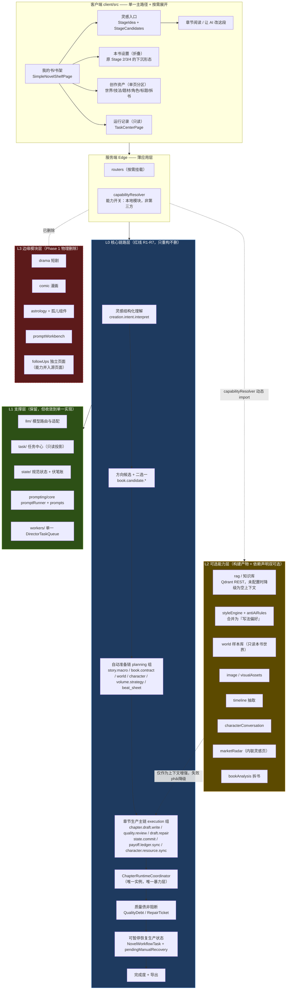
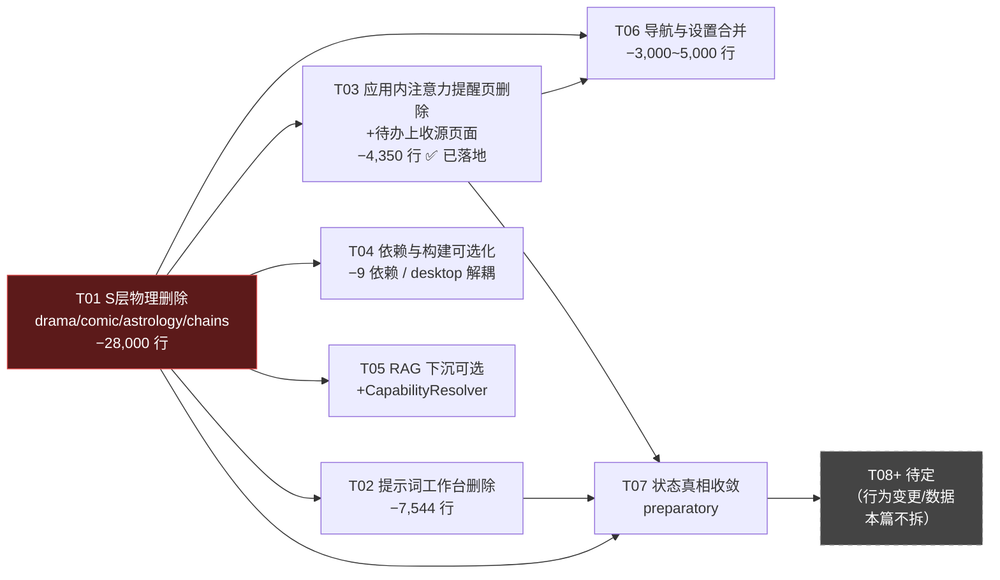

# 代码工程复杂度诊断与分层简化架构方案

> 文档类型：诊断 + 架构方案（本轮**不改任何代码、配置、数据库**，仅输出结论与可执行任务清单）
> 编写人：高见远（架构师）
> 根目录：`D:\workbuddyfiles\AI-Novel-Writing-Assistant-main`
> 上游输入：`docs\simplification\01-product-simplification-prd.md`（许清楚，产品侧 PRD，含附录 B 边界输入）
> 用户诉求：代码用起来非常复杂，希望在不丢核心能力的前提下激进精简
> 取向：**激进精简**（允许砍低频边缘模块、把可选依赖下沉为真正可选）

本文档所有数字均由本次对仓库的实读/实测得出（命令：`find`/`wc`/`grep -rl` 计数）。凡未核实处一律标注「未核实」，不做估算充数。

> **状态：✅ 已完成（术语已统一为「应用内注意力提醒 / Director Attention」，见 PR #28）。** 本文是简化工作的架构方案记录：其中 C4 / T03「应用内注意力提醒页（原「导演跟进」）删除 + 待办上收源页面」已落地——独立页面已移除，能力重命名为「应用内注意力提醒（Director Attention）」并收口到统一入口（导航栏角标 / 全局横幅 / 任务中心），源页面落点已验证（见 03-followup-removal-assessment.md）。下文保留当时的方案与风险登记供追溯。

---

## 0. 一句话结论

**这个产品的复杂度不是"写小说"这件事的复杂度，而是"把同一件事做了三遍以上，然后让三次实现互相翻译"的复杂度。**

实测到的三个硬事实可以概括全部问题：

1. **同一条生产流程有 9 套并行的命名真值表**（13 Stage / 9 Checkpoint / 3 lane / 22 编排步骤 / 8 展示阶段 / 8 工作台 Tab / 8 DirectorDisplayStageKey / 6 首页分组 / ~10 个 untyped step stage），靠至少 6 处 `switch`/`if` 链互相翻译，且其中 2 处翻译表的 key 已经不一致。
2. **三条 lane 各自演化出了独立的一整套编排栈**——`services/novel/director/`（117 文件 / 33,399 行）与 `services/novel/production/NovelPipelineExecutor.ts`（934 行）是两套章节执行编排器，同一个进程里 `ChapterRuntimeCoordinator` 被实例化了 **3 次**。
3. **162 张表里至少有 12 张在 `server/src` 中零引用**，其中 `DirectorRuntimeCommand / DirectorRuntimeExecution / DirectorRuntimeCheckpoint / DirectorRuntimeEvent / WorldSyncRecord / WorldAsset / ComicUploadAsset / MarketRankingItem` 连一个 Prisma 调用都没有。

因此本方案的核心不是"删掉某个功能"，而是：

> **先把 S 层物理删干净并让代码不再引用它（Phase 1，纯代码、零数据动作、可逆）；把可选能力改为真正的构建/依赖层可选（Phase 2，仍然零数据动作）；再统一状态真相到一套（Phase 3）；最后在独立批次里、凭已验证备份与用户显式批准，才处理数据库（Phase 4，本轮不执行）。**

---

# 第一部分：代码复杂度测绘（事实层）

## 1.1 全局体量基线

| 区域 | 文件数 | TS/TSX 行数 | 备注 |
|---|---:|---:|---|
| `client/src` | 636 | **121,960** | 团队基线 653 文件/126,701 行（含非 ts 文件），本次测得 ts/tsx 口径如上 |
| `server/src` | 1,147 | **216,962** | 与基线 1,218/294,369 的差异为口径不同（基线含 dist/日志/脚本等非源码） |
| `shared` | 75 | 15,023 | 其中 `shared/types` 70 文件 / 14,787 行 |
| `desktop` | 31 | 2,426 | |
| `site` | 36 | 1,760 | |
| **合计（一级源码）** | **1,925** | **358,131** | |

## 1.2 后端模块拓扑（`server/src` 一级，19 个目录）

| 目录 | 文件 | 行数 | 承载职责 |
|---|---:|---:|---|
| `services/` | 576 | **140,577** | 领域服务的主体实现（大而全） |
| `prompting/` | 151 | 31,218 | 提示词资产 + 执行器 + 工作台 |
| `modules/` | 76 | 16,054 | 第二套组织方式：按「能力域」切分，内含 http/application/domain 子层 |
| `agents/` | 46 | 9,639 | AI 工具箱（24 个 tools 文件）+ trace + approvalPolicy |
| `llm/` | 24 | 6,671 | 模型适配/工厂/限流/流式 |
| `routes/` | 26 | 6,107 | **扁平路由**（REST 面） |
| `creativeHub/` | 10 | 2,089 | AI 副驾（含 2 个 LangGraph） |
| `db/` | 6 | 1,186 | Prisma client + 运行时迁移 |
| `events/` | 9 | 718 | 事件总线 + 副作用 worker |
| `config/` | 5 | 335 | 含 `rag.ts`（Qdrant REST 配置） |
| `graphs/` | 4 | **522** | 4 个 LangGraph：characterDesign / novelOutline / worldBuilding / writingFormula |
| `platform/` | 5 | 627 | 日志保留、LLM live 探测 |
| `middleware/` | 3 | 305 | |
| `prisma/` | 196 | 0 | 全部为 `.prisma`/`.sql`，无 TS |
| `runtime/` | 2 | 155 | appPaths + 内存遥测 |
| `workers/` | 3 | 362 | DirectorTaskQueue / directorWorker / TaskDispatcher |
| `chains/` | 3 | **9** | **全部是 no-op 桩，零引用（详见 1.7）** |
| `types/` | 1 | 12 | |

### 1.2.1 `services` 与 `modules` 两套组织方式并存 —— 是复杂度来源，且是**主要**来源之一

实测：两者**没有任何同名文件**（`find server/src -name "*.ts" -exec basename {} \; | sort | uniq -c | awk '$1>1'` 结果为空），说明不是简单的复制，而是**同一批能力被从两个维度各切了一遍**：

| 能力 | `services/` 侧 | `modules/` 侧 |
|---|---|---|
| Novel | `services/novel/**` 328 文件 / 83,838 行 | `modules/novel/` 39 文件 / 7,475 行（http / creation-studio / short-story / writing-platform / production / setup） |
| Drama | `services/drama/` 28 / 4,132 | `modules/drama/http/dramaRoutes.ts` 1 / 799 |
| Comic | `services/comic/` 13 / 3,658 | `modules/comic/http/comicRoutes.ts` 1 / 1,071 |
| BookAnalysis | `services/bookAnalysis/` 32 / 6,633 | `modules/bookAnalysis/` 1 / 597 |
| World | `services/world/` 21 / 7,248 | `modules/setup/world/http` |
| CharacterConversation | `services/characterConversation/` 6 / 696 | `modules/characterConversation/http` 1 / 63 |
| export / marketRadar / timeline / setup / visualAssets | 无 | `modules/` 独占 |

结论：**不存在"某个能力只在一侧"的稳定规则**。一个 Drama 需求要同时知道 `services/drama`（领域逻辑）与 `modules/drama/http`（路由），而 Novel 需求要知道 `services/novel/**`（83,838 行）与 `modules/novel/**`（7,475 行）。这个分裂没有带来任何收益——`modules/` 总共只占 `services/` 的 11.4%，且其中 drama/comic/bookAnalysis/characterConversation 都是单行 http 壳。

额外证据：`server/src/modules/novel/` 内部还出现了第三套分层（`http/` / `application/` / `production/` / `creation-studio/` / `short-story/` / `setup/` / `writing-platform/`），即同一仓库里并行存在 **至少三种分层方言**。

### 1.2.2 `services/novel` 内部再分层（328 文件 / 83,838 行）

| 子目录 | 文件 | 行数 | 说明 |
|---|---:|---:|---|
| `director/` | 117 | **33,399** | auto_director lane 的完整编排栈 |
| `runtime/` | 44 | 9,410 | 章节运行时（两 lane 共享的"暴力层"） |
| `volume/` | 28 | 8,348 | 卷/拆章 |
| `workflow/` | 14 | 3,237 | NovelWorkflowTask 状态机 |
| `worldContext/` | 9 | 1,980 | |
| `production/` | 20 | **2,186** | manual_create lane 的编排栈（含 `NovelPipelineExecutor.ts` 934 行） |
| `state/` | 8 | 2,323 | 规范状态 |
| 其余（`fact` / `characterResource` / `application` / `storyMacro` / `characterPrep` / `dynamics` / `planning` / `chapterEditor` / `storyWorldSlice` / `characters` / `quality`） | 43 | 11,624 | |
| 根目录散装文件 | 45 | 13,231 | `novelCoreXxx` 系列 13 个、`NovelXxx` 系列 22 个等 |

`services/novel/director/` 再往下还有 **12 个子包**：

`runtime/` 38 文件 13,753 行 ｜ `workflowStepRuntime/` 15 / 3,742 ｜ `projections/` 10 / 3,707 ｜ `phases/` 11 / 2,752 ｜ `automation/` 9 / 2,522 ｜ `recovery/` 6 / 1,519 ｜ `commands/` 6 / 1,832 ｜ `http/` 2 / 755 ｜ `issues/` 5 / 373 ｜ `state/` 4 / 332 ｜ `idea/` 2 / 160 ｜ `langgraphPilot/` 1 / 311

**一个 `services/novel/director/runtime` 目录（13,753 行）就比整个 `client/src/components`（108 文件 / 12,314 行）还大。**

## 1.3 状态机复杂度 —— 全仓库最严重的问题

这是本次测绘最重要的发现。所谓"13 Stage / 9 Checkpoint / 3 lane / 22 步 / 8 审批点"远远没说全：**实测共有 9 类、至少 6 份字面平行的枚举真值表，外加至少 6 处人工翻译表。**

### 1.3.1 枚举定义（同一批阶段名被声明了几遍）

| # | 名称 | 数量 | 定义位置 | 关键证据 |
|---|---|---:|---|---|
| E1 | `NovelWorkflowStage` | 13 | `shared/types/novelWorkflow.ts:3-16` | `project_setup`…`quality_repair` |
| E2 | `NovelWorkflowCheckpoint` | 9 | `shared/types/novelWorkflow.ts:18-27` | |
| E3 | `NovelWorkflowLane` + `taskQueryKey` | 3 | `shared/types/novelWorkflow.ts:1, 59-84` | 三条 lane 各带一个 URL 参数名：`workspaceTaskId` / `directorTaskId` / `taskId` |
| E4 | `NovelWorkflowResumeTarget.stage`（内联联合） | 8 | `shared/types/novelWorkflow.ts:44` | `"basic"｜"story_macro"｜"world"｜"character"｜"outline"｜"structured"｜"chapter"｜"pipeline"` —— **第 4 套名字** |
| E5 | `WorkflowStepCatalogDisplayStage` | 8 | `shared/types/directorWorkflowStepCatalogData.ts:8-16` | |
| E6 | `WORKFLOW_DISPLAY_STAGES`（带 label） | 8 | `directorWorkflowStepCatalogData.ts:82-94` | 项目设定/故事宏观规划/世界观准备/角色准备/卷战略/节奏·拆章/章节执行/质量修复 |
| E7 | **`DirectorDisplayStageKey`** | 8 | `shared/types/directorRuntime.ts:861-869` | **与 E5 完全相同的 8 个 key，却独立重新声明了一遍**，两者之间无 import 关系 |
| E8 | `WorkflowStepCatalogEntry.stage`（**无类型约束的 `string`**） | ~10 | `directorWorkflowStepCatalogData.ts:46` 字段 + 实例值 | 实际取值含 `candidate_selection` / `candidate_confirm` / `takeover` / `story_macro` / `world_setup` / `character_setup` / `volume_strategy` / `structured_outline` / `chapter_execution` / `quality_repair` —— 其中 `candidate_selection`/`candidate_confirm`/`takeover` **不属于任何一个正式 Stage 枚举** |
| E9 | `WORKFLOW_STEP_CATALOG` | 22 | `directorWorkflowStepCatalogData.ts:130-680` | 22 个编排条目 |
| E10 | `WORKFLOW_CHECKPOINT_CATALOG` | 9 | `directorWorkflowStepCatalogData.ts:682-768` | |
| E11 | `WorkflowStepCatalogApprovalPoint` | 8 | `directorWorkflowStepCatalogData.ts:29-37` | |

### 1.3.2 人工翻译表（把上面这些表缝起来的地方）

PM 已指出 `novelWorkspaceNavigation.ts:94-138` 的两张 `switch`。**核实属实，并且还有第三、第四、第五张：**

| # | 翻译表 | 位置 | 形态 | 备注 |
|---|---|---|---|---|
| M1 | `tabFromWorkflowStageName` | `client/src/pages/novels/novelWorkspaceNavigation.ts:94-115` | `switch` 8 case | Stage → 工作台 Tab |
| M2 | `tabFromDirectorDisplayStage` | `novelWorkspaceNavigation.ts:117-138` | `switch` 8 case | DisplayStage → Tab（**与 M1 名字不同：-story_planning，+**） |
| M3 | **`tabFromDirectorProgress`** | `novelWorkspaceNavigation.ts:140-220` | **嵌套两段 `switch`（`checkpointType` 5 case + `currentItemKey` 21 case）+ 优先级仲裁逻辑** | 这才是真正决定 Tab 的函数；它把 checkpoint 表、itemKey 表和 Stage 表三份真相混在一起，并用 `getNovelWorkspaceFlowStepIndex(currentTab) > getNovelWorkspaceFlowStepIndex(checkpointTab)` 做仲裁 |
| M4 | `scopeFromWorkspaceTab` | `novelWorkspaceNavigation.ts:75-85` | `if` 8 段 | Tab → `DirectorLockScope`（又一套 8 项枚举） |
| M5 | `NOVEL_WORKSPACE_FLOW_STEPS`（Tab 定义 + label） | `novelWorkspaceNavigation.ts:16-25` | 常量数组 8 项 | **label 与 E6 不一致**：`outline`="卷战略 / 卷骨架" 而服务端 "卷战略"；`structured`="节奏 / 拆章" 而服务端 `structured_outline`="节奏 / 拆章" |
| M6 | **`workflowStageFromTab`（反向翻译）** | `client/src/pages/novels/novelWorkflow.client.ts:8-31` | `if` 链 7 段 | Tab → Stage，**是 M1 的反向重写**，两处必须同步维护 |
| M7 | **`HOME_JOURNEY_GROUPS`（第 6 套分组）** | `client/src/pages/home/homeJourney.ts:13-24` | 常量数组 6 组，自带 6 个 label | 把 8 个 DisplayStage 再合并成 6 组，label 又不一样（"世界与角色"/"卷与章节"/"正文创作"/"质量完善"） |
| M8 | **`formatStageLabel`（第 7 套 label，含不存在的 stage）** | `client/src/pages/novels/components/DirectorFactDebugDialog.tsx:22-34` | `if` 链 10 段 | 处理 `candidate_selection`/`candidate_confirm`/`takeover`/`book_contract` —— **这四个 key 在 E1/E5/E7 中都不存在** |
| M9 | `stageSchema` z.enum（9 项） | `server/src/services/novel/director/http/novelWorkflows.ts:17-27` | zod enum | 少了 `short_story_*` 三个；**且是字符串手抄，不与 E1 联动** |
| M10 | `checkpointSchema` z.enum（9 项） | `novelWorkflows.ts:29-39` | zod enum | 同上，手抄 E2 |
| M11 | **`lane: z.enum(["manual_create","auto_director"])`** | `novelWorkflows.ts:44` | zod enum **2 项** | **与 E3 的 3 项 lane 不一致** —— `creation_studio` lane 无法通过 `/api/novel-workflows` 的 bootstrap 入参校验 |

> **M11 是一个活的类型级不一致 bug 级证据**：`NovelWorkflowLane` 声明 3 条 lane（`shared/types/novelWorkflow.ts:1`），但 director 工作流 HTTP 入口只接受 2 条。中间环节必然存在"类型说是 3、运行时只认 2"的落差。

### 1.3.3 22 步目录内部还有一个自相矛盾的重复定义

`WORKFLOW_STEP_CATALOG` 里有两个条目的 **`nodeKey` 完全相同**：

| 行号 | `id` | `nodeKey` | `checkpoint` | `defaultProgress` | `orchestrationOrder` |
|---:|---|---|---|---:|---:|
| 562 | `chapter.draft.repair` | `chapter_repair_node` | `replan_required` | 0.97 | **1000** |
| 663 | `chapter.quality.repair` | `chapter_repair_node` | `replan_required` | 0.97 | **1000** |

两者的 `stage` / `displayStage` / `workflowStage` / `tab` / `reads` / `writes` / `policyAction` / `prerequisiteStepIds` / `orchestrationOrder` **全部相同**，仅 `id`、`aliases` 不同。

而 `orchestrationOrder: 1000` 被 **3 个条目共享**（第 512 行 `chapter.draft.write`、562 行、663 行）——也就是说 `orchestrationOrder` 这个"编排顺序"字段本身已经失去排序能力，真正的执行顺序一定来自别处（`prerequisiteStepIds` 图或硬代码顺序）。

这条直接踩了 TASK.md「明确不做」第 2 条：**不把两套预设复制成两套执行器**。

### 1.3.4 谁真的消费了这 22 步

| 导出 | 外部消费方数量 | 消费方 |
|---|---:|---|
| `WORKFLOW_STEP_CATALOG` | **1 个文件** | 仅 `shared/types/directorWorkflowStepCatalog.ts`（同包内的索引/查询函数） |
| `directorWorkflowStepCatalog.ts` 的整体 | **10 个文件** | `client/src/pages/home/homeJourney.ts`、`server/src/services/novel/director/projections/DirectorDisplayStateBuilder.ts`、`director/workflowStepRuntime/*`（4 个）、`services/novel/workflow/novelWorkflow.helpers.ts`、`services/task/novelWorkflowDetailSteps.ts`、`shared/types/autoDirectorApproval.ts` |
| `WORKFLOW_DISPLAY_STAGES` | **3 个文件** | `DirectorDisplayStateBuilder.ts` + shared 内部 2 个 |
| `WORKFLOW_CHECKPOINT_CATALOG` | **2 个文件** | 仅 shared 内部 |

**结论：这份被 PRD 描述为"22 个编排步骤"的核心资产，在整个仓库里只有 10 个文件真正引用它，其中客户端 1 个、服务端 5 个。它是一个"被写得很重、被用得很轻"的真相表。** 这恰恰说明：复杂度是**被构造出来的**，不是被需求逼出来的。

## 1.4 数据层（162 模型 / 192 迁移）

### 1.4.1 分布（按领域手工分组，共 162）

| 领域 | 模型数 | 代表模型 |
|---|---:|---|
| 小说核心 / 成书 / 版本 | ~18 | Novel, NovelIntentVersion, CreationStudioConfirmation, NovelSnapshot, Chapter, ChapterArtifactSyncCheckpoint, StorylineVersion, VolumePlan*, QualityReport, StoryMacroPlan, BookContract, ChapterPlanScene, StoryPlan, ReplanRun, AuditReport, AuditIssue, PlotBeat, ChapterSummary, ConsistencyFact, GenerationJob, ChapterAutomaticAttempt, NovelFactEntry |
| 自动导演运行时 | ~22 | NovelWorkflowTask, DirectorRun*, DirectorStepRun, DirectorRuntime*, DirectorEvent, DirectorArtifact*, DirectorLlmUsageRecord, AutoDirector*（3）, DirectorArtifactDependency |
| 角色 | ~24 | Character, CharacterMindSnapshot, CharacterInfluenceProposal, CharacterDialogue*, CharacterConversation*, CharacterRelation, CharacterCast*, CharacterTimeline, CharacterCandidate, CharacterVolumeAssignment, CharacterFactionTrack, CharacterRelationStage, BaseCharacter*, CharacterLibraryLink, CharacterSyncProposal |
| 世界 | ~10 | World, NovelWorld, WorldSyncRecord, WorldAsset, WorldPropertyLibrary, WorldSnapshot, WorldDeepeningQA, WorldConsistencyIssue, WorldPropertyLibrary… |
| 拆书 bookAnalysis | ~12 | BookAnalysis, BookAnalysisSourceCache, BookAnalysisSection, BookAnalysisCharacter*（6） |
| 短剧 drama | 10 | DramaProject, DramaSourceBundle, DramaCharacter, DramaEpisode, DramaFact, DramaCharacterLibrary, DramaStoryboard, DramaShot, DramaVideoPrompt, DramaBatchJob |
| 漫画 comic | 11 | ComicProject, ComicSourceBundle, ComicCharacter, ComicCharacterAsset, ComicScene, ComicEpisode, ComicPanel, ComicFact, ComicUploadAsset, ComicExportJob, ComicBatchJob |
| 时间线 timeline | 5 | StoryTimelineEvent, ChapterTimeAnchor, TimelineHook, TimelineConstraint, TimelineCheckReport |
| 知识库/RAG | 6 | KnowledgeDocument, KnowledgeDocumentVersion, DocumentChapter, KnowledgeBinding, KnowledgeChunk, RagIndexJob, RagRetrievalTrace |
| 题材雷达 | 5 | MarketScanRun, MarketRankingSnapshot, MarketRankingItem, MarketTrendReport, MarketSavedTopic, MarketCreativeBrief |
| 写法/图像/旁观 | ~20 | ImageGenerationTask, ImageAsset, VisualAssetProjection, Style*, AntiAiRule, WritingFormula, WritingPlatformProfile*, CreativeDecision, CreativeHub* |
| 提示词治理 | 8 | PromptAddendum, PromptSlotOverride, PromptTemplateOverride, PromptTemplateVersion, PromptTemplateOverride… |
| 任务/审计/杂项 | ~21 | AgentRun, AgentStep, AgentApproval, TaskCenterArchive, GenerationJob, NovelSideEffectJob, APIKey, AppSetting, ModelRouteConfig, TitleLibrary, NovelGenre, NovelStoryMode, NovelBible … |

### 1.4.2 迁移历史成因

- **双 schema 双 migration**：`schema.prisma`（4,182 行）+ `schema.sqlite.prisma`（4,094 行），两者都是 **162 个 model**，必须手工同步维护。
- **192 个 SQL 迁移文件**（`migrations/` 90 个 Postgres + `migrations.sqlite/` 102 个 SQLite），合计 **9,093 行 SQL**。（注：团队基线引用的"216 个"与本次实测 192 的差值为目录内非 `.sql` 文件，本文采用实测值。）
- **时间跨度**：`20260313170000_init` → `20260922120000_market_radar_multiple_reports`，约 6 个月。
- **churn 证据（同一主题被迁移多次）**：
  - `style_extraction_task` 出现 **2 次**（`20260421183000` 与 `20260422190000`）
  - `style_profile_extraction_metadata` 出现 **2 次**（`20260421224500` 与 `20260422190500`）
  - `20260328120000_schema_gap_backfill` / `20260419123000_schema_column_backfill` —— **两个独立的"补列"回填迁移**，说明 schema 是先上线后回填的模式
  - 最后一批（`20260916090000`–`20260916090500`）连续 6 个迁移全是 drama/comic 相关，即 S 层模块在生命周期末期仍在持续加表

同一个能力在 6 个月内被迁移了 2 次、并在最后阶段为一个永不上线的功能加表——**这是"边演模型边上线"的典型迁移史**，也是 162 张表的主要成因。

### 1.4.3 疑似无写入方 / 完全无引用的表

方法：对 `server/src` 全部 `.ts` 做 `prisma|db|tx|client.<model>.` 正则扫描并去重。

**完全找不到任何 Prisma 访问的 12 张表**：

| 模型 | 二次核验结果 |
|---|---|
| `CharacterCastOptionMember` / `CharacterCastOptionRelation` | 树外唯一命中是 prompt schema 里的 zod 定义（`characterPreparation.promptSchemas.ts:122,167`），**不是数据库访问**。疑似通过 `CharacterCastOption` 嵌套写入，需最终确认 |
| `NovelWorld` | `server/src` 中 164 处 `novelWorld` 全部是 `NovelWorldSlice` 相关，**无 `prisma.novelWorld.` 调用** |
| `WorldSyncRecord` / `WorldAsset` | 字面量 **0 命中** |
| `ChapterAutomaticAttempt` | 仅 2 处，都是类型引用（`ChapterAutomaticAttemptService.ts:4,7`），实际写入未核实到 |
| `DirectorRuntimeCommand` / `DirectorRuntimeExecution` / `DirectorRuntimeCheckpoint` / `DirectorRuntimeEvent` | **字面量 0 命中**（`directorRuntimeEvent` 的 2 处命中是 zod schema 名，非 Prisma） |
| `ComicUploadAsset` / `MarketRankingItem` | 字面量 **0 命中** |

> **重要限定**：以上均为「静态扫描未见写入方」，不等价于「表为空」。最终处置必须走第四节的数据保护流程。

## 1.5 提示词资产（162 个注册资产 / 104 个 .ts 文件 / 21,232 行）

### 1.5.1 组织方式

```
server/src/prompting/
├── core/          7 文件  2,406 行   promptRunner(1,264) / contextBudget / renderContextBlocks / structuredOutputHint / promptQualityTelemetry
├── prompts/     104 文件 21,232 行   提示词本体（按域分 22 个子目录）
├── registry/      2 文件    656 行   promptAssetLoaderEntries.ts（27,989 字节，162 条 key→require 映射） + README
├── slots/         6 文件  1,141 行
├── templates/     5 文件  1,173 行
├── context/       8 文件    783 行
├── materials/     4 文件    810 行
├── workbench/     4 文件    820 行   ← S4 提示词工作台
├── addendums/     1 文件    330 行
├── workflows/     6 文件    832 行
├── PromptWorkbenchService.ts   817 行   ← S4
├── registry.ts                 138 行
└── promptCatalog.ts             80 行
```

### 1.5.2 命名空间分布（162 个注册 key）

| 命名空间 | 数量 | 命名空间 | 数量 |
|---|---:|---|---:|
| novel | **74** | director | 2 |
| world | 17 | comic | 2 |
| drama | **12** | audit | 2 |
| style | 11 | title / storyWorldSlice / state / rag / genre / creation | 各 1 |
| bookAnalysis | 10 | | |
| planner | 5 | | |
| image / character | 各 4 | | |
| writingFormula / storyMode / market_radar / agent | 各 3 | | |

### 1.5.3 三个具体的机制性问题

1. **27,989 字节的手写注册表**。`promptAssetLoaderEntries.ts` 逐条列出 `key → () => require("../prompts/...").xxxPrompt`。新增一个 prompt 必须手工登记，重复登记会在**启动时抛错**（`registry.ts:13-15`）。这是典型的手工索引脆弱性。
2. **注册表 key 形同虚设**。实测：全部 161 个 key 在 `server/src` 范围内（排除 registry/catalog/prompts 自身）**均无任何字符串引用**——真正的消费方式是**直接 `import` 具名符号**（例如 `server/src/modules/marketRadar/application/MarketRadarService.ts` 直接 import prompt 对象）。这意味着：① 静态工具无法判断任何 prompt 是否被消费；② key 与实体可能漂移；③ 整个 key 层带来的只是运行时开销与维护成本。
3. **`promptCatalog.ts` 只给 47/162（29%）写了中文描述**，其余 115 个落到 `switch (taskType)` 兜底，最终兜底为「通用任务」。也就是 UI 上有 71% 的 prompt 显示不出人话名字。

### 1.5.4 死 prompt 候选

扫描 `prompting/prompts` 下 103 个 `.ts`，**仅被 `server/src/prompting` 内部引用**、树外零引用的有 **24 个**（合计 ≫1,300 行），其中绝大多数是 `*.promptSchemas.ts`（被同域 prompt 共享，**不是死代码**，属于正常组织），需逐个甄别。

由 S 层删除直接连带消失的：

| 目标 | 文件 | 行数 | 注册资产数 |
|---|---|---:|---:|
| drama prompts | `prompts/drama/drama.prompts.ts` | 632 | 12 |
| comic prompts | `prompts/comic/comic.prompts.ts` | 347 | 2 |

## 1.6 巨型文件 Top 10 —— 逐个给出"为什么长"

| # | 文件 | 行数 | 成因分类 | 为什么长（实读依据） |
|---:|---|---:|---|---|
| 1 | `client/src/pages/novels/NovelEdit.tsx` | 2,871 | **状态编排 + 视图装配** | 一个页面装配 8 个流程 Tab + 1 个工具 Tab 的全部状态与回调；旁证：`pages/novels/novelEditPlanningTabs.ts` 中 `BuildNovelEditPlanningTabsInput` 入参对象约 **150 个字段**（PM 实测）。长的原因不是 if/else，是「把整条工作台的入参摊平在一个入参对象上」 |
| 2 | `server/src/prompting/prompts/world/world.prompts.ts` | 1,312 | **提示词文本** | 世界设定的多轮 prompt 文本（`world.layer.generate` / `world.structure.generate` / `world.deepening.questions` / `world.consistency.check` 等 17 个 world 资产的一部分） |
| 3 | `server/src/services/world/worldStructure.ts` | 1,311 | **领域管线** | 世界结构生成的完整管线（骨架生成 → 层次深化 → 回填 → 一致性检查），对应 `world.structure.generate` / `world.structure.backfill` / `world.layer.*` |
| 4 | `client/src/pages/comic/project/CharactersPanel.tsx` | 1,309 | **视图（S2 层）** | 漫画角色面板，**属于可删 S 层**，成才再多也不影响核心链路 |
| 5 | `server/src/services/novel/runtime/ChapterArtifactDeltaService.ts` | 1,292 | **AI 输出 → 状态的差分/回灌** | 章节定稿后把 LLM 提取的事实变化写回 6 类规范状态；对应 Henry's `novel.chapter.artifact_delta.extract`。长的原因是「一张 haberritungs Promise.all 里扇出到所有 state store」 |
| 6 | `shared/types/directorRuntime.ts` | **1,277** | **纯类型定义** | 这是关键信号：**第 6 大文件不含一行业务逻辑**，它是"运行时快照/投影/事件/审批/命令"全部接口的并集。类型本身长成了产品复杂度的一面镜子 |
| 7 | `server/src/prompting/core/promptRunner.ts` | 1,264 | **执行引擎** | 渲染 + 上下文预算 + 结构化输出提示 + 质量遥测 + 重试，被全部 162 个 prompt 共用 |
| 8 | `server/src/services/rag/RagIndexService.ts` | 1,242 | **可选能力** | Qdrant REST 批量 upsert + 分片 + 并发控制（可下沉） |
| 9 | `shared/types/novel.ts` | **1,161** | **纯类型定义** | 同上，Novel 领域接口并集 |
| 10 | `server/src/services/novel/director/runtime/novelDirectorTakeover.ts` | 1,158 | **接管/补偿编排** | 「把一本已经在别处（manual_create lane）建起来的书导入 director 计划」的补偿逻辑。**它的存在本身就是 lane 分裂的产物**——如果只有一条 lane，这个文件不需要存在 |

**Top 10 里：2 个是纯类型定义（2,438 行）、2 个是可删层（1,309 + 1,242 = 2,551 行）、1 个是 lane 分裂的补偿产物（1,158 行）、1 个是提示词文本（1,312 行）。真正属于"面条式 if/else"的，一个都没有。**

这个分布本身就是结论：**复杂度堆积在"描述表象"和"补偿历史"上，而不是堆积在算法逻辑上。**

> 其余 PM 已提及的大文件复核：`directorExecutionStepModules.ts` 880（bundles 8 个 execution step 的工厂，1:1 对 22 步目录）、`StyleProfileService.ts` 915、`directorRuntime` 见上、`RagIndexService` 见上、`novelDirectorTakeover.ts` 1,158 全部属实。

## 1.7 重复实现 / 死代码 / 被冻结但占体积的模块

### 1.7.1 已确认**完全死**的代码

| 对象 | 体量 | 证据 |
|---|---:|---|
| **`server/src/chains/`（整个目录）** | 3 文件 / **9 行** | 三个文件各 1 行 export，全部是 **no-op 桩**：`runChatChain(msg){return msg}` / `runTitleGeneratorChain(topic){return \`Untitled - ${topic}\`}` / `runWritingFormulaChain(x){return x}`。全仓 `--include=*.ts` 搜索 `runChatChain` / `runTitleGeneratorChain` / `runWritingFormulaChain` / `chains/`，**除自身定义外零命中** |
| **`server/src/routes/astrology.ts`** | 17 行 | 唯一 handler 返回 **`res.status(501).json({success:false, error:"占星模块暂未实现。"})`**。挂载于 `app.ts:164`，无任何客户端调用方 |
| **`client/src/pages/astrology/AstrologyPage.tsx`** | 13 行 | PM 已核实零引用；本次复核 `client/src` 中 `astrology/Astrology` 仅此一处 |
| PM 列出的 6 个孤儿组件 | 合计 **1,006 行** | 实测行径：`CreativeHubNovelSetupCard` 185、`NovelProductionStarterCard` **561**、`GenreTreeItem` 108、`HomeAttentionQueue` 27、`HomeRecentNovels` 76、`NovelWorkflowRunningIndicator` 36 |
| 1 行转发壳文件 | 8 个 | `DirectorStateCommitter.ts` / `DirectorStateReader.ts` / `DirectorStateStore.ts` / `NovelExportService.ts` / `production/{attempts,completion,preparation}/index.ts` / `runtime/acceptance/index.ts`，内容均仅一行 `export { X } from "./..."` |
| `DirectorRuntimeCommand` 等 4 张表 | 见 1.4.3 | 字面量 0 命中 |

### 1.7.2 平行实现（重复配置的执行器）

| 现象 | 证据 |
|---|---|
| **同一进程 3 个 `ChapterRuntimeCoordinator` 实例** | `server/src/services/novel/application/NovelApplicationServices.ts:59`（正文）与 `:60`（**第二个，专用于 quality repair**），以及 `server/src/services/novel/novelCorePipelineService.ts:33`。三个实例各自持有自己的依赖闭包 |
| **两套章节编排器** | `services/novel/director/**`（33,399 行，auto_director lane） vs `services/novel/production/NovelPipelineExecutor.ts`（934 行，被 `novelCorePipelineService.ts:34` 实例化，manual_create lane）。`NovelPipelineExecutor` 的树外引用方只有 **3 个**：`novelCorePipelineService.ts`、`PlannerService.ts`、`PlannerReplanService.ts` |
| **22 步目录里的重复条目** | `chapter.draft.repair` 与 `chapter.quality.repair` 共享 `nodeKey: "chapter_repair_node"` 且其余字段几乎全同（见 1.3.3） |
| **8 个 home vs 6 个 Tab vs 8 个 Stage 的三份进度真相** | 见 1.3.2（M5 / M7 / E6） |

### 1.7.3 featureFlag 冻结但仍在码库/构建中的模块

`client/src/config/featureFlags.ts` 全文只有 **13 行、3 个开关**（`creationStudioEnabled` / `worldWizardEnabled` / `worldVisEnabled`），全仓仅 **7 个文件**引用它。

即：**"featureFlag 隐藏"这件事在这个项目里几乎没有被使用**。所谓"开关关掉了"，绝大多数情况下只是 UI 上不放入口，代码、路由、路由对应的 server handler、依赖包、测试用例全部还在。这正是 PRD 边界输入第 5 条要求覆写的地方。

## 1.8 测试结构

| 区域 | 文件数 | 行数 | 运行方式 |
|---|---:|---:|---|
| `server/tests/` | **276** | **75,922** | `*.test.js`；`server/package.json` 的 `test` = 先 `build`（`tsc`）再 `node scripts/run-tests.cjs fast`；`test:all` 追加 integration |
| `client/tests/` | 20 | 1,989 | `*.test.js` / `*.test.mjs`；`node --experimental-strip-types --test tests/*.test.js src/**/*.test.mjs` |
| **合计** | **296** | **77,911** | |

结构性问题：

1. **客户端覆盖率近乎为零**：client 测试 1,989 行 vs client 源码 121,960 行 = **1.6%**；而 server 测试占 server 源码的 **35%**。客户端 —— 也就是 PM 全部 P0 需求所在的那一层 —— 几乎没有回归网。
2. **测试先编译再跑**：server 测试依赖 `tsc` 产物，反馈链路长，天然鼓励"改完先跑再说"的工作方式。
3. **测试是为实现细节服务的快照**：`server/tests` 里 `directorXxx*.test.js` 有 **70+ 个**、`chapterXxx*.test.js` 有 **20+ 个**、加上 `characterXxx` 十余个。一旦执行器数量从 3 个收敛到 1 个，这些针对具体编排器的期望需要重写——P档 Phase 3 的成本在此。
4. **为将要删/已冻结逻辑服务的测试**（随 S 层删除一并处理）：

| 目标 | 涉及测试文件数 |
|---|---:|
| drama / Drama | ~12（低谷 literacy 9+3） |
| comic / Comic | ~7（5+2） |
| autoDirectorFollowUp* | **12** |
| bookAnalysis / BookAnalysis | ~14 |
| styleEngine | ~11 |
| creativeHub | ~5 |
| marketRadar | ~4 |

---

# 第二部分：复杂度根因诊断

> 目标：回答「为什么一个『帮新手写小说』的产品需要 162 张表和 22 个编排步骤」。以下 9 条按「带来的复杂度成本」降序。

## RC1 ｜三条 lane 各自演化成了一整套平行系统，而不是一条链的三个入口

**现象**：同一章的生产，既可以从 `auto_director` 进（走 `services/novel/director/**`），也可以从 `manual_create` 进（走 `services/novel/production/NovelPipelineExecutor.ts`），还可以从 `creation_studio` 进。三者各自有一套 URL 参数、一套恢复入口、一套投影 builder。

**证据**
- `services/novel/director/**` = 117 文件 / **33,399 行**，内含 12 个子包
- `services/novel/production/NovelPipelineExecutor.ts` = 934 行，被 `novelCorePipelineService.ts:34` 实例化
- `ChapterRuntimeCoordinator` 在同一进程被实例化 **3 次**（`NovelApplicationServices.ts:59`、`:60`、`novelCorePipelineService.ts:33`）
- `NOVEL_WORKFLOW_LANE_DESCRIPTORS`（`shared/types/novelWorkflow.ts:59-84`）给三条 lane 各分配一个 `taskQueryKey`：`workspaceTaskId` / `directorTaskId` / `taskId`
- 而 HTTP 入口只认 2 条 lane：`novelWorkflows.ts:44` 的 `z.enum(["manual_create","auto_director"])`
- PM 亦指出：同一本书在不同入口会带不同的 URL 参数，书签与恢复入口不稳定

**历史成因**：`manual_create` 是早期"手工填表"时代的主 lane；`auto_director` 是后来为「AI 替你做」加的；`creation_studio`（`shared/types/creationStudio.ts` 的 `NarrativeForm="short_story"|"long_novel"`）是再后来为 AI-First 加的第三 lane。每一次加 lane 时，收敛旧 lane 意味着要迁移已有书/任务的数据，于是选择了"并行保留 + 加一张翻译表"。

**复杂度成本**：这是全仓库**最大的乘数因子**。任何横切改动（超时、重试、熔断、质量门禁、观察性）都要在 N 处落地。证据：`automation/` 里为 auto lane 单独写了 9 个文件 2,522 行（含专门的 circuit breaker runtime 276 行），而 manual lane 的 `production/` 里又有一套自己的 `PipelineIssueGovernance`(69) + `PipelineExecutionLeaseService`(68) + `ChapterQualityClosure`(240)。**两套熔断器、两套 lease、两套质量闭环。**

---

## RC2 ｜同一条流程存在 9 类并行命名真值表，靠 6 处人工 switch/if 翻译

**现象**：见 §1.3 全表（E1–E11 + M1–M11）。一句话概括：**一个概念（"当前进行到哪一步"）在代码里有 20 处字面定义。**

**证据（最锋利的三条）**
- M1/M2/M3：同一个文件里三张翻译表，`tabFromDirectorProgress` 单次调用要过 `checkpointType`(5 case) + `currentItemKey`(21 case) 两张表再加一次 index 大小比较仲裁
- E7 `DirectorDisplayStageKey`（`directorRuntime.ts:861-869`）与 E5 `WorkflowStepCatalogDisplayStage`（`directorWorkflowStepCatalogData.ts:8-16`）是**相同的 8 个 key，被独立声明了两次，互无引用**
- M8 `formatStageLabel`（`DirectorFactDebugDialog.tsx:22-34`）处理 `candidate_selection` / `candidate_confirm` / `takeover` / `book_contract` —— **这四个 stage 在任何正式枚举里都不存在**，它们只存在于 E8 那个 `stage: string` 无类型字段的实际取值中

**历史成因**：Tab（给人看的导航）先有，Stage（给机器看的 LangGraph 状态）后有，DisplayStage（为了给 UI 一个更友好的中间层）再有，HomeJourney（首页要 6 步而不是 8 步）再有。每一次"名字不好听就再加一层"，从没人回头删旧层。

**复杂度成本**：这是**直接违反 AI-First 规则**的一处（硬编码分支表驱动产品级核心路由），同时是命名漂移的永动机。仅 `_ freight:` PM 指出的工作流 Tab 与服务端 Stage 同名不同 label（`outline`="卷战略/卷骨架" vs "卷战略"）就已经造成用户困惑；更糟的是，新增一个阶段要同时改 **11 处枚举 + 至少 6 处翻译表**。

---

## RC3 ｜"可观测/可恢复"被实现为「给每个状态加一张表 + 一个投影」，而不是一个统一状态模型

**现象**：162 张表不是因为业务实体多，而是因为「运行时的每一种中间态都被拍平成了一张表」。

**证据**
- 仅自动导演运行时就有 ~22 张表：`NovelWorkflowTask` / `DirectorRun` / `DirectorStepRun` / `DirectorRunCommand` / `DirectorRuntimeInstance` / `DirectorRuntimeCommand` / `DirectorRuntimeExecution` / `DirectorRuntimeCheckpoint` / `DirectorRuntimeEvent` / `DirectorEvent` / `DirectorArtifact` / `DirectorArtifactDependency` / `DirectorLlmUsageRecord` / `AutoDirector*`(3) …
- 其中 **`DirectorRuntimeCommand` / `DirectorRuntimeExecution` / `DirectorRuntimeCheckpoint` / `DirectorRuntimeEvent` 在 `server/src` 中字面量 0 命中**
- `DirectorArtifactDependency` + `DirectorArtifact` 是给"产物依赖图"单建的两张表
- 补偿性現存另有表：`StoryStateSnapshot` / `CharacterState` / `RelationState` / `InformationState` / `ForeshadowState` / `CharacterResourceLedgerItem` / `CharacterResourceEvent` / `CanonicalStateVersion` / `StateChangeProposal` / `ChapterArtifactSyncCheckpoint` / `TaskCenterArchive` / `OpenConflict`

**历史成因**：因为一次全书生成要跑几小时到几天，任何中断都必须能从任意点恢复。于是**每一个被担心会断的地方**都被单独做成一张 checkpoint 表 + 一个 recovery service（`director/recovery/` 6 文件 1,519 行）+ 一个 background sync（`runtime/ChapterArtifactBackgroundSyncService.ts` 817 行 + `ChapterArtifactSyncCheckpointStore` 145 行 + `ChapterArtifactRecoveryService` 212 行）。9 个 Checkpoint、22 个编排步骤都是这条路径的产物。

**复杂度成本**：162 张表要维护两份 schema、双份 migration；任何一个状态语义变化要在 `-prisma` 与 `sqlite-prisma` 同步两边改。**并且这条路径与 R5（质量债非阻断）冲突的风险最高**——checpoint 表越多，"局部问题升级为全局 stop"的路径越多。

---

## RC4 ｜可选能力在启动期被无条件装配，featureFlag 只摘掉了入口

**现象**：所谓"已下沉为可选"在代码层并不成立。

**证据**
- `server/src/app.ts` 顶层 **import 了 27 个 router**，包括 `dramaRouter`(:32) / `comicRouter`(:33) / `astrologyRouter`(:12, 返回 501) / `ragRouter`(:39)
- `server/src/app.ts:266` 无条件调用 **`ragServices.ragWorker.start()`**（以及 `:267` 保留期清理 worker）——即**没有配置 Qdrant 也会起一个 worker**
- `client/src/router/index.tsx` 无条件 `lazy()` 声明全部 **39 个页面**，`featureFlags` 被顶层 eager import
- `client/src/config/featureFlags.ts` 只有 **3 个开关、13 行**，全仓仅 7 个文件引用

**历史成因**：Express app 启动即挂载是最省事的写法；vite 的 `lazy()` 已经做了路由级代码分割，就在实践中把"已经分割了=已经可选了"当成了结论，但**声明仍在 bundle graph 里、server handler 仍在内存里、worker 仍在跑**。

**复杂度成本**：删一个导航项的实际收益 ≈ 0（源码、依赖、构建图、内存占用都不变）。这正是 PRD 边界输入第 5 条点名要解决的问题。

---

## RC5 ｜依赖声明与实际使用漂移：9 个声明依赖零引用，多个重型依赖只服务一个可删页面

**现象与方法**：对 `client/package.json` 的每一项 dependency，在 `client/src` / `client/scripts` / `client/vite.config.ts` / `site/src` / `desktop/src` 全量 grep 其包名。

**证据 —— 零引用的声明依赖（9 个）**

| 包 | client/src 命中文件数 | 备注 |
|---|---:|---|
| `recharts` | **0** | 无任何位置命中 |
| `dagre` | **0** | 连同 `client/scripts` 也无 |
| `d3-array` | **0** | |
| `d3-selection` | **0** | |
| `d3-zoom` | **0** | |
| `@platejs/ai` | **0** | |
| `@assistant-ui/react-ui` | **0** | |
| `@assistant-ui/react-devtools` | **0** | |
| `@langchain/langgraph-sdk` | **0** | 仅出现在 `vite.config.ts:85` 的 manualChunks 字符串判断里 |

**证据 —— 只被 S 层使用的重型依赖**

| 包 | 使用文件 | 使用范围 |
|---|---:|---|
| `@assistant-ui/react` | 7 | 仅 `pages/chat/`(1) + `pages/creativeHub/`(6) |
| `@assistant-ui/react-langgraph` | 3 | 仅 `pages/creativeHub/` |
| `@xyflow/react` | 5 | `components/tensionCurve/`(2) + `pages/worlds/visualization/`(2) + `characterWorkspace/`(1) |
| `d3-force` | 2 | `characterWorkspace/`(1) + `worlds/visualization/`(1) |
| `platejs` | 6 | 其中 3 个在 `pages/promptWorkbench/` |
| `sharp` + `@aws-sdk/client-s3` | server 侧 | 图像/S3，仅服务 `services/image/` |

**历史成因**：每加一个可视化/编辑器功能就装一套库；功能后来被砍或被替换了，依赖留了下来。PM 提到的 S10（世界样本 Wizard，`@xyflow/react`+`d3-force` 的主要去处）就是典型。

**复杂度成本**：安装体积、`pnpm install` 时间、依赖树 CVE 波及面、以及最重要的——**新人不知道哪些依赖是真的在用**。

---

## RC6 ｜提示词被当成"可版本化资产"而不是"代码"，于是长出了一层没有任何工具能校验的间接层

**现象**：162 个资产 + 27,989 字节的手写 key→require 注册表 + 47 条人工描述，但消费全靠直接具名 import。

**证据**
- 全部 161 个 key 在 `server/src` 范围（排除 registry/catalog/prompts 自身）**零字符串命中**（§1.5.3）
- `promptCatalog.ts` 只描述 **47/162（29%）**，其余 115 个落到 `switch(taskType)` 兜底为「通用任务」
- `registry.ts:13-15` 在重复登记时**抛错中断启动**——一个纯手工维护的清单却具备了让服务起不来的故障能力

**历史成因**：`PromptAddendum` / `PromptSlotOverride` / `PromptTemplateOverride` / `PromptTemplateVersion` 这 8 张表说明设计目标是"运行时可覆盖提示词"。为此做了注册表。但实际消费写成了直接 import（更快、更类型安全），注册表就退化成了一个只有元数据价值的清单。

**复杂度成本**：任何静态工具都无法回答"这个 prompt 还有人用吗"；新增/删除 prompt 的成本里包含一次手工登记。

---

## RC7 ｜双 provider 双 schema 双迁移史被完整保留并持续手工同步

**现象**：`schema.prisma`（4,182 行，162 model）+ `schema.sqlite.prisma`（4,094 行，162 model），两套 migration 各 90 / 102 个 SQL。

**证据**
- 同一能力在 SQLite 侧要先有才能给 desktop/local 用，PG 侧要有才能上服务
- churn 证据：`style_extraction_task` ×2、`style_profile_extraction_metadata` ×2、`*_backfill` ×2（§1.4.2）
- 最后一批迁移 `20260916090000`–`20260916090500` 连续 6 个全给 drama/comic

**历史成因**：桌面版需要零配置 SQLite，云端需要 PG。两边都没有被当作"第二公民"，而是各自全量镜像。

**复杂度成本**：schema 改动的认知成本 ×2；任何漏同步都会在运行时炸；`192` 个迁移文件让"看清当前表结构"这件事几乎不可能只靠读迁移。

---

## RC8 ｜文件名与目录名承担了全部语义，导致"看起来有 500 个 service，实际只有几条链"

**现象**：`server/src/services` 有 576 个文件、`services/novel` 有 328 个文件，但真正的生产主链只有 `WORKFLOW_STEP_CATALOG` 里 execution 组的 6 步（`chapter.draft.write` / `chapter.quality.review` / `chapter.draft.repair` / `chapter.state.commit` / `payoff.ledger.sync` / `character.resource.sync`）+ planning 组的 6 步。

**证据**
- `WORKFLOW_STEP_CATALOG` 全仓库只有 **10 个文件**引用（§1.3.4）
- 22 步逐一对照 PM 的红线定义后：planning 6 + execution 6 = **12 步是 R2/R3 红线**；candidate 4 步是 **R1**；`book.project.create` 1 步是建书；`executionContractSync` 1 步；**其余 4 步（`workflow.takeover.execute`、重复的 `chapter.quality.repair`、以及 candidate 组内 4 步中的部分 refine/patch/title_refine）并非端到端必需**
- 也就是说，**至少 3 步（`workflow.takeover.execute` 与其重复的 `chapter.quality.repair`）纯粹是历史负债**

**复杂度成本**：83,838 行的 `services/novel` 里，读者无法从目录结构分辨什么是主链、什么是旁支、什么已经死了。**这直接放大了"接手成本"，而本团队现在就在付这个成本。**

---

## RC9 ｜测试被视为"事后快照"而非"架构约束"，且在主要用于保护实现细节

**现象**：296 个测试文件 / 77,911 行，其中客户端只有 20 个 / 1,989 行。

**证据**
- client 测试行数 / client 源码行数 = **1.6%**；server = **35%**
- `server/tests` 里 `director*.test.js` **70+** 个、`chapter*.test.js` **20+** 个——绝大多数是对具体编排器内部行为的期望
- server `test` 脚本 = `shared build` → `server build`(`tsc`) → `node scripts/run-tests.cjs fast`，**必须先全量编译**

**历史成因**：主链路（AI + 长事务）难以单测，于是测试集中在可确定性验证的编排断言上；久而久之积累成对实现细节的快照集。

**复杂度成本**：Phase 3（状态机收敛、lane 收敛）会一次性作废大量测试期望 → 这是 PM Q4「lane 收敛成本很高」的技术侧实质。同时也解释为什么过去没人敢动这些架构：**改架构 = 改几百个测试期望**。

---

# 第三部分：简化后的目标架构

## 3.1 目标架构图



## 3.2 分层边界定义

| 层 | 包含什么 | 判定标准 | 处置原则 |
|---|---|---|---|
| **L0 核心链路层** | `creation.intent.interpret` → `book.candidate.*` → planning 6 步 → execution 6 步 → `ChapterRuntimeCoordinator` → 质量债 → 恢复 → 导出 | 是否直接服务"新手把整本书写完"（PM 的 R1–R7） | **不可删，只可重构**。任何改动必须先证明不破坏质量债非阻断 |
| **L1 支撑层** | `llm/`（模型路由）、`task/`（只读投影）、`state/`（规范状态+伏笔账）、`prompting/core`（执行器）、`workers/`（队列） | 核心链路的不可替换依赖 | **收敛到单一实现**。当前主要问题是「同样的东西有多个实例/多份实现」（如 3 个 Coordinator、2 套熔断） |
| **L2 可选能力层** | RAG/知识库、写法引擎+反AI规则、世界样本库、图像/视觉资产、时间线抽取、角色对话、题材雷达、拆书 | 存在能让主链跑通、不装它也不影响"写完一本书"的能力 | **构建产物 + 依赖声明双可选**：① `capabilityResolver` + `await import()` 动态加载；② 依赖移出主 package.json 或标 `optionalDependencies`；③ 未配置时返回空上下文，**绝不抛错、绝不阻断** |
| **L3 边缘模块层** | drama、comic、astrology、promptWorkbench、followUps 独立页 | 与"写完一本书"弱相关或与其他能力重复 | **物理删除**（先 code，**schema 不动**，见 §5 Phase 1） |

**边界纪律（写进 engineering checklist）**

1. L0 不得 import L2/L3 的具名符号，只能通过 `capabilityResolver` 取。
2. L2 内部失败一律在调用点 `try/catch` 降级为空/默认值——这条已经被现有代码证明可行（`GenerationContextAssembler.ts:608-626`、`AuditService.ts:291-300, 387-396` 都是这个模式）。
3. L3 不得出现在 `app.ts` / `router/index.tsx` 的顶层 import 中。

## 3.3 可量化收敛目标

**测算依据说明**：每张 S 项的行数来自实读 `wc -l`；可选能力层的行数来自 §1.7 实读；模型数来自 §1.4.3 的静态扫描结果（数字保守，只算有静态证据的）。区间下界 = 只做已被本文列为 P0 的删除；上界 = 额外做完文档中列出的合并。

| 指标 | 现状（实测） | Phase 1 后 | Phase 2 后 | Phase 3+4 目标 | 测算依据 |
|---|---:|---:|---:|---:|---|
| 一级源码行数 | **358,131** | −30,000 ～ −33,000（−8.5%～9.2%） | −38,000 ～ −45,000（−10.6%～12.6%） | **240,000 ～ 265,000（−26%～33%）** | P1 = S1(9,687)+S2(9,900)+S3(4,350)+S4(7,544)+S6(1,036)+杂项(~200)；P2 = 资产页合并(~2,300)+设置合并(~1,000)+world wizard(~1,500)+双份引导(~250)+Chains/死代码(~150) |
| 源码文件数 | 1,925 | −175 ～ −185 | −200 ～ −215 | **1,300 ～ 1,450** | 同上按文件计数 |
| `server/src` 一级目录数 | 19 | **16**（去 chains / drama / comic…… 其中 drama/comic 以 services+modules 计数） | 15 | **12 ～ 13** | 删除 `chains/`(0 引用)、`modules/drama`、`modules/comic`、`services/drama`、`services/comic`；Phase 3 合并 `graphs/` 与 `langgraphPilot/` 进统一 runtime |
| Prisma 模型数 | **162** | **162（不动）** | 162（不动） | **125 ～ 135** | −21（drama 10 + comic 11）− 12（零引用候选，需先验证为空）＝ 129；上界保守留到 135 |
| 阶段的"真相表"数量 | **20 处字面定义**（E1–E11 + M1–M11，见 §1.3） | 20 | 12 ～ 14 | **≤ 6** | 目标：1 份正式枚举 + 1 份 label 表 + 1 份 step catalog + 必要的 zod 校验 schema + 1 份 M1 翻译（由标准取代 JobTracker） |
|  translates/手工转换表数量 | **6**（M1/M2/M3/M6/M8 + M9/M10 手抄） | 6 | 4 | **0 ～ 1** | M1/M2/M3 合并为一个「消费 AI/编排层结构化输出」的 resolver；M6/M7/M8 删除 |
| 章节编排器数量 | **2**（director 33,399 行 + NovelPipelineExecutor 934 行） | 2 | 2 | **1** | Phase 3+（不在本轮） |
| `ChapterRuntimeCoordinator` 实例数 | **3** | 3 | **1** | 1 | `NovelApplicationServices.ts:59/:60` + `novelCorePipelineService.ts:33` |
| 声明但零引用的依赖 | **9** | **0** | 0 | 0 | §RC5 清单 |
| 迁移 SQL 文件数 | 192 | 192 | 192 | **192（冻结追加，只 forward，绝不回滚/合并）** | 数据安全红线；此项**只增不减** |
| 路由挂载数（`server/src/app.ts` 的 `app.use`） | **27** | **22** | 22 | **15 ～ 18** | 实测 `grep -c "app.use(" server/src/app.ts` = 27（含 catch-all 与 errorHandler） |
| 客户端页面路由数（`router/index.tsx`） | **39**（43 条声明） | **31** | **24** | **10 ～ 12** | 实测 `grep -c "lazy(" = 39` |
| 服务端启动即起的 worker 数 | ragWorker + retention + sideEffect + directorWorker | 少 1（ragWorker 变条件启动） | 少 1 | **仅剩必要项** | `app.ts:266-267` |

> **特别提醒**：迁移文件数**不减**。任何"整理迁移史"的动作都属于 `prisma migrate reset` 级破坏性操作，本项目规则禁止且本轮绝不执行。

---

# 第四部分：代码侧裁剪清单

> **引用方计数口径**：服务端 = `grep -rl -- <key> --include=*.ts server/src`；客户端 = `grep -rl -- <key> --include=*.ts --include=*.tsx client/src`；测试 = `grep -rl -- <key> server/tests client/tests`。**计数为"文件数"，不是"行数"，可能略有重叠。**

## 4.1 P0 —— Phase 1 物理删除（零数据动作，100% git 可逆）

| # | 目标（路径级） | 处置 | 依据 | 服务端引用 | 客户端引用 | 测试引用 | 风险 | 前置条件 |
|---|---|---|---|---:|---:|---:|---|---|
| C1 | `client/src/pages/drama/`(9 文件/3,503 行) + `client/src/api/drama.ts`(621) + `server/src/services/drama/`(28/4,132) + `server/src/modules/drama/http/dramaRoutes.ts`(1/799) + `server/src/prompting/prompts/drama/drama.prompts.ts`(632) + `app.ts:32,145` + router 两条 lazy | **物理删除** | `Sidebar.tsx:59` 已 `disabled:"即将推出"`，从未上线；12 个 prompt 资产 | drama 41 / Drama 45 | drama 17 / Drama 12 | 9 | 低：**服务端 drama 名称可能与其他字符串混淆**（如 `DramaScriptService`），删除前需逐个确认实际 import 图 | ① 数据存在性查询（只读 SELECT COUNT）② git tag 归档 ③ 确认 `.sourceNovelBookAnalysis` 等关联能力不依赖 drama |
| C2 | `client/src/pages/comic/`(7/4,022) + `client/src/components/comic/`(1) + `client/src/api/comic.ts`(783) + `server/src/services/comic/`(13/3,658) + `server/src/modules/comic/http/comicRoutes.ts`(1/1,071) + `server/src/prompting/prompts/comic/comic.prompts.ts`(347) + `app.ts:33,146` + router 2 条 | **物理删除** | Beta 角标；与"写小说"零交集；`ComicUploadAsset` 表零引用 | comic 27 / Comic 30 | comic 15 / Comic 9 | 5 | 低同上 | 同 C1 |
| C3 | `client/src/pages/astrology/AstrologyPage.tsx`(13) + `server/src/routes/astrology.ts`(17, 返回 501) + `app.ts:12,164` + 6 个孤儿组件：`CreativeHubNovelSetupCard`(185) `NovelProductionStarterCard`(561) `GenreTreeItem`(108) `HomeAttentionQueue`(27) `HomeRecentNovels`(76) `NovelWorkflowRunningIndicator`(36) | **物理删除** | AstrologyPage 零引用；route 恒返 501；孤儿合计 1,006 行 | 1 | 7 | 0 | **极低** | 孤儿组件需逐个 `grep` 二次确认（PM 已做，本次抽样复核属实） |
| C4 | `client/src/pages/autoDirectorFollowUps/`(9/1,399) + `server/src/routes/autoDirectorFollowUps.ts`(180) + `server/src/services/task/autoDirectorFollowUps/`(7 文件/**2,769**) + `app.ts:16,159` + router 1 条 | **页面已移除、能力保留并重命名（已完成，见 PR #28）**：`autoDirectorFollowUpReasonResolver` 保留，源页面（书架/工作台/任务中心）已承接全部待办类型 | 与"运行记录"功能重合，且 `AutoDirectorFollowUpBatchBar` 持有 AGENTS.md「任务中心规则」禁止的批量可变动作 | FollowUp 26 | FollowUp 19 | **12** | **已闭环**：PM 原标为本方案最需谨慎的一条。已确认每条跟进都有源页面落点 | ① 已实现"书架/工作台顶部待办卡" + 统一注意力入口（导航栏角标 / 全局横幅 / 任务中心）② `tasks` 页面承载全部只剩场景 ③ 已跑通异常恢复的手工回归 |
| C5 | `client/src/pages/promptWorkbench/`(19/4,732) + `client/src/api/promptWorkbench.ts`(638) + `server/src/routes/promptWorkbench.ts`(537) + `server/src/prompting/PromptWorkbenchService.ts`(817) + `server/src/prompting/workbench/`(4/820) + `app.ts:38,155` + router 1 条 | **物理删除** | 纯开发者/调参工具，非写作功能 | promptWorkbench 3 | promptWorkbench 20 | 1 | 中：**`PromptWorkbenchService` 被 `prompting/registry` 等地方 import 做去重检查**，需确认它不是 `prompting/registry` 的前置依赖 | grep 确认 registry 不强依赖它 |
| C6 | `server/src/chains/`（3 文件 / **9 行**，全是 no-op 桩） | **物理删除** | 全仓零引用 | 3（自引用） | 0 | 0 | **极低** | 无 |
| C7 | 8 个一行转发壳（`DirectorStateCommitter/Reader/Store.ts`、`NovelExportService.ts`、`production/{attempts,completion,preparation}/index.ts`、`runtime/acceptance/index.ts`） | **内联到调用方** | 每个文件仅 1 行 `export from` | — | — | — | 极低 | 无 |

**Phase 1 合计：约 180 个文件 / 约 32,500 行（占一级源码 9.1%）。**

## 4.2 P1 —— Phase 2 可选化与合并（零数据动作）

| # | 目标 | 处置 | 依据 | 服务端 | 客户端 | 测试 | 风险 | 前置 |
|---|---|---|---|---:|---:|---:|---|---|
| C8 | RAG / Qdrant：`app.ts:51,149,266-267,311-312` + `services/rag/`(15/3,688) + `routes/rag.ts`(125) | **下沉为可选能力**（详见 §7） | Qdrant 无 npm 依赖（纯 REST），主链已有 try/catch 降级 | 5 | — | 4 | 中：`AuditService`/`GenerationContextAssembler` 已容错，但 `novelCoreCharacterService.ts:249`、`novelCoreReviewService.ts:240` 的调用点**需补 try/catch（未核实是否已有）** | 先做"未配置时跑通全链路"的验证 |
| C9 | `client/src/pages/settings/views`（32 文件 / 4,074 行，6 个子路由各 10 行壳 page） | **合并为单页分区** | PM S9 | — | — | 1 | 低 | 深链重定向到 `#hash` |
| C10 | 资产组 9 页：`worlds`(35/7,922) `genres`(7/980) `titles`(5/796) `characters`(5/1,550) `storyModes`(6/1,461) `antiAiRules`(9/1,046) `knowledge`(7/2,568) `templates…` | **合并为单页 + 二级 tab**（不删能力） | PM V5/C13；服务端 `FirstNovelOnboardingService.ts:256-275` 自证这些是 `optionalEnhancements` | — | — | — | 中：需保证每个原能力有可直达 URL | 先定 URL 契约（`/creation-assets?zone=xxx`） |
| C11 | 世界样本 Wizard：`client/src/pages/worlds/WorldGenerator.tsx` + `WorldWorkspace.tsx`（合计 ~996 行）+ `worldWizardEnabled` | **下线，保留 `WorldList` 只读 + 本书世界只读视图** | PM S10/C17；新手不会手搭世界观（R2 已由 AI 做） | — | worlds 相关 | — | 中：`services/world/`(21/7,248) 被 director 的 `book.world.prepare` 依赖，**只删前端 wizard，不删 service** | 确认 `worldVIS`/`worldVisEnabled` 与 wizard 的解耦边界 |
| C12 | `/help`(`pages/help/HelpPage.tsx` 216 行) 与首页 `HomeNextActionPanel` 双份引导 | **二选一**：保留首页内嵌卡，删 `/help` 一级入口 | PM S11/C6 | onboarding routes | home 相关 | — | 低 | 首页卡需能承载 5 步展开态 |
| C13 | `DirectorFactDebugDialog`（311 行，`NovelEditView.tsx:288` 挂载） | **下沉为 URL 参数/ devFlag 进入** | PM C10；调试视图混进创作主界面 | — | 1 | — | 低 | 开发者仍需可达路径 |
| C14 | `AICockpit` worker 四元组（排队/接手/执行/恢复，`AICockpit.tsx:244,509`）从 `NovelList` 移除 | **文案 + 数据改写**（改成为"写到第几章/在做什么/要不要你处理"） | PM C11/Top4 | — | `NovelList.tsx:432,443` | — | 低（但受 AGENTS.md UI 文案规则约束） | 新文案需符合「用户能做什么/系统在帮你做什么/下一步是什么」 |
| C15 | 9 个零引用依赖 + `vite.config.ts:85-91` manualChunks 中已失效的分块名 | **从 package.json 移除** | §RC5 实测 | — | 0 | — | 低 | 移除后跑一次 `client build` 验证 |
| C16 | `desktop` 硬耦合点：`client/vite.config.ts:51` 读取 `../desktop/package.json` 并强校验 semver | **改为可选：读不到时用 fallback 版本号** | 构建 web 客户端当前**必须存在 desktop workspace** | — | — | — | 低但**重要**（这是 desktop "Build 层可选"的关键卡点） | 明确 desktop 与 web 的版本解耦策略 |
| C17 | `client/src/pages/bookAnalysis/`(30/6,568) 一级导航 | **下沉到"创作资产"二级分区** | PM S8/C16 | bookAnalysis 73 / BookAnalysis 93 | 48 / 55 | 14 | 中：`.sourceNovelBookAnalysis` 能力被 novel 创作侧引用 | 先梳理 `services/bookAnalysis` 与 `services/novel` 的引用图 |
| C18 | `marketRadar` / `MarketRadarService`(742) | **降级为灵感输入框内联面板** | PM S7/C15 | 10 / 7 | 6 / 3 | 4 | 低 | 榜单数据 + "逐本勾选"能力要在内联面板可用 |

## 4.3 P2 —— Phase 3 状态真相收敛（涉及行为变更，需谨慎）

| # | 目标 | 处置 | 依据 | 风险 | 前置 |
|---|---|---|---|---|---|
| C19 | 6 处人工翻译表 M1/M2/M3 | **删除，改为消费编排层已结构化的 `nextStep + tab + targetRoute` 输出**（保留输入校验与安全守卫类固定判断） | 直接违反 AGENTS.md「AI-First」第 2 条 | **中高**：连 R2/R3 进度展示的主路径 | ① 先确认编排层已产出结构化 `resumeTarget`（`NovelWorkflowResumeTarget` 已存在，`novelWorkflow.ts:39-48`）② 该数据是 AI/编排层产出而非另一张表 |
| C20 | `FirstNovelOnboardingService.ts:118-215` 的 if/else 路由决策树（约 100 行 7 分支） | **同上**：改为消费结构化输出 + 安全兜底 | 同上 | 中 | 同上 |
| C21 | `DirectorDisplayStageKey`（`directorRuntime.ts:861-869`）与 `WorkflowStepCatalogDisplayStage`（`directorWorkflowStepCatalogData.ts:8-16`）重复声明 | **合并为一处导出** | §1.3.1 E5/E7 证据 | 低 | 无 |
| C22 | 22 步目录中重复条目 `chapter.draft.repair` / `chapter.quality.repair`（同 `nodeKey`，且均与 `chapter.draft.write` 共享 `orchestrationOrder:1000`） | **二选一保留**（建议保留 `chapter.draft.repair`，因为它带 `policyAction:"repair"` 且不是ocols nothing；删 `chapter.quality.repair`）+ 修正 `orchestrationOrder` 使其真正有序 | 违反 TASK.md「不把两套预设复制成两套执行器」 | 中：需确认线上没有只命中 `chapter.quality.repair` 别名（`quality_repair` / `chapter_quality_repair_node`）的路径 | 先 grep 全部 alias 的实际命中 |
| C23 | `WORKFLOW_STEP_CATALOG` 中 `workflow.takeover.execute`（`novelDirectorTakeover.ts` 1,158 行） | **归入下一阶段 lane 收敛**；本轮不删 | 它存在的唯一理由是 lane 分裂 | 高 | lane 收敛（见 §8 Q4） |
| C24 | 3 个 `ChapterRuntimeCoordinator` 实例 → 1 个 | **合并** | `NovelApplicationServices.ts:59,:60` + `novelCorePipelineService.ts:33` | **高**：两个 instance 的构造入参不同（`:60` 是专门给 quality repair 的），合并前必须确认入参差异是否语义必要 | 先做入参差异说明文档 |

## 4.4 P3 —— Phase 4 数据层（**本轮不执行**，见 §8.2）

| # | 目标 | 处置 | 需用户显式批准 | 需已验证备份 |
|---|---|---|---|---|
| C25 | drama 10 张表 + comic 11 张表 | forward migration DROP | ✅ | ✅ |
| C26 | 12 张零引用候选表（§1.4.3） | forward migration DROP（先做 COUNT=0 校验） | ✅ | ✅ |
| C27 | 双 schema 同步维护的人工纪律 | **不改**（保留双份，否则需要数据迁移） | — | — |

---

# 第五部分：分层简化路线图

> 设计原则（遵循 PM 边界输入 ④ 与 §本立法 AGENTS.md 数据保护）：
> 1. **低风险高收益先做**（Phase 1 = S 层物理删除）
> 2. **物理删除与数据迁移绝不同批** —— Phase 1/2/3 全程不触碰 Prisma schema 与任何数据
> 3. **每一阶段结束时，系统必须可构建、可启动、可跑通"灵感→第一章节之一"**

## Phase 1 —— 「把已经不用的东西搬出房子」

| 项 | 内容 |
|---|---|
| **目标** | 物理删掉从未上线/零引用/从不消费的一侧分支，让"骨架清晰"这件事先发生，且不改变任何一行主链路行为 |
| **范围** | C1(drama) C2(comic) C3(astrology+孤儿) C5(promptWorkbench) C6(chains) C7(转发壳)；C4(followUps) 若 delay 到 1.5 也可 |
| **预期收益** | **−约 180 文件 / −约 32,500 行（−9.1%）**；`app.ts` router 挂载 27 → 22；`router/index.tsx` 页面 39 → 31；一级导航 21 → 17；测试文件 −约 17 个 |
| **数据安全** | **零数据动作**。Prisma schema 不动、migration 不动、不执行任何 `DROP` / `reset` / `truncate`。21 张 drama/comic 表以"孤儿表"形式留在库中，**这一阶段不删** |
| **风险** | 主要为"删除后才发现某条引用"，风险等级：低～中（C4 为中高） |
| **回滚** | 100% git revert（纯删除，无 schema diff） |
| **验证标准** | ① `pnpm typecheck` 全绿 ② `pnpm build` 全绿 ③ `pnpm test` 与现状 baseline 对比，只允许被删模块对应的测试消失，不允许新增失败 ④ 手工跑通「灵感 → 二选一 → 准备 → 第一章产出 → 书架可读」 |
| **前置依赖** | 无（本轮起点） |
| **后续阻塞** | Phase 2 的可选化不应与其穿插（避免"正在删"与"正在改造同一批文件"产生冲突） |

## Phase 2 —— 「让剩下的东西真的变成可选的」

| 项 | 内容 |
|---|---|
| **目标** | 把 L2 能力从"UI 上不露"变成"依赖层可拆 + 构建产物不分 + 运行时不启" |
| **范围** | C8(RAG 可选化) C15(零引用依赖) C16(desktop 解耦) C9(设置合并) C10(资产页合并) C11(world wizard) C12(/help) C13(debug 面板下沉) |
| **预期收益** | **−约 6,000～8,000 行**（叠加 UI 层合并后可到 −10,000）；**−9 个零引用依赖**；首屏 JS bundle 不再包含 `@xyflow`/`d3-*`/`@assistant-ui` 等；`app.ts` 无条件启动的 worker 数量 −1（ragWorker）；一级导航收敛到 ≤ 8 |
| **数据安全** | **零数据动作** |
| **风险** | C8 中：需确认"知识库未配置"时全文链路零阻塞（现有代码已部分具备，见 §7.3） |
| **回滚** | git revert + 逐个能力开关回打开 |
| **验证标准** | ① `QDRANT_URL` 不配置时，跑通「灵感 → 写完全书 → 导出」全流程 ② `client build` 产物中不再包含已移除包的 chunk ③ `desktop/` 目录临时改名后，`client build` 仍能成功（验证 C16） |
| **前置依赖** | Phase 1 |
| **后续阻塞** | 无 |

## Phase 3 —— 「让同一件事只有一套名字和一个执行器」

| 项 | 内容 |
|---|---|
| **目标** | 消除 RC2（9 类 parallels 真相）与 RC1 的部分症状，同时完成 AI-First 合规收敛 |
| **范围** | C19(6 处 switch 转 AI/编排层结构化输出) C20(Onboarding if/else 转结构化输出) C21(重复枚举合并) C22(22 步重复条目) C24(3 个 Coordinator → 1 个)；lane 收敛 C23 **不包含** |
| **预期收益** | 真相表 20 处 → ≤6；翻译表 6 → 0~1；`ChapterRuntimeCoordinator` 实例 3 → 1；22 步 → 21 步+真正有序的 orchestrationOrder。**行数收益反而有限（−3,000～5,000），但这是唯一会降低"认知成本"而不是降低"体积"的阶段** |
| **数据安全** | **零数据动作** |
| **风险** | **中高**。C19/C20 触碰的是 R2/R3 进度展示主路径；必须保证：① 不引入任何新的 hind/人工分支表（否则换汤不换药，违反 AI-First）② 不改变 R5 质量债非阻断行为 ③ 不改变 R4 恢复行为 |
| **回滚** | git revert + 保留旧表一到两个迭代做影子对照（只做日志比对，不做分支） |
| **验证标准** | ① 全 Stage / Checkpoint 的 tab 落位与改造前逐条对照一致 ② 质量债场景不改变停止/继续判定 ③ `shared/types` 行数应有可见下降（>10%） |
| **前置依赖** | Phase 1 + Phase 2 |
| **后续阻塞** | lane 收敛（下一阶段）需要本阶段产出的统一 `resumeTarget` 契约 |

## Phase 4 —— 「处理历史」（**本轮不执行**）

| 项 | 内容 |
|---|---|
| **目标** | 清理孤儿表与 S 层表（C25/C26），让 schema 与代码重新对得上 |
| **范围** | 33 张表的 forward DROP migration（162 → ~129） |
| **预期收益** | 模型 162 → ~129（−20%）；两个 schema 文件行数下降；`prisma generate` / typecheck 时间下降 |
| **数据安全** | 🔴 **本阶段整体属于 AGENTS.md 定义的破坏性操作**。必须：① 已完成备份且有具体备份路径 ② 备份做过恢复校验（至少存在性+大小校验）③ **用户显式批准每一个 DROP** ④ 本轮不执行 |
| **风险** | **不可逆**：DROP 之后无 UPDATE。即使 COUNT=0，"静态扫描未见写入方"也不等于"表里没数据" |
| **回滚** | 只能从备份恢复。因此必须做完"备份 → 恢复校验 → 批准"三步才许执行 |
| **前置依赖** | Phase 1/2/3 全部完成并稳定运行至少一个迭代 |

## Phase 5（下一阶段，不在本轮）—— lane 收敛

见 §8.3 Q4 的技术侧判断。**明确推迟**，理由：① 与 Phase 4 的数据侧可能交叉（PM 边界输入第 4 条已要求分离）② 会一次性作废大量 `server/tests/directorXxx*.test.js` 期望 ③ 需要一个稳定的统一 `resumeTarget` 契约作为前提（由 Phase 3 产出）。

---

# 第六部分：任务分解

> **给工程师的直接输入。** 任务粒度控制在 7 条（遵循架构-Agent 的分组原则：按功能模块聚合，不做单文件切分），每条含验收标准。
> 全局约定：所有任务统一在**同一个特性分支**上进行，且每条任务结束时 `pnpm typecheck` + `pnpm build` + `pnpm test` 必须通过。

| 任务 ID | 标题 | 涉及文件（路径级） | 依赖 | 预估改动量 | 验收标准 |
|---|---|---|---|---|---|
| **T01** | **S 层物理删除：drama + comic + astrology + chains** | 删除：`client/src/pages/drama/**`(9/3,503)、`client/src/api/drama.ts`(621)、`server/src/services/drama/**`(28/4,132)、`server/src/modules/drama/**`(1/799)、`server/src/prompting/prompts/drama/**`(1/632)、`client/src/pages/comic/**`(7/4,022)、`client/src/components/comic/**`、`client/src/api/comic.ts`(783)、`server/src/services/comic/**`(13/3,658)、`server/src/modules/comic/**`(1/1,071)、`server/src/prompting/prompts/comic/**`(1/347)、`client/src/pages/astrology/**`、`server/src/routes/astrology.ts`、`server/src/chains/**`(3/9)、`client/src/pages/{creativeHub,genres,home,novels}/**` 下 6 个孤儿组件(1,006 行)<br>修改：`server/src/app.ts`（删 :12/:32/:33/:146/:164 等挂载）、`client/src/router/index.tsx`（删 5 条 lazy + route）、`client/src/components/layout/Sidebar.tsx`(51-88)、`server/src/prompting/registry/promptAssetLoaderEntries.ts`（删 14 条）、`server/src/prompting/promptCatalog.ts`（删 14 条描述）、各测试文件约 14 个 | — | **约 −165 文件 / −28,000 行** | ① `pnpm typecheck` 绿 ② `pnpm build` 绿 ③ `pnpm test` 无新增失败（仅被删模块的对应用例消失）④ **Prisma schema 与 migrations 零 diff** ⑤ 手工跑通「灵感→二选一→自动准备→第一章→书架可读」⑥ grep 确认 `drama`/`comic`/`astrology` 在 `client/src`+`server/src` 中仅剩预期残留（应为 0） |
| **T02** | **提示词工作台（S4）物理删除** | 删除：`client/src/pages/promptWorkbench/**`(19/4,732)、`client/src/api/promptWorkbench.ts`(638)、`server/src/routes/promptWorkbench.ts`(537)、`server/src/prompting/PromptWorkbenchService.ts`(817)、`server/src/prompting/workbench/**`(4/820)<br>修改：`server/src/app.ts:38,155`、`client/src/router/index.tsx`、`Sidebar.tsx` | T01（同批更省 git） | **约 −30 文件 / −7,544 行** | ①–④ 同 T01 ⑤ 确认 `server/src/prompting/registry.ts` 的重复登记检测不依赖 `PromptWorkbenchService` ⑥ `/api/prompt-workbench` 返回 404 |
| **T03** | **应用内注意力提醒页删除 + 待办上收源页面（已完成，见 PR #28）** | 删除：`client/src/pages/autoDirectorFollowUps/**`(9/1,399)、`server/src/routes/autoDirectorFollowUps.ts`(180)、`server/src/services/task/autoDirectorFollowUps/**`(7/2,769)（已执行）<br>**保留**：`autoDirectorFollowUpReasonResolver` 抽出保留；能力重命名为「应用内注意力提醒（Director Attention）」并收口到统一入口（导航栏角标 / 全局横幅 / 任务中心）<br>修改：`app.ts:16,159`、`router/index.tsx`、`Sidebar.tsx`、源页面（书架/工作台）新增待办卡、12 个测试文件（均已落地） | T01 | **约 −20 文件 / −4,350 行**（+新增源页面卡片） | ①–④ 同 T01 ⑤ **每条原有跟进都能在源页面找到对应落点与处理入口**（逐条对照清单，已达成）⑥ `/tasks` 保持只读合规（AGENTS.md Task Center Rules 逐条过）⑦ 全站不存在第二个可变状态的任务清单页 |
| **T04** | **依赖与构建层可选化**：零引用依赖清理 + desktop 解耦 + client manualChunks 修正 | 修改：`client/package.json`（删 9 个零引用依赖：`recharts`/`dagre`/`d3-array`/`d3-selection`/`d3-zoom`/`@platejs/ai`/`@assistant-ui/react-ui`/`@assistant-ui/react-devtools`/`@langchain/langgraph-sdk`）、`client/vite.config.ts`（:51 的 desktop semver 强校验改为可回退；:85-91 manualChunks 同步修正）、`pnpm-lock.yaml` | T01 | **约 −9 依赖 / ±200 行配置** | ① `client build` 成功 ② 临时重命名 `desktop/` 后 `client build` **仍成功**（C16 关键验收）③ `pnpm install` 依赖树中上述 9 个包消失 ④ 构建产物中无对应 chunk |
| **T05** | **RAG/知识库下沉为真正可选** | 新增：`server/src/platform/capability/CapabilityResolver.ts`（本地模块，**不得新增第三方依赖**）<br>修改：`server/src/app.ts`（:51/:149/:266-267/:311-312 改为按需动态 import + worker 条件启动）、`server/src/routes/rag.ts`、`server/src/routes/settings.ts:30,442-454`、`server/src/services/audit/AuditService.ts:15,293,388`、`server/src/routes/chat.ts:19,207`、`server/src/services/novel/novelCoreCharacterService.ts:249`、`server/src/services/novel/novelCoreReviewService.ts:240`、`agents/tools/novelReadTools.ts:457`、`services/bookAnalysis/**/BookAnalysisCharacterRagAdapter.ts` | T01 | **约 12 文件 / +300 ~ −50 行** | ① **不配置 `QDRANT_URL` 时，跑通「灵感→二选一→准备→写 N 章→导出」全链路且与配置时行为一致（除上下文更少）** ② 不配置时不启动 ragWorker（`app.ts` 不再无条件 start）③ 未配置时日志有明确 info 级提示，不报错 ④ 命中 RAG 失败时全部走 `try/catch` 降级为空串，**绝不阻断** ⑤ 符合 AGENTS.md「质量问题不得全局阻断」 |
| **T06** | **UI 导航与 htaccess 合并**：设置单页化 + 资产页单页化 + /help 收敛 + debug 面板下沉 | 修改：`client/src/pages/settings/**`(32/4,074 → 约 20/3,000)、`client/src/components/layout/Sidebar.tsx`、`client/src/pages/{worlds,genres,titles,characters,storyModes,antiAiRules,knowledge}/**`、`client/src/pages/help/**`、`client/src/pages/novels/components/NovelEditView.tsx:288`、`client/src/config/featureFlags.ts`、路由表 | T01, T03 | **约 −25 文件 / −3,000～5,000 行** | ① 一级导航 ≤ 8 项 ② 每个被合并的原能力**仍有可直达 URL** ③ 深链重定向到对应分区（hash/query） ④ `/api` 与 client 均无 dead link ⑤ 主界面默认不渲染 `DirectorFactDebugDialog` 触发点 |
| **T07** | **状态真相收敛（准备性，不含行为变更）**：合并重复枚举 + 修正 22 步重复条目 + Coordinator 入参差异文档化 | 修改：`shared/types/directorRuntime.ts:861-869` 与 `shared/types/directorWorkflowStepCatalogData.ts:8-16`（合并为一处导出）、`shared/types/directorWorkflowStepCatalogData.ts:562,663`（删 `chapter.quality.repair` 重复条目 + 修正 `orchestrationOrder` 使三处不再同为 1000）、8 个一行转发壳内联、`docs/` 新增《ChapterRuntimeCoordinator 三处实例入参差异说明》 | T01, T02, T03 | **约 −10 文件 / −1,500 行 + 1 份说明文档** | ① 线上不存在只命中 `chapter.quality.repair` 别名（`quality_repair` / `chapter_quality_repair_node`）的路径（grep + 日志确认）② `shared/types` 行数下降 >5% ③ **本任务不改变任何运行时 tab 落位行为**（diff 只应为枚举去处与 import 路径）④ 说明文档明确回答"`NovelApplicationServices.ts:60` 那个 qualityRepair Coordinator 的构造入参是否语义必要" |

> **Phase 3（T08+）与 Phase 4 任务分解待 T07 完成后再出**：它们涉及行为变更与数据破坏性操作，需要先把《入参差异说明》与统一的 `resumeTarget` 契约确认下来，届时另开一份补充任务表。**本轮不拆分 T08。**

### 任务依赖图



**并行建议**：T01 是唯一的前置阻塞。T02/T03 可与 T01 同批推进（都是删除），但三者提交应分批以便回滚。T04/T05/T06 在 T01 完成后可并行。T07 必须在 T02/T03 之后。

---

# 第七部分：依赖与构建层的可选化方案

## 7.1 先纠正一个认知：RAG 在依赖层已经是可选的

实测结论：

- `server/package.json` **不含任何 Qdrant / 向量库依赖**。Qdrant 通过纯 REST 调用（`server/src/config/rag.ts:110-116` 读 `QDRANT_URL`）。
- 因此，**RAG 的"可选化"根本不是删依赖，而是解开 `require` 图与启动装配**。

真正的硬耦合点只有以下几处：

| 位置 | 硬耦合形式 | 改造方式 |
|---|---|---|
| `server/src/app.ts:51` | 顶层 `import { ragServices } from "./services/rag"` | 移除顶层 import |
| `server/src/app.ts:149` | `app.use("/api/rag", ragRouter)` | 改为 `capabilityResolver` 判断后动态挂载 |
| `server/src/app.ts:266-267` | **`ragServices.ragWorker.start()` + `ragRetrievalTraceRetention.start()` 无条件执行** | 改为能力可用判断后启动 |
| `server/src/app.ts:311-312` | 停机回调 | 同上 |
| `server/src/routes/settings.ts:30, 442-454` | 设置保存 RAG 配置时起停 worker | 同上 |
| `AuditService.ts:15, 293, 388` | 章节审校时拿 RAG 上下文 | **已有 try/catch**（见下） |
| `GenerationContextAssembler.ts:5, 608-626` | 章节正文生成时拿 RAG 上下文 | **已有 try/catch**，失败落 `ragText = ""` |
| `chat.ts:19, 204-214` / `bookAnalysis` RAG adapter / `agents/tools/novelReadTools.ts:457` | 旁路 | 已有或需补 try/catch |
| `novelCoreCharacterService.ts:249` / `novelCoreReviewService.ts:240` / `NovelChapterSummaryService.ts:168` / `ChapterArtifactDeltaService.ts:1286` / `ChapterArtifactSyncService.ts:244` | novel 主链路的直接读/写调用 | **需逐个核实并补 try/catch（本次未逐个核实）** |

## 7.2 未配置时的降级路径（现有代码已经证明可行）

实测两处样板：

```ts
// server/src/services/novel/runtime/GenerationContextAssembler.ts:619-626  —— 主链路
let ragText = "";
try {
  ragText = await ragServices.hybridRetrievalService.buildContextBlock(ragQuery, { ... });
} catch {
  ragText = "";          // ← 已有降级
}
```

```ts
// server/src/services/audit/AuditService.ts:291-300（full 审校）与 :387-396（light 审校）
let ragContext = "";
try {
  ragContext = await ragServices.hybridRetrievalService.buildContextBlock(content, {...});
} catch { /* 已有降级 */ }
```

**这两处恰好覆盖了红线 R3（章节生产主链）中「写」与「审校」两个最关键节点。** 也就是说：**"知识库没配置时主流程零阻塞"在当前代码里已经基本成立，缺的只是"未配置时不要起 worker、不要挂路由、不要报一个吓人的错"。**

降级契约（写进 `CapabilityResolver` 的接口约定）：

| 能力 | 未配置/不可用时的返回 | 绝不允许 |
|---|---|---|
| `rag.buildContextBlock` | `""` | 抛出、返回 null 导致上层 crash、让章节链 stop |
| `rag.enqueueUpsert/Delete` | no-op（已经是 `void … .catch(() => {})` 形式） | 阻塞调用方 |
| `rag health` | `{ ok: false }` | 作为启动前置条件 |

## 7.3 各能力的具体下沉做法

约束：**TASK.md「明确不做」第 5 条——不在本阶段扩展新的 UI、创作能力或第三方依赖。** 因此不得引入新框架（如 DI 容器、插件 SDK）。方案必须只用 Node 原生 `await import()` + 已有 pnpm workspace 机制。

### 7.3.1 服务端：本地 `CapabilityResolver`（零新依赖）

```
server/src/platform/capability/
├── CapabilityRegistry.ts     // 静态表：capabilityId → loader（() => import("...")）
├── resolveCapability.ts      // await import + memoize + 失败降级哨兵
└── degradedFallbacks.ts      // 每个能力的降级返回值
```

用法替换原则：**凡 `@ai-novel/server` 侧的顶层 import 一律改为在 handler 内部 `await import()`**。Express 5 的路由注册可以异步化（`await app` 之前的 async bootstrap），或用「能力不可用时挂载返回 501 的占位 router」的方式保持路由表形状稳定——建议采用后者，避免路由形状抖动影响前端。

### 7.3.2 客户端：package.json 拆分建议

现状已经是**单 package.json + 全 routes `lazy()`**。`lazy()` 已实现路由级代码分割。**真正要为正确做的三件事**：

1. **移除 9 个零引用依赖**（T04）——这是投入产出比最高的动作，一行 `pnpm remove` 级别。
2. **更正 `manualChunks`**：`vite.config.ts:85-91` 目前把 `@assistant-ui` + `@langchain/langgraph-sdk` 分到 `assistant-ui` chunk、`platejs`/`@platejs` 分到 `plate-editor` chunk。逐项核对后：只有 `@assistant-ui/react` 与 `platejs` 是真的被 import。空的 chunk 名会误导后续优化。
3. **可选的进一步做法（若用户接受更激进）**：把 S/V 层专属依赖（`@xyflow/react`、`d3-*`、`@assistant-ui/*`、`platejs` 中的 promptWorkbench 部分）移入一个可选 workspace package `client-opt`，主包用动态 import 引用。**但这一步会增加构建复杂度，且本轮 PM 未要求 — 建议本轮只做第 1、2 项，第 3 项留到 Phase 2 收尾时按 Q1 答案决定。**

### 7.3.3 Desktop / Electron

现状：

- `desktop/` 已经是独立 workspace，`pnpm-workspace.yaml` 的 `allowBuilds` 已设 `electron: false`、`electron-winstaller: false`，构建不会自动下载 Electron。
- **但存在一个硬卡点**：`client/vite.config.ts:50-58` 的 `resolveDesktopAppVersion()` 会在 **vite 配置加载阶段同步读取 `../desktop/package.json`**，并要求 `/^\d+\.\d+\.\d+$/` 的 semver，否则 `throw`。

> **这意味着：即使你完全不用桌面版，构建 Web 客户端也必须存在 `desktop/` 目录且版本号合法。这是当前唯一一个真正让 desktop 不可选的技术点。**

改造方案（T04）：读不到 / 解析失败时回退到 `client/package.json` 或环境变量提供的版本，仅在 `AI_NOVEL_CLIENT_BASE === "relative"`（桌面构建模式）下才强制校验。这样：

- Web/站点构建：`desktop/` 存在与否均可
- 桌面构建：行为不变，仍然强制校验

`package.json` 层面无需改动（desktop 的依赖已经在 `desktop/package.json` 里，不污染主包）。

### 7.3.4 drama / comic

**这两个不需要"可选化"，直接删除即可**（T01）。理由是：

- `Sidebar.tsx:59` 已 `disabled: true`（从未上线）
- 它们与我们关心的主路径完全正交
- 可选化反而要保留一笔长期维护成本（21 张表的长期 presence、2 个 namespace 的 prompt、~19 个测试）

**唯一不删的部分**：对应的 **21 张 Prisma 表**（见 Phase 4）。Phase 1 结束时它们会成为孤儿表——代码不再读写，但历史数据仍在。**这是刻意为之**：把"删表"推到一个完全受控的、独立的、有备份与批准的批次里去。

### 7.3.5 汇总：可选化前后的实际差异

| 能力 | 现状（实测） | Phase 2 后（目标） |
|---|---|---|
| RAG / 知识库 | `app.ts:266` 无条件起 worker；7 个调用点顶层 import；Qdrant 无 npm 依赖 | 未配置时：不起 worker、不挂路由、所有读路径返回 `""`；主链路零阻塞 |
| Desktop | 独立 workspace（依赖已隔离），**但 `client/vite.config.ts:51` 强制依赖 `desktop/package.json`** | Web 构建不再依赖 desktop 目录；桌面构建行为不变 |
| 短剧 drama | 顶层 import + 挂载 + 2 条 lazy 路由 + nav disabled | **物理删除**（21 张表留到 Phase 4） |
| 漫画 comic | 顶层 import + 挂载 + 2 条 lazy 路由 + nav Beta | **物理删除**（同上） |
| 9 个零引用依赖 | 声明了但无人 import | 从 `package.json` 移除 |

---

# 第八部分：风险登记表 + 待明确事项

## 8.1 风险登记表

| # | 风险 | 触发条件 | 影响 | 缓解措施 |
|---|---|---|---|---|
| R-01 | **删除时漏掉间接引用**（尤其 `services/drama`、`services/comic` 之外还有 Sidebar/router/registry/catalog/测试） | 执行 T01/T02/T03 | 构建失败 / 运行时 500 | ① 每个删除批次独立提交，便于 `git revert` ② 删除后立即 `typecheck` + `build` + `test`，任一项不通过就 revert ③ 先在分支上做「先摘引用，再删实体」两步 |
| R-02 | **C4 删除后用户失去异常处理通道（已闭环）** | 删除 `/auto-director/follow-ups` 后源页面已承接全部待办类型 | 异常时用户无处可去的风险已消除 | ① 逐条列出 followUp 的全部 reason 类型（评估见 03-followup-removal-assessment.md）② 每一条在源页面（书架/工作台/章节页）已有明确落点与动作 ③ 已跑通异常恢复回归 ④ 原风险最高的一条，已随 PR #28 落地 |
| R-03 | **质量控制的非阻断行为被简化破坏**（违反 AGENTS.md 最高优先级） | 合并执行器 / 合并 Checkpoint / 归一化审批点 | 局部质量问题升级为整本失败，**这是最不能犯的错** | ① 任何 Phase 3 的改动必须附带「质量债场景回归清单」并逐条验证（`local_patch_plan` / `continue_with_warning` / `defer_and_continue` / `patchable_obligation_gap` / recoverable repair failure） ② 验收标准里明确写入：**上述场景下流水线行为与改造前逐条一致** ③ 不做审批点的「整齐化」合并 |
| R-04 | **AI-First 改写引入新的分支表**（换汤不换药） | T07 后续阶段的 C19/C20 | 从一大张 switch 换成另一张 switch，反而更难发现 | ① 验收标准明确：**不新增任何新的字符串分支表** ② 新的 resolver 必须消费编排层/AI 已结构化产出的 `resumeTarget`（`shared/types/novelWorkflow.ts:39-48` 已存在该类型） ③ 仅允许输入校验与安全守卫类固定判断 |
| R-05 | **静态扫描结论不等于运行时真相**（"零引用"≠"可以删"） | 依赖 §1.4.3 / §1.7 的静态结论直接删代码或删表 | 误删有数据的表 / 删掉动态字符串引用的模块 | ① 代号层删除：删后立即 build+test 兜底（成本低） ② 数据层删除：**本轮不执行**，且执行前必须 COUNT 校验 ③ 对 `prisma[modelName]` 形式的动态访问保持警惕 |
| R-06 | **Phase 3 大量测试期望失效** | 合并 Coordinator / 收敛真相表 | `directorXxx*.test.js` 70+ 个需要重写，进度被严重低估 | ① T07 明确限定为「准备性，不含行为变更」——刻意保持测试全绿 ② 真正的行为变更推迟到下一份任务表，届时先做「测试影响面评估」再动手 |
| R-07 | **双 schema 手工同步遗漏** | 任何未来 schema 改动 | 一侧能跑一侧崩 | Phase 4 之前维持现状即可；建议在 `docs/` 增加一条 checklist：**每次改 schema 必须同时改 `schema.prisma` 与 `schema.sqlite.prisma` 并各跑一次 migration**（本轮不改代码） |
| R-08 | **RAG 下沉后某些未核实调用点缺 try/catch** | 未配置 Qdrant 时跑进 `novelCoreCharacterService.ts:249` / `novelCoreReviewService.ts:240` 等未核实的点 | 主链路异常 | T05 的验收标准已包含「逐点核实并补齐 try/catch」与「未配置时跑通全链路」 |
| R-09 | **desk 解耦改变了桌面版本号语义** | T04 修改 `resolveDesktopAppVersion` | 桌面构建拿到错误版本号 | 仅在 `AI_NOVEL_CLIENT_BASE === "relative"` 下保持强制校验；桌面构建路径行为零变化；构建物 verifiy 脚本（`verify:desktop-package`）不变 |
| R-10 | **历史之后的阶段性交付状态不一致** | 某 Phase 中途中断 | 系统不可用 | 每个 Phase 结束时必须通过「构建 + 启动 + 走通主链」三重验收；任务粒度已经按照这个要求切分 |

## 8.2 数据保护专章（对应 AGENTS.md「Data Protection (Highest Priority)」）

AGENTS.md 的原文约束：

> Never execute any destructive data operation without a verified backup first.
> Destructive operations include: deleting database files, `prisma migrate reset`, `db reset`, truncation, dropping tables, or any command that can remove existing data.
> Before any such operation, require: explicit user approval / a completed backup with a concrete backup path / a quick restore validation.
> If backup is missing or unverified, stop and do not proceed.

**适用于本方案的全部动作，逐条标注：**

| 动作 | 是否属于破坏性数据操作 | 备份要求 | 用户显式批准 | 本轮是否执行 |
|---|---|---|---|---|
| Phase 1：删除 drama/comic/astrology/promptWorkbench/followUps 的**代码** | ❌ 否（纯源码变更，不动数据库） | 不需要（git 已足够） | 需要批准「删除范围」 | ✅ 可执行（批准范围后） |
| Phase 1：删除路由挂载、nav 入口、prompt 注册条目 | ❌ 否 | 不需要 | 同上 | ✅ 可执行 |
| Phase 1：删除对应 test 文件 | ❌ 否 | 不需要 | 同上 | ✅ 可执行 |
| **Phase 1：21 张 drama/comic 表** | — | — | — | 🔴 **明确不动**。以孤儿表形式保留 |
| Phase 2：依赖/构建可选化、RAG 下沉、UI 合并 | ❌ 否（不动数据库） | 不需要 | 需要批准「范围」 | ✅ 可执行 |
| Phase 3：状态真相收敛、Coordinator 合并 | ❌ 否（不动 schema；但会改运行时行为，**需要行为回归**） | 建议做一次常规备份作为行为回滚的辅助 | 需要批准 | ✅ 可执行（本轮只做 T07 的准备性部分） |
| **Phase 4：DROP drama/comic 共 21 张表** | 🔴 **是** | ✅ **必须** | ✅ **必须** | 🔴 **本轮不执行** |
| **Phase 4：DROP 12 张零引用候选表** | 🔴 **是** | ✅ **必须** | ✅ **必须** | 🔴 **本轮不执行** |
| 任何 `prisma migrate reset` / `db reset` / `truncate` / 合并 migration 历史 | 🔴 **是** | ✅ **必须** | ✅ **必须** | 🔴 **本方案明确禁止，任何阶段都不执行** |
| 「整理 migration 历史」/ 合并 192 个迁移文件 | 🔴 **是**（必然涉及数据重放） | ✅ 必须 | ✅ 必须 | 🔴 **明确不做**（也违反 TASK.md「不为尚未出现的旧数据问题预建迁移框架」） |
| 对孤立表做 `SELECT COUNT(*)` 只读核对 | ❌ 否（只读） | 不需要 | 不需要 | ✅ 可执行（作为 Phase 4 的前置调研） |

**本轮（这一份方案）与数据相关的承诺是明确的：**

1. **本轮不产生任何一个 migration。**
2. **本轮不执行任何 `DROP` / `TRUNCATE` / `reset` / 删库文件。**
3. **本轮不删除任何 Prisma model。**
4. Phase 4 若要启动，必须先单独产出《数据清理提案》，含：具体备份路径、恢复校验证据、逐表 COUNT 结果、用户批准记录。**四者缺一不可，缺任一项则 `stop and do not proceed`。**

## 8.3 待明确事项（含我的技术侧判断与建议）

> PM 已给出 Q1–Q7 的产品侧建议。以下我只对其中与架构强相关的 Q1 / Q4 / Q5 给出**技术侧独立判断**，并补充我新发现的、需要用户拍板的问题。

### Q1（PM）：C1/C2 短剧漫画，是"删代码"还是"移出主产品"？

**PM 建议**：分两步，先删导航 + featureFlag，确认无活跃数据后再删代码。

**我的技术侧判断：建议直接「删除代码 + git tag 归档」，不要「抽为独立 repo」，也不要「featureFlag 隐藏」。理由：**

1. **featureFlag 在这个项目里几乎不成立**。`client/src/config/featureFlags.ts` 只有 3 个开关、13 行，全仓仅 7 个文件引用。所谓"flag 关掉"在服务端等于什么都没做——`app.ts` 顶层仍然 import router、精心-related npm 包仍然安装、测试仍然跑、`pnpm test` 仍然把它们编译进来。**用 flag 隐藏只会制造"已经下线了"的错觉，这正是 RC4 描述的问题。**
2. **抽为独立 repo 会违反 TASK.md「不扩展新的第三方依赖 / 新的创作能力」**，而且要额外付出仓库治理、CI、版本发布成本。对一个从未上线（`disabled: true`）的功能不值得。
3. **唯一真正的风险是数据，而数据风险已经被切割掉了**：Phase 1 只删代码，21 张表原样保留。如果日后发现需要恢复，`git revert` 即可，数据库没有受过任何影响。**这个组合的恢复成本是最低的。**

**建议采纳形态**：
- ✅ 代码：**删除**（T01），并在删除提交上打 tag（例如 `archive/drama-comic-removed`）以便日后考古。
- 🔴 数据：**保留**，留到 Phase 4 单独提案。

### Q4（PM）：C20 三条 lane 收敛，本轮是否纳入实施范围？

**PM 建议**：本轮先做入口收敛，lane 收敛下一阶段。**我完全同意，并补充成本测算依据。**

**技术侧判断与依据：**

**好消息（可行性证据）**：两条 lane 在最底层已经收敛了。两者最终都调用同一个 `ChapterRuntimeCoordinator`（`services/novel/runtime/ChapterRuntimeCoordinator.ts`）。也就是说，**真正危险的"生成/审校/回灌"暴力层是共享的，lane 分裂只发生在「编排/URL/投影/保证」这几个上层切面。** 这让 lane 收敛从"重构全书"降级为"拆掉一层包装"。

**坏消息（成本测算）**：

| 成本项 | 实测规模 |
|---|---|
| `taskQueryKey` 三套 URL 参数（`workspaceTaskId`/`directorTaskId`/`taskId`）需要统一为一个 canonical `taskId` + 别名兼容 | URL 兼容性：老书签、老 `NovelWorkflowTask` 记录里的 lane 字段 |
| `NOVEL_WORKFLOW_LANE_DESCRIPTORS`（`novelWorkflow.ts:59-84`）三条描述符 → 一条（lane 降级为数据属性而非路由判别式） | 1 个常量 + 消费方（未完整计数，预计 10+ 文件） |
| 废弃 `services/novel/production/NovelPipelineExecutor.ts`（934 行）+ 其依赖图（`ChapterQualityClosure` 240 / `PipelineIssueGovernance` 69 / `PipelineExecutionLeaseService` 68 …） | 20 文件 / 2,186 行 + 3 个直接引用方 |
| **报废测试**：`server/tests/directorXxx*.test.js` **70+ 个**、`chapterXxx*.test.js` 20+ 个中的一大部分是针对具体编排器的期望 | 这是最大的隐藏成本 |
| `novelDirectorTakeover.ts`（1,158 行）**整个文件的存在理由就是 lane 分裂**，收敛后可整体省去 | 1,158 行 |

**我的建议**：

1. **本轮不做。** 同意 PM。
2. **但本轮的 Phase 3 必须为它做一件事：产出统一的 `resumeTarget` 契约。** `shared/types/novelWorkflow.ts:39-48` 已经有 `NovelWorkflowResumeTarget` 类型，现在是三条 lane 各填一部分。Phase 3 之后它应该成为编排层唯一对外产出的"下一步 + 去哪里"。**有没有这个契约，决定了下一阶段的 lane 收敛是「收敛」还是「又一次重写」。**
3. 另外建议下一阶段**先统一 URL 参数**（接受三个 key 作为别名，内部一律归一化为 `taskId`），这一步风险低、收益高（用户书签稳定），可以独立于别的 lane 工作先做。

### Q5（PM）：RAG / Qdrant 与 Desktop 是否可以接受"未配置时体验降级、主流程不受影响"？

**PM 建议**：下沉为完全可选；若用户确认依赖则保留但移出一级导航。

**我的技术侧判断：技术问题已经解决，答案是「可以接受，而且这是当前最优解」。理由如下：**

1. **RAG 在依赖层本来就没有硬依赖**——没有 npm 包，纯 REST（`config/rag.ts:110-116`）。所谓"依赖 Qdrant"其实只是"会向一个 URL 发请求"。
2. **主链路的两个最关键节点已经有降级样板**（实测）：
   - 正文生成：`GenerationContextAssembler.ts:619-626` → `catch { ragText = "" }`
   - 章节审校：`AuditService.ts:291-300`（full）与 `:387-396`（light）→ `catch { }`
   
   这两处正好覆盖 R3 红线的「写」与「审校」。**也就是说，"未配置知识库时主流程零阻塞"在现有代码里已经基本成立。**
3. **尚需核实（诚实标注）**：`novelCoreCharacterService.ts:249`、`novelCoreReviewService.ts:240` 两处调用点在本次测绘中**未逐个确认是否已有 try/catch**，T05 的验收标准已把它们列为必须逐点核实的项。
4. **Desktop 方面有一个真实且唯一的技术卡点**：`client/vite.config.ts:51` 强制读 `../desktop/package.json` 并校验 semver，导致 **Web 构建必须存在 desktop 目录**。这与"未配置时降级"无关，而是"根本没法不用"。修复它成本很低（T04），价值很高。

**结论**：建议采纳"下沉为完全可选"。**唯一需要用户决策的是产品侧取舍**：如果真实使用场景确实依赖知识库写特定题材，那么"未配置"的产出会在上下文丰富度上变差（不会失败，只是 AI 拿到的参考资料更少）。

### 我新补充的待明确事项

| # | 问题 | 技术侧判断与建议 |
|---|---|---|
| **A1** | **C4（应用内注意力提醒页删除）是否本轮就做，还是延到 Phase 1.5？（已决策：本轮完成，见 PR #28）** | 这是本方案中唯一「可能造成严重产品事故」的一条：经评估每条 reason 在源页面都有落点，已执行删除并上收待办，未造成产品事故。原对照清单已写进 T03 验收标准并全部达成。 |
| **A2** | **是否接受「21 张 drama/comic 表以孤儿表形式长期保留」？** | 这是"物理删除代码但不删表"的必然代价：schema 里会留下一批代码不再读写的表，短期内 schema 与代码会对不上。我的建议：**接受，并且这是唯一安全的选择**。用一次"看得见的不整齐"换取"零不可逆数据操作"，是这个项目规则下的正确取舍。真正清理放在 Phase 4 单独立项。 |
| **A3** | **`shared/types` 是否允许重构（现状 70 文件 / 14,787 行，其中 `directorRuntime.ts` 1,277 行、`novel.ts` 1,161 行）？** | 这两个总和 2,438 行的"巨文件"是纯类型定义。它们是「运行时扁平ized 接口」的产物。我的建议：**Phase 3 把它作为"真相表收敛"的一部分，而不是单独开一条刀 κά**。因为它们高的原因是 E1–E11 那堆并行枚举，收敛了枚举它们自然会瘦下来。 |
| **A4** | **是否需要保留短篇支线（`short_story_plan/draft/review` 三个 Stage + `ShortStoryStudioPage`）？** | PM Q7 已建议「本轮保留双形态但只保留一个入口」。技术上补充：**这三个 Stage 只存在于 E1 枚举、E9/M9 的 zod schema 差异、以及 `stages` 相关分支中，行数代价不大**（`pages/shortStory/` 1 文件 410 行）。真正昂贵的不是短篇本身，而是它带来的第三条 lane。因此我的建议与 PM 一致：**保留能力，把短篇接入统一的 `resumeTarget` 契约，不单独砍。** |
| **A5** | **本轮是否要处理 12 张零引用候选表？** | **否。** §1.4.3 的结论是"静态扫描未见写入方"，这与"表里没数据"不等价。它们只是 Phase 4 的候选清单，不构成本轮的任何动作。 |
| **A6** | **`server/src/prompting` 的 key 注册表（`promptAssetLoaderEntries.ts`, 27,989 字节 / 162 条）是否要在 Phase 2 一并清理？** | 我的建议：**暂不动**。虽然 RC6 证明它是虚立的间接层，但重构它的收益主要是"开发体验"，而风险落在全部 162 个 prompt 的加载路径上。**建议在做完 T01/T02（prompt 数从 162 降到约 146）之后再单独评估**，那时可以先做「自动生成注册表」这种零风险的替换。本轮不纳入。 |

---

## 附录 A：本文的关键证据索引

| 结论 | 位置 |
|---|---|
| 全局体量（client 121,960 / server 216,962 / shared 15,023） | 实读 `find` + `wc -l` |
| `server/src` 19 个一级目录的文件/行数 | 实读统计 |
| `services` 与 `modules` 无同名文件（排除简单复制） | `find -name "*.ts" -exec basename {} \; \| sort \| uniq -c \| awk '$1>1'` → 空 |
| 9 类并行阶段枚举 | `shared/types/novelWorkflow.ts:3-16, 18-27, 44, 59-84`；`directorWorkflowStepCatalogData.ts:8-16, 29-37, 46, 82-94, 130-680, 682-768`；`directorRuntime.ts:861-869` |
| 6 处翻译表 | `novelWorkspaceNavigation.ts:75-85, 94-115, 117-138, 140-220`；`novelWorkflow.client.ts:8-31`；`DirectorFactDebugDialog.tsx:22-34`；`homeJourney.ts:13-24`；`novelWorkflows.ts:17-27, 29-39, 44` |
| 22 步目录中重复 `nodeKey` + `orchestrationOrder` 三处同为 1000 | `directorWorkflowStepCatalogData.ts:512, 562, 663` |
| `WORKFLOW_STEP_CATALOG` 全仓仅 10 个文件引用 | `grep -rln "directorWorkflowStepCatalog"` |
| 162 models × 2 schema；192 个 SQL 迁移 / 9,093 行 | `server/src/prisma/schema.prisma`、`schema.sqlite.prisma`、`migrations/`、`migrations.sqlite/` |
| 迁移 churn（同一主题 ×2） | `style_extraction_task`、`style_profile_extraction_metadata` 各 2 次；2 个 `*_backfill` |
| 12 张零 Prisma 访问的表 | `grep -rhoE "(prisma\|db\|tx\|client)\.[a-zA-Z]+\."` 比对 model 列表 |
| 提示词 162 注册 / 47 条描述 / key 零引用 | `promptAssetLoaderEntries.ts`、`promptCatalog.ts:1-50` |
| `server/src/chains/**` 零引用 no-op 桩 | 3 文件 9 行，全仓 grep 零外部命中 |
| `/api/astrology` 恒返 501 | `server/src/routes/astrology.ts:9-15` |
| 3 个 `ChapterRuntimeCoordinator` 实例 | `NovelApplicationServices.ts:59, :60`；`novelCorePipelineService.ts:33` |
| `NovelPipelineExecutor` 仅 3 个树外引用 | `novelCorePipelineService.ts`、`PlannerService.ts`、`PlannerReplanService.ts` |
| RAG 无 npm 依赖 + `app.ts:266` 无条件启动 worker | `config/rag.ts:110-116`；`app.ts:51, 149, 266-267, 311-312` |
| RAG 降级样板 | `GenerationContextAssembler.ts:619-626`；`AuditService.ts:291-300, 387-396` |
| 9 个零引用 client 依赖 | `grep -rl` 逐个核实（`dagre` / `d3-array` / `d3-selection` / `d3-zoom` / `recharts` / `@platejs/ai` / `@assistant-ui/react-ui` / `@assistant-ui/react-devtools` / `@langchain/langgraph-sdk`） |
| desktop 硬耦合点 | `client/vite.config.ts:50-58` |
| featureFlags 仅 3 个开关 / 7 个引用文件 | `client/src/config/featureFlags.ts` |
| 测试 296 文件 / 77,911 行（client 仅 20 / 1,989） | `server/tests`、`client/tests` |
| 项目规则出处 | `AGENTS.md:1-11`（数据保护）、`:13-21`（AI-First）、`:23-33`（质量门禁）、`:47-52`（任务中心只读）；`TASK.md:199-205`（明确不做） |

## 附录 B：本轮的边界声明

本文**未修改任何源码、配置、数据库、依赖声明或迁移文件**。全部输出集中在：
- `docs/simplification/02-architecture-simplification-plan.md`（本文）

所有标记「本轮不执行」的条目，均需另行提案、另行批准后方可落地。
