# 08 · batch4：世界向导遗留端点（wizard-only）删除清单

> 调研口径：**只读**。所有数字均由本文列出的命令实测得出（HEAD = `a1434a8`，分支 `simplify/phase2-batch3-server-worlds`）。
> 遵循 team-lead 定的规则：**删除清单按「调用关系的闭包」算，不按「列出来的行」算** —— 每删一个符号，必须追到它独占的下游一并处理。
> 前置说明：batch4 **不触碰任何 flag / `requireWorldWizard` 语义**，因此**不受 batch5（退役开关）决策阻塞**；但按 team-lead 指示，在用户本地验证跑通前**不开始执行**。

---

## 0. 结论摘要

| 项 | 结果 |
|---|---|
| 4 条端点是否零调用方 | **是**。客户端 / scripts / 集成测试 / 文档契约 / 服务端内部调用全部为零，全仓证据见 §2 |
| 删除总量 | **约 2,211 行**：整文件 5 个（1,063 行）+ 服务端文件内 1,060 行 + 客户端 54 行 + 测试 34 行 |
| 是否需要动 Prisma schema / 迁移 | **不需要**。本次删除不触碰任何数据层，不产生迁移 |
| prompt 注册能否删 | **必须同批删**，否则会在运行时抛错（§3，**失败模式与 team-lead 记忆里的描述不一致，已更正**） |
| 最大的坑 | 3 处「同名不同物」+ 1 处「删除区间横跨保留代码」（§5） |

---

## 1. 四条端点的路由位置与完整调用链

### 1.1 基线事实

```
$ grep -n "router\.\(get\|post\)" server/src/modules/setup/world/http/worldGenerationRoutes.ts
24:  router.get("/templates", requireWorldWizard, ...
37:  router.post("/inspiration/analyze", requireWorldWizard, validate({ body: inspirationSchema }), ...
50:  router.get("/library", requireWorldWizard, ...            ← 保留（工作台在用）
64:  router.post("/library", requireWorldWizard, ...           ← 保留
77:  router.post("/library/:libraryId/use", ...                ← 保留
96:  router.post("/generate", validate({ body: worldGenerateSchema }), ...   ← 保留（裸，无线索守卫）
107: router.post("/skeleton/generate", requireWorldWizard, ...
143: router.post("/inspiration/analyze/stream", requireWorldWizard, ...
204: router.post("/:id/refine", validate({ params: worldIdSchema, body: worldRefineSchema }), ... ← 保留（裸）
```

四条待删端点的文件 inode 级位置（我用 `sed -n '33,38p;46,52p;139,145p;199,205p'` 逐行核对过首尾）：

| 端点 | 行范围 | 行数 | service 方法 |
|---|---|---|---|
| `GET /templates` | `:24-35` | 12 | `worldService.getTemplates()` |
| `POST /inspiration/analyze` | `:37-48` | 12 | `worldService.analyzeInspiration()` |
| `POST /skeleton/generate` | `:107-141` | 35 | `worldService.generateSkeleton()` |
| `POST /inspiration/analyze/stream` | `:143-202` | 60 | `worldService.analyzeInspiration()`（同一方法，SSE 包装版） |
| **合计** | | **119** | |

> `/inspiration/analyze` 与 `/inspiration/analyze/stream` 是**同一个 service 方法的两种传输方式**，删一条另一条必定失效，必须成对处理。

### 1.2 service 层（三方法都只是薄转发）

```
$ sed -n '155,185p' server/src/services/world/WorldService.ts
159:  async getTemplates() {
160:    return WORLD_TEMPLATES;
161:  }
175:  async analyzeInspiration(input: InspirationInput, onProgress?: (message: string) => void) {
176:    return analyzeWorldInspiration(input, onProgress);
177:  }
179:  async generateSkeleton(input: WorldSkeletonGenerateInput) {
180:    return generateWorldSkeleton(input);
181:  }
```
每个 3 行，共 9 行 —— 删掉之后真正的实现体在下面这些文件里。

### 1.3 完整调用链（mermaid）

```mermaid
graph TD
    T[GET /worlds/templates<br/>routes:24-35] --> GT[WorldService.getTemplates :159-161]
    GT --> WT[WORLD_TEMPLATES<br/>worldTemplates.ts:38]

    A[POST /worlds/inspiration/analyze<br/>routes:37-48] --> AI[WorldService.analyzeInspiration :175-177]
    S[POST /worlds/inspiration/analyze/stream<br/>routes:143-202] --> AI
    AI --> AW[analyzeWorldInspiration<br/>worldInspirationService.ts:312]
    AW --> P1[worldInspirationConceptCardPrompt<br/>world.prompts.ts:327-414]
    AW --> P2[worldInspirationConceptCardLocalizationPrompt<br/>world.prompts.ts:415-469]
    AW --> WP[generateWorldPropertyOptions<br/>worldPropertyOptions.ts:189]
    WP --> P3[worldPropertyOptionsPrompt<br/>world.prompts.ts:470-641]
    AW --> RI[generateReferenceInspirationAnalysis<br/>worldReferenceInspiration.ts:194]
    RI --> P4[worldReferenceInspirationPrompt<br/>world.prompts.ts:101-244]
    AW --> KD[listActiveKnowledgeDocumentContents<br/>knowledge/common.ts:95 &#40;保留&#41;]
    AW --> WT

    K[POST /worlds/skeleton/generate<br/>routes:107-141] --> GS[WorldService.generateSkeleton :179-181]
    GS --> SG[generateWorldSkeleton<br/>worldSkeletonGeneration.ts:32]
    SG --> P5[worldSkeletonGenerationPrompt<br/>worldDraft.prompts.ts:268-416]

    P1 --> R1[loader :550]
    P2 --> R2[loader :554]
    P3 --> R3[loader :558]
    P4 --> R4[loader :530]
    P5 --> R5[loader :538]
```



### 1.4 到 prompt loader 的注册点（5 条）

```
$ grep -n "worldReferenceInspirationPrompt\|worldSkeletonGenerationPrompt\|worldInspirationConceptCardPrompt\|worldInspirationConceptCardLocalizationPrompt\|worldPropertyOptionsPrompt" \
    server/src/prompting/registry/promptAssetLoaderEntries.ts
530:    load: () => require("../prompts/world/world.prompts").worldReferenceInspirationPrompt as UnknownPromptAsset,
538:    load: () => require("../prompts/world/worldDraft.prompts").worldSkeletonGenerationPrompt as UnknownPromptAsset,
550:    load: () => require("../prompts/world/world.prompts").worldInspirationConceptCardPrompt as UnknownPromptAsset,
554:    load: () => require("../prompts/world/world.prompts").worldInspirationConceptCardLocalizationPrompt as UnknownPromptAsset,
558:    load: () => require("../prompts/world/world.prompts").worldPropertyOptionsPrompt as UnknownPromptAsset,
```
每条 entry 是 `key` + `load` 两行结构（`sed -n '526,562p'` 已核对），所以每条删除 **3 行**（`{`、`key`、`load`、`}` 中除 `{` 由上一块共享，实际按整块 4 行计算）：

```
$ sed -n '526,562p' server/src/prompting/registry/promptAssetLoaderEntries.ts
  {
    key: "world.reference.inspiration@v1",
    load: () => require("../prompts/world/world.prompts").worldReferenceInspirationPrompt as UnknownPromptAsset,
  },
```
→ 5 × 4 = **20 行**。（已在 §4 计入 world.prompts.ts 之外单列。）

---

## 2. 零调用方证据（全仓，非仅客户端）

### 2.1 客户端三个函数 + 一个路径常量：零导入

```
$ grep -rIn "getWorldTemplates\|analyzeWorldInspiration\|generateWorldSkeleton\|WORLD_INSPIRATION_ANALYZE_STREAM_PATH" client/src client/tests
client/src/api/world.ts:106:export const WORLD_INSPIRATION_ANALYZE_STREAM_PATH = "/worlds/inspiration/analyze/stream";
client/src/api/world.ts:179:  const { data } = await apiClient.get<ApiResponse<WorldTemplate[]>>("/worlds/templates");
client/src/api/world.ts:199:  >("/worlds/inspiration/analyze", payload);
client/src/api/world.ts:214:    "/worlds/skeleton/generate",
```
全部命中集中在**定义处**，没有任何 import 方。为排除「命名空间导入带出去」这种漏网可能，我专门查了导入形态：

```
$ grep -rnE "import \* as .*world|\} from \"@/api/world\"|from '@/api/world'" client/src client/tests
AutoDirectorCreatePage.tsx:19  import { getWorldList }
NovelCreate.tsx:10             import { getWorldList }
NovelEdit.tsx:54               import { getWorldList }
WorldHandbookEditor.tsx:8      import type { WorldStructurePayload }
WorldStructureTab.tsx:13       import type { WorldStructurePayload }
WorldList.tsx:7                import { deleteWorld, getWorldList }
WorldWorkspace.tsx:36          } from "@/api/world";
```
**7 处全是具名导入，无 `import * as`**，不可能绕过导入列表拿到裸导出名。零调用方结论成立。

### 2.2 全仓路径字符串：只有定义与文档

```
$ grep -rIn "worlds/templates\|/inspiration/analyze\|/skeleton/generate\|inspiration/analyze/stream" . \
    | grep -v node_modules | grep -v "/dist/" | grep -v dist_prev_1795 | grep -v "^\./\.git/"
./client/src/api/world.ts:106 / :179 / :199 / :214                      ← 定义处（待删）
./server/src/modules/setup/world/http/worldGenerationRoutes.ts:37 / :108 / :144  ← 定义处（待删）
./docs/archive/outdated/knowledge-module-plan-implemented-reference.md:55        ← 已在 archive/outdated
./.workbuddy/memory/2026-09-30.md:34                                    ← 团队内部记录，非交付物
```

### 2.3 scripts / CI / 契约文档：零命中

| 渠道 | 命令 | 结果 |
|---|---|---|
| 四个 scripts 目录 | `grep -rn "worlds" scripts server/scripts client/scripts site/scripts` | 无输出 |
| shell / http / postman / python | `grep -rn "worlds" --include=*.{http,rest,sh,ps1,curl,py} .` | 无输出 |
| CI | `grep -rn "curl\|worlds" .github`（目录内仅 `pull_request_template.md` + `workflows/site-pages.yml`） | 无命中 |
| OpenAPI / Swagger 产物 | `find . -maxdepth 3 \( -name "*openapi*" -o -name "*swagger*" \)` | 无输出 |
| `site/` 静态站 | `grep -rIn "worlds" site/src site/*.mjs site/*.js` | 无输出 |

**"私有部署、无第三方调用"不是假设，是本次实测结论。**

### 2.4 服务端内部调用：只有 route 一处

```
$ grep -rIn "\banalyzeWorldInspiration\b" server/src client/src
server/src/services/world/worldInspirationService.ts:312:export async function analyzeWorldInspiration(
server/src/services/world/WorldService.ts:30:import { analyzeWorldInspiration } from "./worldInspirationService";
server/src/services/world/WorldService.ts:176:    return analyzeWorldInspiration(input, onProgress);
client/src/api/world.ts:183:export async function analyzeWorldInspiration(payload: {   ← 同名但不同物，见 §5
```
```
$ grep -rIn "generateWorldSkeleton\|generateWorldPropertyOptions\|generateReferenceInspirationAnalysis" server/src
→ 各自只有「定义 + worldInspirationService / WorldService 的 import 与调用」三处，无第四个 consumer
```

**注意**：`GET /generate`（`POST /generate` 主链路）与 `POST /:id/refine` 走的是 `createWorldGenerateStream` / `createRefineStream`，与本次删除的四个 service 方法**没有任何调用关系**，不受影响。

---

## 3. `promptAssetLoaderEntries` 与 registry 的失败模式（**更正一处认知**）

team-lead 在决策记录里写的是「删除后 `registry.ts:13-15` **重复注册**会在启动时抛错」。我读了 registry 全文（138 行）核对，**真正的失败模式不是这个**：

```
$ sed -n '9,17p' server/src/prompting/registry.ts
function createPromptAssetLoaderRegistry(entries: PromptAssetLoaderEntry[]): Map<string, PromptAssetLoader> {
  const registry = new Map<string, PromptAssetLoader>();
  for (const entry of entries) {
    if (registry.has(entry.key)) {
      throw new Error(`Duplicate prompt asset registration: ${entry.key}`);   // :14
    }
    registry.set(entry.key, entry.load);
  }
  return registry;
}
```
`Duplicate ... registration` 只由 **key 重复** 触发。**删除 entry 不会制造重复**，反而 duplicates 是"多注册"才有的病。

真正的风险在另一端：

```
$ sed -n '36,50p' server/src/prompting/registry.ts
function cacheLoadedPromptAsset(entry, asset) {
  const actualKey = buildPromptAssetKey(asset);          // ← asset 为 undefined 时这里炸
  ...
function hydratePromptAssetEntry(entry) { ... return cacheLoadedPromptAsset(entry, entry.load()); }

$ sed -n '123,126p' server/src/prompting/registry.ts
export function listRegisteredPromptAssets(): UnknownPromptAsset[] {
  hydrateAllPromptAssets();                              // ← 全量 hydrate 在这里触发
```

- 如果**只删 prompt 定义、保留 loader 注册**：`require("../prompts/world/world.prompts").worldSkeletonGenerationPrompt` 求值得到 `undefined`，第一次有人调用 `listRegisteredPromptAssets()` / `findRegisteredPromptAssetById()` / `hasRegisteredPromptAsset()` 时，`buildPromptAssetKey(undefined)` 抛 `TypeError`。**触发点不是进程启动**，而是 `server/src/prompting/addendums/PromptAddendumService.ts:128` 的 `listRegisteredPromptAssets().some(...)`。也就是说：**服务能起来，跑到一个具体功能时才炸**——比启动即崩更难排查。
- **为什么 tsc / build 拦不住**：`load: () => require("...").xxxPrompt as UnknownPromptAsset` 中 `require()` 在 `@types/node` 下返回 `any`，对 `any` 取任何属性都合法，再 `as` 断言一次。属性不存在这件事**在类型层面完全不可见**。
- 如果**只删 loader 注册、保留 prompt 定义**：不报错，但留一个永不注册的死导出（lint 级问题，不是运行时故障）。

**所以执行口径只有一条：prompt 定义与 loader 注册必须在同一个 commit 内成对删。**
验证也必须有能触发全量 hydrate 的一步（见 §6），只跑 tsc / build 是**证明不了**这一点的。

---

## 4. 完整删除清单（按闭包口径）

### 4.1 整文件删除（5 个，1,063 行）

```
$ wc -l server/src/services/world/worldInspirationService.ts \
        server/src/services/world/worldReferenceInspiration.ts \
        server/src/services/world/worldPropertyOptions.ts \
        server/src/services/world/worldSkeletonGeneration.ts \
        server/src/services/world/worldReferenceSchema.ts
  479 server/src/services/world/worldInspirationService.ts
  241 server/src/services/world/worldReferenceInspiration.ts
  231 server/src/services/world/worldPropertyOptions.ts
   81 server/src/services/world/worldSkeletonGeneration.ts
   31 server/src/services/world/worldReferenceSchema.ts
```

这四个 service 文件的全部导出都已确认无外部消费者：

```
$ grep -n "^export" server/src/services/world/worldInspirationService.ts
17:export interface InspirationInput {         ← 与 worldServiceShared.ts:192 同名不同物，见 §5
312:export async function analyzeWorldInspiration(

$ grep -n "^export" server/src/services/world/worldReferenceInspiration.ts
12:export interface ReferenceConceptCard {
40:export function buildReferenceModeLabel(...)   ← 与 world.prompts.ts:38 同名不同物，见 §5
194:export async function generateReferenceInspirationAnalysis(

$ grep -n "^export" server/src/services/world/worldPropertyOptions.ts
189:export async function generateWorldPropertyOptions(

$ grep -n "^export" server/src/services/world/worldSkeletonGeneration.ts
21:export interface WorldSkeletonGenerateInput {
32:export async function generateWorldSkeleton(

$ grep -rIn "worldReferenceConceptCardSchema\|worldReferenceAnchorSchema\|worldReferenceSeedBundleSchema" server/src
→ 命中全部落在 worldReferenceSchema.ts 内部（:3/:25、:14/:26、:22/:28/:29），无外部消费者
```
→ `worldReferenceSchema.ts` 整文件可删（4 个导出只互相引用）。

### 4.2 服务端文件内删除（1,060 行）

| 文件 | 删除内容 | 行范围 | 行数 |
|---|---|---|---|
| `worldGenerationRoutes.ts` | 四条路由块 | `:24-35` `:37-48` `:107-141` `:143-202` | 119 |
| | import 清理（删 `:6` `:8` `:15` `:20` `:21`，改 `:4` 只留 `streamToSSE`） | | 6 |
| `WorldService.ts` | `getTemplates` `analyzeInspiration` `generateSkeleton` | `:159-161` `:175-177` `:179-181` | 9 |
| | import 清理（`:13` 去掉 `WORLD_TEMPLATES`、删 `:30` `:55` `:73`） | | 4 |
| `world.prompts.ts` | `buildReferenceModeLabel` | `:38-49` | 12 |
| | `worldReferenceInspirationPrompt` | `:101-244` | 144 |
| | 三个 concept-card / property-options prompt（连续块） | `:327-641` | 315 |
| | import 清理（删 `:23` `worldConceptCardSchema`、`:29` `worldPropertyOptionsPayloadSchema`、`:31` `worldReferenceInspirationPayloadSchema`） | | 3 |
| `worldDraft.prompts.ts` | `stringListSchema` | `:53` | 1 |
| | `worldSkeletonSchema` | `:55-187` | 133 |
| | `WorldSkeletonGenerationPromptInput` | `:189-197` | 9 |
| | `formatBlueprint` + `formatReferenceContext` | `:233-267` | 35 |
| | `worldSkeletonGenerationPrompt` | `:268-416` | 149 |
| `worldHttpContext.ts` | `inspirationSchema` / `skeletonPresetSchema` / `worldSkeletonGenerateSchema` | `:75-88` `:90` `:92-111` | 35 |
| `world.promptTypes.ts` | 4 个接口 + `:2` 的 worldWizard import + 分隔空行 | `:2` `:4-8` `:48-57` `:58-61` `:62-82` | 41 |
| `world.promptSchemas.ts` | `worldConceptCardSchema` 起至 `worldPropertyOptionsPayloadSchema` | `:6-36` | 31 |
| `worldServiceShared.ts` | `InspirationInput` | `:192-205` | 14 |
| `promptAssetLoaderEntries.ts` | 5 条 entry | `:529-532` `:537-540` `:549-552` `:553-556` `:557-560` | 20 |
| **小计** | | | **1,060** |

> `world.promptSchemas.ts:6-36` 判定依据：`worldConceptCardSchema` 在 `world.prompts.ts` 的 6 次使用（`grep -n` → `:329 :339 :417 :427 :464` 及 import `:23`）**全部落在待删区间 `:327-641` 内**；`worldPropertyChoiceSchema` / `worldPropertyOptionSchema` 只服务于 `worldPropertyOptionsPayloadSchema`。`:4` 的 `worldAxiomSuggestionSchema` 属于保留的 `worldAxiomSuggestionPrompt`（retained，`suggestAxioms` 在用），**不要连带删**。

### 4.3 客户端删除（54 行）

```
$ grep -n "^export async function\|^export const\|^const" client/src/api/world.ts
30:const WORLD_SKELETON_GENERATE_TIMEOUT_MS = 130 * 1000;
106:export const WORLD_INSPIRATION_ANALYZE_STREAM_PATH = "/worlds/inspiration/analyze/stream";
178:export async function getWorldTemplates() {          ← :178-181
183:export async function analyzeWorldInspiration(...) { ← :183-201
203:export async function generateWorldSkeleton(...) {   ← :203-219
221:export async function suggestWorldAxioms(            ← 保留，边界在此确认
```
- 函数与常量：**44 行**（`:30`、`:106`、`:178-219`）
- import 清理 **10 行**：`:10 WorldTemplate`、`:18 WorldOptionRefinementLevel`、`:19 WorldPropertyOption`、`:20 WorldReferenceAnchor`、`:21 WorldGenerationBlueprint`、`:22 WorldReferenceMode`、`:23 WorldReferenceContext`、`:24 WorldReferenceSeedBundle`、`:25 WorldSkeletonGenerationOptions`、`:26 WorldSkeletonGenerationPayload`

判定依据（count = import 行 + 该符号的唯一使用行 ⇒ 2 即孤儿）：
```
$ for s in WorldTemplate WorldOptionRefinementLevel WorldPropertyOption WorldReferenceAnchor \
           WorldGenerationBlueprint WorldReferenceMode WorldReferenceContext WorldReferenceSeedBundle \
           WorldSkeletonGenerationOptions WorldSkeletonGenerationPayload; do
    grep -c "\b$s\b" client/src/api/world.ts; done
→ 全部 = 2  （对照组：World 12 / LLMProvider 11 / ApiResponse 32，均为保留）
```

### 4.4 测试删除（34 行）

```
$ grep -n "worldSkeletonGenerationPrompt" server/tests/prompting.test.js
88:  worldSkeletonGenerationPrompt,                  ← import 行，删
1345:  const messages = worldSkeletonGenerationPrompt.render({   ← 测试体内
1370-1372: version / repairPolicy / semanticRetryPolicy 断言
$ grep -n "world skeleton prompt keeps" server/tests/prompting.test.js
1344:test("world skeleton prompt keeps large world output within a recoverable one-shot budget", () => {
```
→ 删除 `:88`（1 行）+ `:1344-1377`（34 行，含末行 `});` 与尾随空行）。

这是本次**唯一**一个会被 break 的测试。`server/tests` 就这一个文件引用了待删符号：
```
$ grep -rIln "WorldTemplate\|SkeletonGeneration\|InspirationAnalysis\|worldInspiration" server/tests client/tests
server/tests/prompting.test.js        ← 唯一
```

### 4.5 已核对「不会因本次删除而崩」的测试（重要）

| 测试 | 为什么安全 |
|---|---|
| `prompting-governance.test.js` | `collectViolations` 遍历 `GOVERNED_DIRECTORIES` 下的文件做**扫描断言**；删文件只会缩小扫描集。其核心断言 `assert.deepEqual(violations, [])` 不会因少几个文件而失败。`CORE_AUDIT_PROMPTS` 不含任何 world 资产 |
| `prompting.test.js:148`（prompt registry exposes versioned planning assets） | 断言的是**存在性**子集（planner / novel.director / title / audit 等），清单内无 world prompt |
| `directorCompletionProfile.test.js:30-33`、`writingPlatformProfiles.test.js:27-31` | 用 `listRegisteredPromptAssets()` 做 `keys.has(...)` / `assets.get(...)` 存在性校验，查的是 novel.* 资产 |
| `novelCreateResourceSelectionContracts.test.js:153/187/206` | 对 loader 文件做 `assert.match(loaders, /novel\.create\.resource_recommendation@v3/)` 等，只匹配 novel.* 的 key |

---

## 5. 五处必须避开的坑

### 5.1 🔴 删除区间横跨保留代码：`worldDraft.prompts.ts`

```
$ grep -n "^function \|^const \|^export interface \|^export const " server/src/prompting/prompts/world/worldDraft.prompts.ts
53:const stringListSchema = ...
55:const worldSkeletonSchema = z.object({
189:export interface WorldSkeletonGenerationPromptInput {
198:function buildWorldDraftRequirements(input: WorldDraftGenerationPromptInput): string[] {  ← 保留
233:function formatBlueprint(...)
252:function formatReferenceContext(...)
268:export const worldSkeletonGenerationPrompt: PromptAsset<
417:export const worldDraftGenerationPrompt: PromptAsset<   ← 保留
```
`buildWorldDraftRequirements` **夹在 skeleton 区块中间**（`:198-231`），但它是 `worldDraftGenerationPrompt`（`:417`）的实现 helper —— 后者是主链路 `createWorldGenerateStream` 的 prompt，**必须保留**。
→ **禁止整段删除 `:53-416`**，必须按 §4.2 的分段切。这是本批最容易踩的一刀。

### 5.2 🔴 同名不同物（3 处）

| 符号 | A（本次要删） | B（必须保留） |
|---|---|---|
| `InspirationInput` | `worldInspirationService.ts:17` | **`worldServiceShared.ts:192`** —— `WorldService.ts:55` 的 `type InspirationInput` 来自 `} from "./worldServiceShared";`（`WorldService.ts:72`），删的是**这一份** |
| `buildReferenceModeLabel` | 模块私有版 `world.prompts.ts:38`（只被 `:599` 使用，随 property-options prompt 一起删） | `worldReferenceInspiration.ts:40`（导出版，随该文件整体删除） —— 两份实现互不引用，别只看名字就一起删错 |
| `analyzeWorldInspiration` | 服务端 `worldInspirationService.ts:312` | **同名客户端函数** `client/src/api/world.ts:183`（不同包、不同物），grep 时要留心包名前缀 |

### 5.3 不要顺手删 `requireWorldWizard`

删完这 4 条路由后，守卫从 **29 处降到 25 处**，且**减法全部发生在 `worldGenerationRoutes.ts` 这一个文件里**：

| 文件 | 删除前 | 删除后 | 说明 |
|---|---|---|---|
| `worldGenerationRoutes.ts` | 7 | **3** | 删 `/templates`、`/inspiration/analyze`、`/inspiration/analyze/stream`、`/skeleton/generate`；留 `/library`(get/post)、`/library/:libraryId/use` |
| `worldCoreRoutes.ts` | 6 | **6** | 本批不触碰（注意：虽然叫 core，但 `/templates` **不在**这里，它在 generation 文件 `:24`） |
| `worldStructureRoutes.ts` | 15 | **15** | 本批不触碰 |
| `worldVisualizationRoutes.ts` | 1 | **1** | 本批不触碰 |
| 合计 | 29 | **25** | |

**剩余的 25 处是工作台在用且 PM 已判定"不下线"的路由，一个都不要顺手清理。**

### 5.4 `/templates` 删完后 `WORLD_TEMPLATES` 只剩文件内自用

```
$ grep -rIn "WORLD_TEMPLATES" server/src
worldTemplates.ts:38（定义）、:132（getTemplateByKey 的兜底 fallback）
worldInspirationService.ts:323,404（随文件删）
WorldService.ts:13（import）、:160（随 getTemplates 删）
```
→ 删除完成后 `WORLD_TEMPLATES` 无任何外部 importer。`worldTemplates.ts` **文件本身必须保留**（`getTemplateByKey` / `LAYER_FIELD_MAP` / `WORLD_LAYER_ORDER` 被 `worldLayerGeneration.ts:11,155`、`WorldService.ts:13,98,99,119,131,208,358,380,387,400,429`、`worldServiceShared.ts:11`、`worldTransfer.ts:16` 大量使用）。
可选（P2，不在本批）：把 `WORLD_TEMPLATES` 的 `export` 去掉降级为文件内私有。我建议**留到 batch5 之后**再决定 —— 现在改会与 §7 的 shared 清理混在一起。

### 5.5 `shared/types/worldWizard.ts` 必须保留

本批会让一批符号在 server 侧失去消费者（`normalizeWorldSkeletonGenerationOptions`、`createEmptyWorldReferenceSeedBundle`、部分 type），但它们都定义在 `shared` 包里，且**同一文件还有大量保留消费者**：

```
$ grep -rIn "worldWizard" server/src client/src
server/src/services/world/worldGenerationBlueprint.ts:6      ← 保留（suggestAxioms 链路）
server/src/services/world/worldStructure.ts:17               ← 保留（parseWorldGenerationBlueprint :858）
server/src/services/world/worldServiceShared.ts:10           ← 保留
server/src/prompting/prompts/world/world.promptTypes.ts:2    ← 本批删这一行
server/src/prompting/prompts/world/world.prompts.ts:1        ← 本批删这一个 type 的名字即可，文件保留
client/src/api/world.ts:26                                   ← 本批整块删
```
→ **`shared` 包本批不动**。动它要连带 `shared` 重新构建并影响 client/server 两侧，收益（几十行死类型）远小于风险。列入 §7 的后续项。

---

## 6. 验证口径

> team-lead 明确要求：验证口径必须包含「**服务能正常启动**」，不能只靠 tsc。我在 §3 已给出技术理由（loader 是 `require()` 动态取属性，类型层面看不见缺失）。

**① 静态（`= 0` 才算过）**
```
grep -rIn "analyzeWorldInspiration\|generateWorldSkeleton\|generateWorldPropertyOptions\|generateReferenceInspirationAnalysis" server/src
grep -rIn "worldSkeletonGenerationPrompt\|worldReferenceInspirationPrompt\|worldInspirationConceptCardPrompt\|worldInspirationConceptCardLocalizationPrompt\|worldPropertyOptionsPrompt" server/src
grep -rIn "getWorldTemplates\|analyzeWorldInspiration\|generateWorldSkeleton\|WORLD_INSPIRATION_ANALYZE_STREAM_PATH" client/src
grep -rIn "worlds/templates\|/inspiration/analyze\|/skeleton/generate" . | grep -v node_modules | grep -v "/dist/" | grep -v dist_prev_1795 | grep -v "^\./\.git/"
grep -rIn "WorldSkeletonGenerationPromptInput\|stringListSchema\|skeletonPresetSchema\|inspirationSchema\|worldSkeletonGenerateSchema" server/src
grep -rIn "InspirationInput" server/src          # 应完全为空（两份都被删）
```
第 5 条最容易漏：`inspirationSchema` / `worldSkeletonGenerateSchema` 这两个 zod schema 与端点同名不同位置，删了 schema 忘了 import 会直接编译失败；反过来只删 import 不删 schema 也过不了 lint。

**② 构建**
```
pnpm -F shared build
pnpm -F server prisma:generate     # ← 必须在 tsc 之前，否则会重现我在评估时遇到的 883 条环境级联报错
node node_modules/typescript/bin/tsc -p server/tsconfig.json --noEmit
pnpm -F client build
```
（`npx tsc` 在本仓库会误命中 npm 的废弃 `tsc` 占位包，报 "This is not the tsc command you are looking for"，别用它。）

**③ 运行 —— 这是本批的关键一步，缺了它 §3 的故障发现不了**
```
# 触发 registry 全量 hydrate（registry.ts:124），会执行每一个 require(...)
node -e "
  const { listRegisteredPromptAssets } = require('./server/dist/prompting/registry.js');
  const xs = listRegisteredPromptAssets();
  console.log('hydrated assets =', xs.length);
  console.log('has skeleton =', xs.some(a => a.id === 'world.skeleton.generate'));
"
# 期望：正常打印数量，无 TypeError；'has skeleton = false'
```
对照：`PromptAddendumService.ts:128` 也会走同一条路，所以必须确认这条不再是偷懒的借口。

**④ 冒烟**
```
pnpm -F server test                # 期望全绿，尤其是 prompting-governance.test.js
pnpm -F server dev                 # 进程起来 → 打一次 /worlds 列表 → 打开 /worlds/:id/workspace 随便点一层 laryer
```
保持 **`-235` 之外的增量全是删除**：本批应当 commit 出 `pure deletion`（除 import 行的改写），不引入任何新逻辑分支。

---

## 7. 本次不做 / 留到后续的事项

| # | 事项 | 规模 | 为什么现在不做 |
|---|---|---|---|
| 1 | 清理 `shared/types/worldWizard.ts` 里失去消费者的符号（`normalizeWorldSkeletonGenerationOptions`、`createEmptyWorldReferenceSeedBundle` 等） | ~100 行 | 跨 workspace 改动，需重建 `shared`，收益/风险比不划算 |
| 2 | `worldTemplates.ts` 的 `WORLD_TEMPLATES` 降级为文件内私有 | 1 行 | 与 batch5 的结局有关，提前改会被下一批推翻 |
| 3 | `/worlds/import`（`worldCoreRoutes.ts:19` → `worldTransfer.ts:353`）仍被 `WorldWorkspace.tsx` 的 `importWorldData` 使用 | — | 是活链路，**本批明确不动** |
| 4 | batch5：退役两端 flag + 剩余 27 处守卫 | 待批 | 等 PM 答复「工作台不下线」是"暂时"还是"不再需要开关"，以及用户本地验证通过 |

**batch4 → batch5 的顺序依赖不变**：先清干净 wizard-only 端点，退役 flag 后才不会有"永久存活却无 UI"的残留。

---

## 附录：本次调研使用的命令全集

```bash
# 路由与调用链
grep -n "router\.\(get\|post\)" server/src/modules/setup/world/http/worldGenerationRoutes.ts
sed -n '20,80p;105,205p' server/src/modules/setup/world/http/worldGenerationRoutes.ts
sed -n '33,38p;46,52p;139,145p;199,205p' server/src/modules/setup/world/http/worldGenerationRoutes.ts
sed -n '155,190p' server/src/services/world/WorldService.ts
grep -n "async getTemplates\|async analyzeInspiration\|async generateSkeleton" server/src/services/world/WorldService.ts
sed -n '1,60p' server/src/services/world/WorldService.ts
sed -n '1,30p' server/src/services/world/worldInspirationService.ts
sed -n '1,35p' server/src/services/world/worldSkeletonGeneration.ts

# 调用方证明
grep -rIn "getWorldTemplates\|analyzeWorldInspiration\|generateWorldSkeleton\|WORLD_INSPIRATION_ANALYZE_STREAM_PATH" client/src client/tests
grep -rnE "import \* as .*world|\} from \"@/api/world\"|from '@/api/world'" client/src client/tests
grep -rIn "worlds/templates\|/inspiration/analyze\|/skeleton/generate\|inspiration/analyze/stream" . \
  | grep -v node_modules | grep -v "/dist/" | grep -v dist_prev_1795 | grep -v "^\./\.git/"
grep -rn "worlds" scripts server/scripts client/scripts site/scripts
grep -rn "worlds" --include=*.{http,rest,sh,ps1,curl,py} .
grep -rn "curl\|worlds" .github
find . -maxdepth 3 \( -name "*openapi*" -o -name "*swagger*" \)
grep -rIn "worlds" site/src site/*.mjs site/*.js

# prompt 与注册
grep -n "worldReferenceInspirationPrompt\|worldSkeletonGenerationPrompt\|worldInspirationConceptCardPrompt\|worldInspirationConceptCardLocalizationPrompt\|worldPropertyOptionsPrompt" \
  server/src/prompting/registry/promptAssetLoaderEntries.ts
sed -n '526,562p' server/src/prompting/registry/promptAssetLoaderEntries.ts
grep -n "^export const" server/src/prompting/prompts/world/world.prompts.ts
grep -n "^export const" server/src/prompting/prompts/world/worldDraft.prompts.ts
grep -n "^function \|^const \|^export interface \|^export const " server/src/prompting/prompts/world/worldDraft.prompts.ts
grep -n "^export interface\|^export type\|^export const" server/src/prompting/prompts/world/world.promptTypes.ts
grep -n "^export const\|^const" server/src/prompting/prompts/world/world.promptSchemas.ts
grep -n "buildReferenceModeLabel\|sanitizeLooseWorldObject\|normalizeWorldStructureSectionPayload" server/src/prompting/prompts/world/world.prompts.ts
sed -n '1,40p;36,50p;123,126p' server/src/prompting/registry.ts

# 孤儿判定（本批核心方法：对每个待删符号 count 是否只剩"定义 + import"）
for s in <symbol>; do grep -rIn "\b$s\b" server/src client/src shared; done
grep -n "^export" server/src/services/world/{worldInspirationService,worldReferenceInspiration,worldPropertyOptions,worldSkeletonGeneration,worldReferenceSchema}.ts
grep -rIn "worldReferenceConceptCardSchema\|worldReferenceAnchorSchema\|worldReferenceSeedBundleSchema" server/src

# 测试影响面
grep -n "worldSkeletonGenerationPrompt\|world skeleton prompt keeps" server/tests/prompting.test.js
grep -rIln "WorldTemplate\|SkeletonGeneration\|InspirationAnalysis\|worldInspiration" server/tests client/tests
grep -rIn "promptAssetLoaderEntries\|listRegisteredPromptAssets\|registry" server/tests client/tests
sed -n '40,115p;139,200p' server/tests/prompting-governance.test.js
sed -n '148,175p' server/tests/prompting.test.js

# 规模
wc -l server/src/services/world/worldInspirationService.ts \
      server/src/services/world/worldReferenceInspiration.ts \
      server/src/services/world/worldPropertyOptions.ts \
      server/src/services/world/worldSkeletonGeneration.ts \
      server/src/services/world/worldReferenceSchema.ts \
      server/src/prompting/prompts/world/world.promptSchemas.ts \
      server/src/prompting/prompts/world/world.prompts.ts \
      server/src/prompting/prompts/world/worldDraft.prompts.ts
```
