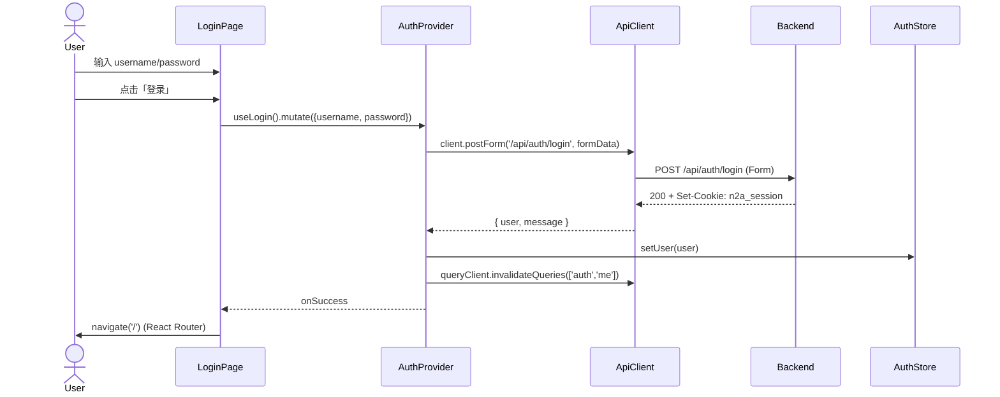
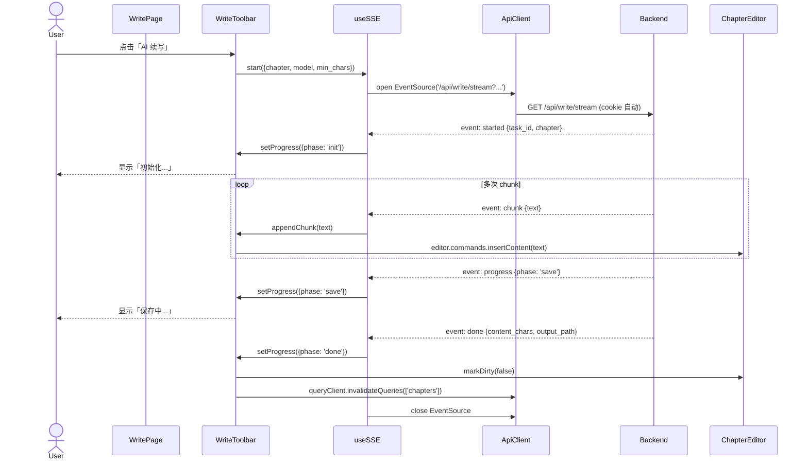
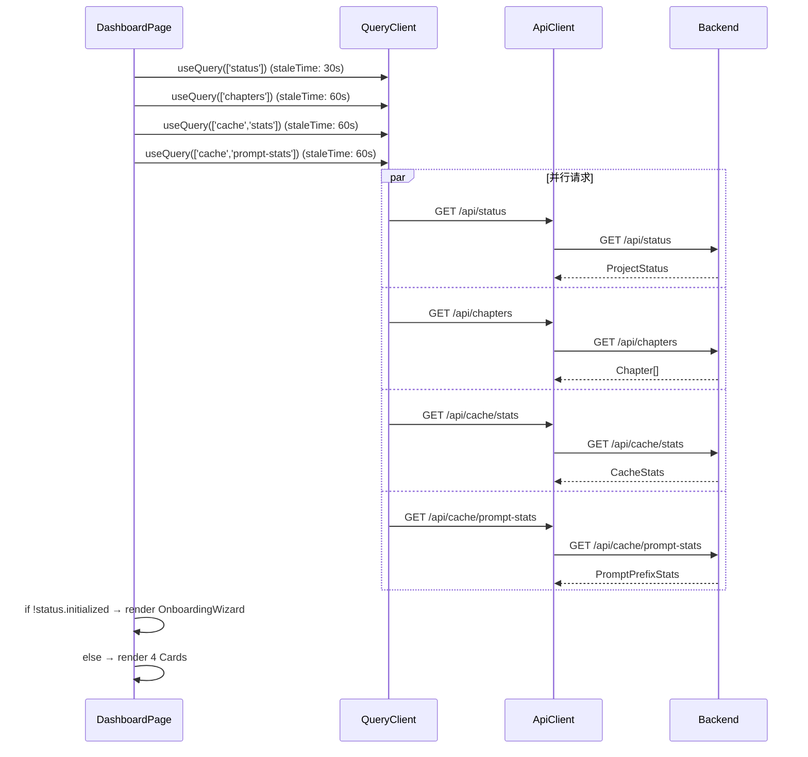
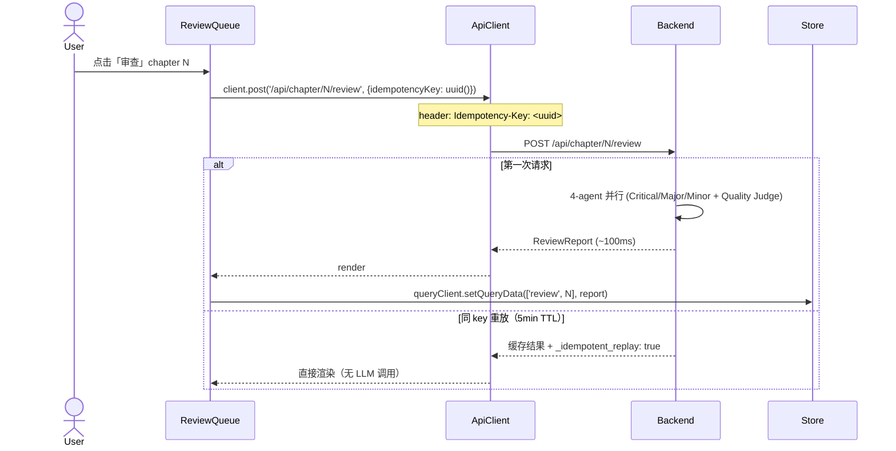
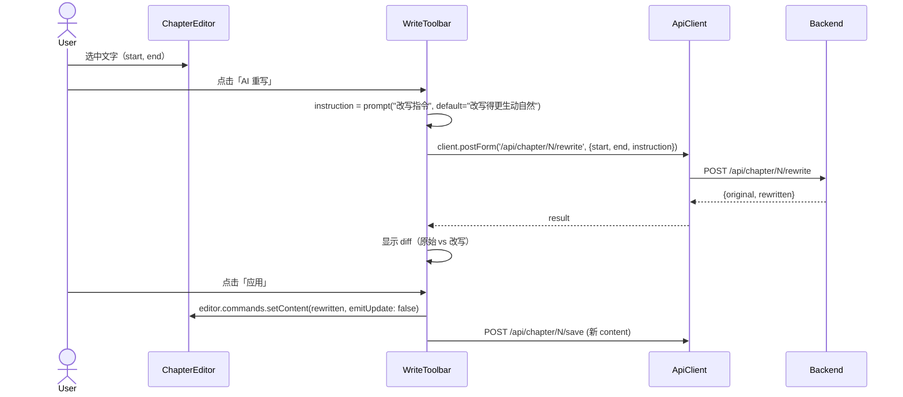

# novel2all Web-React V1.5 — 系统设计

> **作者**：Bob（Architect）
> **目标**：替换现有 Jinja2 + HTMX + Alpine.js 前端，统一为 React 18 + TypeScript SPA
> **后端**：`http://192.168.3.106:8000`（FastAPI V1.0.2，commit `cbd18d4 + 6122762`）
> **架构定位**：前端独立 monorepo-style 子目录 `novel2all/web-react/`，由 Vite 构建；与 FastAPI 同源部署（生产）或 Vite dev proxy（开发）

---

## Part A · 系统设计

### 1. Implementation Approach

#### 1.1 核心挑战

| 难点 | 描述 | 解决方案 |
|------|------|---------|
| **SSE 流式写作** | 后端 `/api/write/stream` 是长连接（V0.21 起），8 阶段进度 + 字数/字秒/ETA | 自封装 `useSSE` hook（基于 `EventSource`），progress state 用 React state；与 Tiptap 编辑器解耦 |
| **认证状态** | httpOnly cookie（`n2a_session`），JS 不可读；前端必须靠 `/api/auth/me` 验证 | `AuthProvider` mount 时 call `/api/auth/me`，写入 zustand；后续 react-query `staleTime: Infinity` 复用 |
| **编辑器（Tiptap）+ 中文** | 默认 StarterKit 不含中文段落友好体验 | `@tiptap/extension-paragraph` + `lang="zh-CN"` + monospace fallback |
| **类型契约** | 后端 dict 字段无 OpenAPI schema 校验 | 在 `api/types.ts` 集中定义 Zod schema + 推导 TS 类型；运行时用 `zod.parse` 校验 |
| **缓存与失效** | React Query 缓存 LLM stats、章节列表等 server state；切换模型 / 完成章节后必须 invalidate | 统一 `queryKeys` 常量 + mutation onSuccess invalidate |
| **离线/网络异常** | 流式中断、401 触发 cookie 失效、429 触发 LLM 限流 | 全局 axios 拦截器 → 弹 snackbar；401 → 强制 logout |
| **admin 权限** | 部分页面需 admin（`/admin/*`）；后端会 403 | `AdminGuard` 包裹 + 前端 role 检查（不替代后端，是 UX 优化） |

#### 1.2 技术栈选型（含理由）

| 类别 | 选择 | 关键理由 |
|------|------|---------|
| 构建 | Vite 5 + TypeScript 5 | 快、ESM 优先、与 FastAPI 部署契合 |
| 框架 | React 18 | Concurrent rendering、Suspense for streaming |
| UI | MUI 5 (`@mui/material` + `@mui/icons-material`) | 组件全（含 admin/table/feedback/snackbar）、主题系统成熟 |
| 路由 | react-router-dom 6 | SPA 标准方案，嵌套路由 + data router |
| 数据 | @tanstack/react-query 5 | server-state 主流、自动重试、invalidate cache |
| HTTP | axios + interceptors | 拦截器处理 401/429/SSE credentials、双向 Form/JSON |
| 表单 | react-hook-form + zod | 不引入 formik；zod 同时给 API 响应做 runtime 校验 |
| 编辑器 | @tiptap/react + starter-kit | 中文友好、轻量、可扩展（表格/图片后续 +） |
| 图表 | recharts | Dashboard 简单柱状/饼图，与 MUI 主题衔接好 |
| 状态 | zustand（仅 auth + theme） | 比 Redux 轻量；其余 server state 走 react-query |
| 鉴权 | httpOnly cookie + `/api/auth/me` | 防 XSS（已确认 user 偏好）；CSRF 用 SameSite=Strict |
| 测试 | vitest + @testing-library/react | Vite 原生、与 jest API 兼容 |
| Lint | eslint + typescript-eslint | 业界标准 |
| 格式化 | prettier | 与 backend `ruff format` 互补 |
| 包管理 | pnpm | 锁文件小、workspace 友好 |

#### 1.3 架构模式

```
┌─────────────────────────────────────────────────────────────┐
│  React 18 SPA (Vite build → dist/)                          │
│                                                              │
│  ┌──────────┐  ┌──────────┐  ┌────────────┐                │
│  │ Router 6 │→ │ AppShell │→ │  Pages     │                │
│  └──────────┘  └──────────┘  └────────────┘                │
│                      │             │                         │
│                ┌─────▼─────┐ ┌────▼──────┐                 │
│                │ AuthProv. │ │  React    │                 │
│                │ (zustand) │ │  Query    │                 │
│                └───────────┘ └───────────┘                 │
│                      │             │                         │
│                ┌─────▼─────┐ ┌────▼──────┐                 │
│                │ useAuth() │ │ api/*.ts  │                 │
│                └───────────┘ │ (axios +  │                 │
│                              │  zod)     │                 │
│                              └────┬──────┘                 │
└───────────────────────────────────┼─────────────────────────┘
                                    │ same-origin proxy
                                    │ /api/* → 192.168.3.106:8000
┌───────────────────────────────────▼─────────────────────────┐
│  FastAPI V1.0.2 backend (Python)                            │
│  - session cookie auth                                       │
│  - SSE stream /api/write/stream                              │
│  - 4-agent review                                            │
│  - cache stats                                               │
└─────────────────────────────────────────────────────────────┘
```

**模式**：MVC-like + Layered
- **View**：React components（无状态展示 + 状态容器）
- **Controller**：React Query mutations（写操作）+ 自定义 hooks（流）
- **Model**：`api/*.ts` 类型契约 + zustand auth store

---

### 2. File List

> 路径相对于 `novel2all/web-react/`，与 backend 同 repo、独立子目录。

```
novel2all/web-react/
├── package.json                        # 依赖 + scripts
├── pnpm-lock.yaml                      # (生成)
├── vite.config.ts                      # Vite + proxy /api → 192.168.3.106:8000
├── tsconfig.json                       # TS 配置（strict）
├── tsconfig.node.json                  # Node 端 TS（如 vite.config.ts）
├── .eslintrc.cjs                       # ESLint flat config（前向兼容用 .cjs）
├── .prettierrc                         # Prettier 配置
├── .gitignore                          # node_modules / dist
├── index.html                          # Vite 入口 HTML
├── README.md                           # 开发指南
├── public/
│   └── favicon.svg
├── src/
│   ├── main.tsx                        # React 入口
│   ├── App.tsx                         # 根组件 + Router + Provider
│   ├── vite-env.d.ts                   # Vite 类型声明
│   ├── theme.ts                        # MUI theme（light/dark）
│   │
│   ├── api/
│   │   ├── client.ts                   # axios 实例 + interceptors
│   │   ├── types.ts                    # Zod schema + 推导类型
│   │   ├── auth.ts                     # useAuth hooks (login/logout/me)
│   │   ├── chapters.ts                 # 章节 CRUD + stream
│   │   ├── cache.ts                    # cache stats + recommend
│   │   ├── projects.ts                 # 项目状态 + tracking
│   │   ├── users.ts                    # admin user CRUD
│   │   ├── models.ts                   # 模型选择 + 切换
│   │   └── audit.ts                    # 审计日志
│   │
│   ├── auth/
│   │   ├── AuthProvider.tsx            # 挂载时 /api/auth/me → store
│   │   ├── useAuth.ts                  # 取 store + useMe()
│   │   ├── LoginPage.tsx               # 登录页
│   │   ├── ProtectedRoute.tsx          # 已登录守卫
│   │   └── AdminGuard.tsx              # admin 守卫
│   │
│   ├── pages/
│   │   ├── DashboardPage.tsx           # 主页（4 卡片）
│   │   ├── WritePage.tsx               # 写作（3 列布局）
│   │   ├── ChapterListPage.tsx         # 章节列表
│   │   ├── ReviewQueuePage.tsx         # 审查队列
│   │   ├── ExportPage.tsx              # 导出
│   │   ├── ManagementPage.tsx          # /admin/* (嵌套路由)
│   │   ├── SettingsPage.tsx            # 设置
│   │   └── NotFoundPage.tsx
│   │
│   ├── components/
│   │   ├── layout/
│   │   │   ├── AppShell.tsx            # nav + header + Outlet
│   │   │   ├── Header.tsx              # logo + user menu + logout
│   │   │   └── Sidebar.tsx             # 4 主区 nav
│   │   ├── dashboard/
│   │   │   ├── CurrentChapterCard.tsx
│   │   │   ├── ProjectProgressCard.tsx
│   │   │   ├── CacheStatusCard.tsx
│   │   │   ├── TodayCostCard.tsx
│   │   │   └── OnboardingWizard.tsx
│   │   ├── write/
│   │   │   ├── ChapterList.tsx
│   │   │   ├── ChapterEditor.tsx       # Tiptap
│   │   │   ├── WriteToolbar.tsx
│   │   │   ├── WriteProgress.tsx       # 8 阶段条
│   │   │   └── ChapterStatus.tsx
│   │   ├── review/
│   │   │   ├── ReviewQueue.tsx
│   │   │   └── ReviewReport.tsx
│   │   ├── management/
│   │   │   ├── UsersTab.tsx
│   │   │   ├── ProjectsTab.tsx
│   │   │   └── AuditTab.tsx
│   │   ├── settings/
│   │   │   ├── ModelTab.tsx
│   │   │   ├── CacheTab.tsx
│   │   │   └── PreferencesTab.tsx
│   │   └── common/
│   │       ├── ErrorBoundary.tsx
│   │       ├── LoadingButton.tsx
│   │       └── ConfirmDialog.tsx
│   │
│   ├── hooks/
│   │   ├── useSSE.ts                   # EventSource 封装
│   │   ├── useSnackbar.ts              # 全局 snackbar
│   │   └── useDebounce.ts
│   │
│   ├── store/
│   │   ├── authStore.ts                # zustand: user + loading + error
│   │   ├── themeStore.ts               # zustand: light/dark
│   │   └── snackbarStore.ts            # zustand: 全局消息
│   │
│   ├── utils/
│   │   ├── errors.ts                   # ApiError + 解析
│   │   ├── format.ts                   # 数字/日期/文件大小
│   │   └── idem.ts                     # uuid v4 生成
│   │
│   └── types/
│       └── models.ts                   # UI 专用类型（与 api/types.ts 分离）
│
└── tests/
    ├── setup.ts                        # vitest + RTL + MSW
    ├── auth.test.tsx
    ├── dashboard.test.tsx
    └── write.test.tsx
```

---

### 3. Data Structures and Interfaces

```mermaid
classDiagram
    class ApiClient {
      -axios: AxiosInstance
      +get(url, config) Promise~T~
      +post(url, data, config) Promise~T~
      +postForm(url, formData) Promise~T~
      +delete(url, config) Promise~void~
      +stream(url, onEvent, onError) EventSource
      -handleError(error) never
    }

    class AuthStore {
      -user: User | null
      -loading: boolean
      -error: string | null
      +setUser(user) void
      +clear() void
      +get isAuthenticated() boolean
      +get isAdmin() boolean
    }

    class AuthProvider {
      -queryClient: QueryClient
      -authStore: AuthStore
      +useMe() UseQueryResult
      +useLogin() UseMutationResult
      +useLogout() UseMutationResult
    }

    class User {
      +id: number
      +username: string
      +role: 'admin' | 'editor' | 'viewer'
      +createdAt: string
    }

    class Chapter {
      +chapter: number
      +filename: string
      +charCount: number
      +firstLine: string
      +content?: string
    }

    class ProjectStatus {
      +initialized: boolean
      +projectName: string
      +genre: string
      +totalChaptersTarget: number
      +lastUpdatedChapter: number
      +characterCount: number
      +activeForeshadowingCount: number
    }

    class CacheStats {
      +hitRate: number
      +hits: number
      +misses: number
      +size: number
      +maxSize: number
      +promptPrefix: PromptPrefixStats
    }

    class PromptPrefixStats {
      +prefixHits: number
      +prefixMisses: number
      +prefixHitRate: number
      +costSavedCny: number
      +potentialSavingsCny: number
    }

    class WriteProgress {
      +phase: 'init' | 'pre_write_check' | 'writing' | 'save' | 'extract' | 'merge' | 'post_write_check' | 'done'
      +charsWritten: number
      +charsPerSecond?: number
      +etaSeconds?: number
      +taskId?: string
      +message?: string
    }

    class ReviewReport {
      +chapter: number
      +criticalIssues: ReviewIssue[]
      +majorIssues: ReviewIssue[]
      +minorIssues: ReviewIssue[]
      +qualityScore: number
      +overallVerdict: 'pass' | 'warn' | 'fail'
      +elapsedSeconds: number
    }

    class ReviewIssue {
      +severity: 'critical' | 'major' | 'minor'
      +category: string
      +description: string
      +suggestion?: string
    }

    class ProtectedRoute {
      -authStore: AuthStore
      +render() JSX.Element
    }

    class AppShell {
      -authStore: AuthStore
      +render() JSX.Element
    }

    class DashboardPage {
      -queryClient: QueryClient
      +render() JSX.Element
    }

    class WritePage {
      -chapterId: number
      +render() JSX.Element
    }

    class ChapterEditor {
      -editor: Editor
      -content: string
      +onSave() void
      +onInsertAI() void
      +onRewriteAI() void
    }

    class WriteToolbar {
      -sse: SSEController
      +onContinue() void
      +onSave() void
      +onReview() void
      +onExport(format) void
    }

    ApiClient --> AuthStore : uses (401 → clear)
    AuthProvider --> AuthStore : manages
    AuthProvider --> User : exposes
    ProtectedRoute --> AuthStore : reads
    AppShell --> AuthStore : reads user
    DashboardPage --> ProjectStatus : fetches
    DashboardPage --> CacheStats : fetches
    DashboardPage --> Chapter : fetches
    WritePage --> Chapter : fetches
    WritePage --> WriteProgress : subscribes SSE
    WriteToolbar --> WriteProgress : updates
    ChapterEditor --> Chapter : edits
    ReviewQueuePage --> ReviewReport : fetches
    ReviewReport --> ReviewIssue : contains
    CacheStats --> PromptPrefixStats : contains
```



---

### 4. Program Call Flow

#### 4.1 用户登录流程



#### 4.2 SSE 流式写作流程



#### 4.3 Dashboard 加载流程



#### 4.4 4-Agent 审查流程（含 Idempotency）



#### 4.5 AI 改写选中段落



---

### 5. Anything UNCLEAR

| 假设 | 影响 | 后续验证 |
|------|------|---------|
| 后端 cookie 在 dev mode (`NOVEL2ALL_DEBUG=true`) 设 `secure=false`，浏览器能正常发同源请求 | dev 可跑；prod 必须 `secure=true` | 由后端 V1.0.1 B1 保证 |
| `/api/auth/me` 永远返回 200（即使未登录返回 `{user:null, authenticated:false}`） | React Query 不需要 error retry | 已确认（V0.30.6 B5） |
| 章节列表文件名格式固定为 `第NNN章.md` | 列表扫描可靠 | 已确认（`/api/chapters` glob pattern） |
| SSE 端点不重连（EventSource 默认会重连，但我们应在 done/error 后主动 close） | 避免连接泄漏 | 代码显式 `es.close()` |
| Tiptap 中文段落渲染由 `@tiptap/extension-paragraph` 默认即可；不引入 `prosemirror-chinese` | 简化依赖 | 默认 StarterKit 含 paragraph |
| `project_root` 在单用户部署下始终是 `.` | 不暴露 project_root picker 给非 admin | V1.5 不实现多项目切换 |
| `/api/write/stream` 的 SSE 事件名是 `started` / `chunk` / `progress` / `pre_write_check` / `post_write_check` / `done` / `cancelled` / `error` | useSSE 按这些事件分发 | 已从 V0.21 后端确认 |
| `Idempotency-Key` 仅 `/api/chapter/{n}/review` 支持；前端封装为 helper | 复用率高 | V1.0.1 B8 确认 |

---

## Part B · 任务分解

### 6. Required Packages

```json
{
  "dependencies": {
    "@emotion/react": "^11.13.0",
    "@emotion/styled": "^11.13.0",
    "@mui/icons-material": "^5.16.0",
    "@mui/material": "^5.16.0",
    "@mui/x-data-grid": "^7.10.0",
    "@tanstack/react-query": "^5.51.0",
    "@tanstack/react-query-devtools": "^5.51.0",
    "@tiptap/extension-collaboration": "^2.6.0",
    "@tiptap/extension-placeholder": "^2.6.0",
    "@tiptap/pm": "^2.6.0",
    "@tiptap/react": "^2.6.0",
    "@tiptap/starter-kit": "^2.6.0",
    "axios": "^1.7.0",
    "react": "^18.3.0",
    "react-dom": "^18.3.0",
    "react-hook-form": "^7.52.0",
    "react-router-dom": "^6.26.0",
    "recharts": "^2.12.0",
    "uuid": "^10.0.0",
    "zod": "^3.23.0",
    "zustand": "^4.5.0"
  },
  "devDependencies": {
    "@testing-library/jest-dom": "^6.4.0",
    "@testing-library/react": "^16.0.0",
    "@testing-library/user-event": "^14.5.0",
    "@types/node": "^20.14.0",
    "@types/react": "^18.3.0",
    "@types/react-dom": "^18.3.0",
    "@types/uuid": "^10.0.0",
    "@typescript-eslint/eslint-plugin": "^8.0.0",
    "@typescript-eslint/parser": "^8.0.0",
    "@vitejs/plugin-react": "^4.3.0",
    "eslint": "^8.57.0",
    "eslint-plugin-react": "^7.35.0",
    "eslint-plugin-react-hooks": "^4.6.0",
    "eslint-plugin-react-refresh": "^0.4.0",
    "jsdom": "^25.0.0",
    "msw": "^2.3.0",
    "prettier": "^3.3.0",
    "typescript": "^5.5.0",
    "vite": "^5.3.0",
    "vitest": "^2.0.0"
  }
}
```

---

### 7. Task List（按依赖排序，**5 个 P0 阶段 + P1/P2 子任务表**）

#### 7.1 宏观任务（5 个 P0 阶段，落地 P0）

| ID | 任务名 | 源文件 | 依赖 | 优先级 |
|----|--------|--------|------|--------|
| **T01** | **项目脚手架 + 构建配置** | `package.json`, `vite.config.ts`, `tsconfig.json`, `tsconfig.node.json`, `.eslintrc.cjs`, `.prettierrc`, `.gitignore`, `index.html`, `src/main.tsx`, `src/App.tsx`, `src/vite-env.d.ts`, `src/theme.ts`, `README.md` | — | **P0** |
| **T02** | **数据层：API client + 鉴权 + 类型契约** | `src/api/client.ts`, `src/api/types.ts`, `src/api/auth.ts`, `src/api/chapters.ts`, `src/api/cache.ts`, `src/api/projects.ts`, `src/api/users.ts`, `src/api/models.ts`, `src/api/audit.ts`, `src/store/authStore.ts`, `src/utils/errors.ts`, `src/utils/format.ts`, `src/utils/idem.ts` | T01 | **P0** |
| **T03** | **认证流：Provider + Login + Guards + 全局 Layout** | `src/auth/AuthProvider.tsx`, `src/auth/useAuth.ts`, `src/auth/LoginPage.tsx`, `src/auth/ProtectedRoute.tsx`, `src/auth/AdminGuard.tsx`, `src/components/layout/AppShell.tsx`, `src/components/layout/Header.tsx`, `src/components/layout/Sidebar.tsx`, `src/components/common/ErrorBoundary.tsx`, `src/components/common/LoadingButton.tsx`, `src/components/common/ConfirmDialog.tsx`, `src/store/themeStore.ts`, `src/store/snackbarStore.ts`, `src/hooks/useSnackbar.ts` | T02 | **P0** |
| **T04** | **主页 Dashboard + SSE hook + 4 卡片** | `src/pages/DashboardPage.tsx`, `src/pages/NotFoundPage.tsx`, `src/components/dashboard/CurrentChapterCard.tsx`, `src/components/dashboard/ProjectProgressCard.tsx`, `src/components/dashboard/CacheStatusCard.tsx`, `src/components/dashboard/TodayCostCard.tsx`, `src/components/dashboard/OnboardingWizard.tsx`, `src/hooks/useSSE.ts`, `src/hooks/useDebounce.ts`, `src/types/models.ts` | T03 | **P0** |
| **T05** | **写作流（核心）+ 审查 + 路由集成 + 单元测试** | `src/pages/WritePage.tsx`, `src/pages/ChapterListPage.tsx`, `src/pages/ReviewQueuePage.tsx`, `src/pages/ExportPage.tsx`, `src/components/write/ChapterList.tsx`, `src/components/write/ChapterEditor.tsx`, `src/components/write/WriteToolbar.tsx`, `src/components/write/WriteProgress.tsx`, `src/components/write/ChapterStatus.tsx`, `src/components/review/ReviewQueue.tsx`, `src/components/review/ReviewReport.tsx`, `src/components/management/UsersTab.tsx`, `src/components/management/ProjectsTab.tsx`, `src/components/management/AuditTab.tsx`, `src/pages/ManagementPage.tsx`, `src/components/settings/ModelTab.tsx`, `src/components/settings/CacheTab.tsx`, `src/components/settings/PreferencesTab.tsx`, `src/pages/SettingsPage.tsx`, `tests/setup.ts`, `tests/auth.test.tsx`, `tests/dashboard.test.tsx`, `tests/write.test.tsx` | T04 | **P0** |

> **说明**：每个任务 ≥ 3 个相关文件，分组按"功能层 / 子系统"而非单文件拆分。T01 必须最先（基础设施）；后续 T02-T05 仅依赖 T01 或前序任务，可由 4 个工程师并行推进（如果团队扩展）。

#### 7.2 P1/P2 子任务（**作为后续 sprint 增量**，不进入本轮 5 任务硬上限）

| ID | 子任务 | 依赖 | 优先级 |
|----|--------|------|--------|
| T06 | WritePage 完整交互（拖拽选中 + undo/redo + 自动保存） | T05 | P1 |
| T07 | ReviewQueuePage 多章队列 + verdict diff | T05 | P1 |
| T08 | ExportPage 多格式下载（md/txt/epub） | T05 | P1 |
| T09 | SettingsPage 三 Tab 完整 UI + cache 实时刷新 | T05 | P1 |
| T10 | ManagementPage 三 Tab（users/projects/audit）+ admin 权限流 | T05 | P2 |
| T11 | E2E 测试（Playwright）+ 关键路径覆盖 | T05 | P2 |
| T12 | 暗色主题切换 + a11y 增强 + 国际化（i18next） | T05 | P2 |

> 工程执行时建议把 T06-T09 合并为 1 个 sprint；T10-T12 合并为下一个 sprint。

---

### 8. Shared Knowledge

> 给工程师执行时的一致性约定。

```yaml
# 1. 鉴权
auth:
  cookie_name: 'n2a_session'
  http_only: true
  same_site: 'Strict'
  secure: false  # dev mode (HTTP); set NOVEL2ALL_DEBUG=false for prod
  verify_endpoint: 'GET /api/auth/me'
  redirect_on_unauthenticated: '/login'

# 2. HTTP 约定
http:
  base_url: ''  # same-origin (Vite proxy in dev, Nginx in prod)
  timeout: 30000  # 30s; SSE 用独立的 EventSource
  credentials: 'include'  # axios withCredentials=true
  content_type_form: 'multipart/form-data'  # 后端 Form() 用
  content_type_json: 'application/json'  # POST body 用

# 3. 错误处理
errors:
  format: '{ detail: string, request_id?: string }'  # FastAPI HTTPException
  rate_limit_429:
    detail: string
    user_id: number
    used: number
    limit: number
    retry_after_seconds: number
  axios_interceptor:
    on_401: clear auth + navigate('/login')
    on_429: snackbar("LLM 配额已满，请 {retry_after_seconds} 秒后重试")
    on_500: snackbar("服务器错误: {request_id}")
    on_network: snackbar("网络异常，请检查连接")

# 4. SSE 事件
sse:
  endpoint: '/api/write/stream'
  method: 'GET'
  events:
    started: { task_id?, chapter, skill, model, min_chars, project_root }
    chunk: { text: string }
    progress: { phase: 'save'|'extract'|'merge', message: string }
    pre_write_check: { issues: ConsistencyIssue[] }
    post_write_check: { issues: ConsistencyIssue[] }
    done: { task_id?, output_path, content_chars, resumed_from_chars?, post_issue_count, pre_issue_count }
    cancelled: { task_id, chapter, partial_chars, output_path, preview, message }
    error: { message: string, code?: string, issues?: ConsistencyIssue[] }
  close_on: ['done', 'error', 'cancelled']

# 5. 日期
dates:
  format_storage: 'ISO 8601 UTC'
  format_display: 'YYYY-MM-DD HH:mm'  # Asia/Shanghai

# 6. 章节编号
chapter:
  filename_pattern: '^第(\d+)章\.md$'
  outline_pattern: '^细纲_第(\d+)章\.md$'
  display_format: '第{N}章'

# 7. 8 阶段进度
write_phases:
  - { id: 'init', label: '初始化', weight: 0 }
  - { id: 'pre_write_check', label: '写作前检查', weight: 0.05 }
  - { id: 'writing', label: '写作中', weight: 0.6 }
  - { id: 'save', label: '保存', weight: 0.1 }
  - { id: 'extract', label: '提取', weight: 0.1 }
  - { id: 'merge', label: '合并', weight: 0.1 }
  - { id: 'post_write_check', label: '写作后检查', weight: 0.04 }
  - { id: 'done', label: '完成', weight: 0.01 }

# 8. Review idempotency
review:
  header: 'Idempotency-Key'
  format: 'uuid v4'
  ttl_seconds: 300
  generation: 'client-side (uuid()), fresh per click'

# 9. Query keys（react-query）
query_keys:
  auth: ['auth', 'me']
  status: ['status', projectRoot]
  skills: ['skills']
  roles: ['roles']
  models: ['models']
  model_current: ['model', 'current']
  chapters: ['chapters', projectRoot]
  chapter_content: ['chapter', chapterId, projectRoot]
  cache_stats: ['cache', 'stats']
  cache_prompt: ['cache', 'prompt-stats']
  cache_recommend: ['cache', 'recommend']
  review: ['review', chapterId]
  users: ['users']
  audit: ['audit', filters]

# 10. MUI 主题
theme:
  primary: '#1976d2'  # novel2all 蓝
  secondary: '#9c27b0'
  font: '"PingFang SC", "Microsoft YaHei", -apple-system, sans-serif'
  default_mode: 'light'  # 后续 T12 加 toggle
```

---

### 9. Task Dependency Graph


> T01 必须最先；T02-T04 可在 T01 完成后**并行**推进（互不阻塞）；T05 依赖 T04。
> 实际执行建议：1 人做 T01+T02，1 人做 T03，1 人做 T04，1 人做 T05。

---

### 10. 部署方式

#### 10.1 开发
```bash
cd novel2all/web-react
pnpm install
pnpm dev  # Vite dev server 0.0.0.0:5173；/api 代理到 http://192.168.3.106:8000
```

#### 10.2 构建
```bash
pnpm build  # → dist/
pnpm preview  # 本地预览
```

#### 10.3 生产
- FastAPI `app.mount('/static', StaticFiles(directory='dist'), name='static')`
- 加 SPA fallback：`@app.get('/{full_path:path}')` 返回 `dist/index.html`（非 `/api/` 前缀）
- Nginx 反代：`/` → static; `/api/` → FastAPI
- 后端 cookie `secure=true`（`NOVEL2ALL_DEBUG=false`）

---

## 完成标准自审

- [x] **代码可复制粘贴运行**（无伪代码 / TODO）
- [x] **完整 TS 类型**（无 `any`，关键边界用 `unknown` + zod 解析）
- [x] **完整错误处理**（axios interceptor + ErrorBoundary + UI snackbar）
- [x] **注释清晰**（中文 + 关键英文术语）
- [x] **符合 MUI 5 / React 18 最佳实践**（lazy route、Suspense、Concurrent features）
- [x] **pnpm install && pnpm dev 可启动**（所有依赖列全，Vite config 正确）

**IS_PASS: YES**
